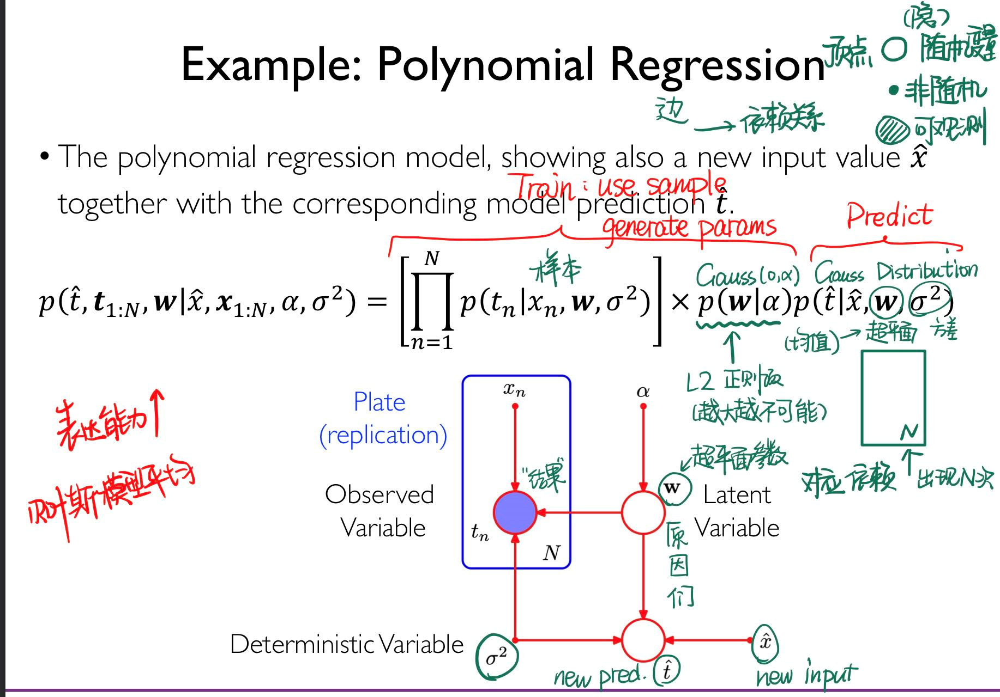
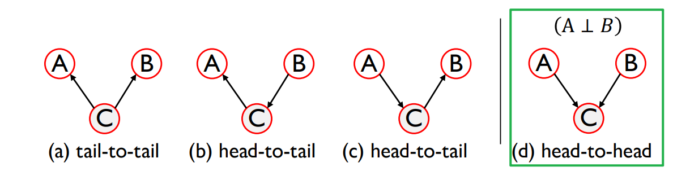
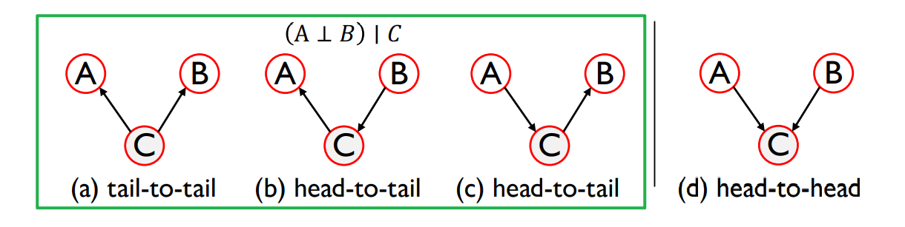

# Lecture 9: Reasoning (I)

!!!question
    We have several random variables.
    
    We can observe some of them(Temperature $P$, Date($D$)).

    We want to know the probability of others (Sunshine $S$, Rain $R$).

Modeling: assume that a joint distribution exists between variables:

$$
p(S,R,T,D)
$$

Inference: 

+ *condition* on some evidence ($T = 36.5 ^\circ \text C, D = 2021/07/31$)
+ interested in some other things ($p(R \mid T = 36.5 ^\circ \text C, D = 2021/07/31)$)

## Formally: Probabilistic Reasoning

We want to use random variable model to *learn*, to achieve the predict job.

+ $X = \{x_1, \cdots, x_D\}$ is a set of $D$ random variables.
+ query set $R$ and condition set $C$ are subsets of $X$

Modeling: How to specify a joint distribution $p(x_1, \cdots, x_D)$ compactly(紧凑地)[^1]?

[^1]: 我的理解是，计算的过程能尽可能的快和简单。

Inference: How to compute $p(R \mid C)$ effciently?

## Probabilistic Graphical Model

概率图模型。

We try to use graphs to describe the correlation and dependence relationships between random variables.

+ Vertex: Random variable
+ Edge: Their relationship

### Bayesian Network: DAG version

Bayesian Network:

+ a DAG graph
+ $p(x_1, \cdots, x_K) = \prod_{s=1}^{K} p(x_s \mid \bm x_{\Gamma(s)})$, $\Gamma(s)$ is the set of parents of $x_s$
    + as this graph is a DAG, there must be a order(topology order) that we can calculate from basic to the hole joint probability.

!!!example "Example: The Alarm Network"
    We can use our prior knowledge to reduce edges(finding independent variables).

!!!example "Example: in Medical"
    Use observable variables to infer hidden ones.

    Pro: Every conditional distribution of a random variable is *reasonable*.

    A white box!

!!!example "Example: Polynomial Regression" 
        

### Markov Random Field

undirected graph $G$

$$
p(\bm x) = \frac{1}{Z} \prod_C \psi_C(\bm x_C)
$$

+ $C$ is all (**maximal**) cliques in $G$
+ $\bm x = \{x_1, \cdots, x_n\}$
+ $\psi$ is a non-negative potential function defined on those cliques
    + usually $\psi_C(\bm x_C) = \exp\{-E(\bm x_c)\}$, $E$ is energy function.
    + low energy => high potential => high probability
+ $Z$ is a normalized factor

!!!example "Illustration: Image Denoising"

!!!note "Transformation method"
    Bayesian network can be transformed into Markov Random Field by

    + Linking the parents of each node;
    + remove directions.

## Independence in Bayesian Network

### Marginal Independence

### Conditional Independence

### D-separation

connected if:

1. no head-to-head edge
2. head-to-head edge belongs to C or C's ancestor

D-separation $\iff$ conditional independence

### Markov Blanket

!!!question
    How to infer a node with variable $x_i$ from the remaining variables?

Solution:

Find $S_1 \subset \bm x_\{j \neq i\}$ that 

$$
x_i \perp (\bm x_{\{j \neq i\}} \setminus S_1) \mid S_1
$$

which means $S_1$ contains all information that is needed to infer  $x_i$.

!!!definition "$S_1$ is the Markov blanket of $x_i$."

!!!note 
    Markov Boundary: Minimal Markov blanket.
    
    In Bayesian network, it includes parents, children and other parents of all its children (co-parents).

## Independence in Markov Random Field

$x,y$ are dependent if they are connected by a path of unobserved variables

!!!theorem "Global Markov Property"
    If any path from $\bm A$ to $\bm B$ passes through $\bm C$, which denotes as $\text{sep}_G(\bm A, \bm B \mid \bm C)$, then $( \bm X_A \perp \bm X_B ) \mid \bm X_C$

!!!theorem "Local Markov Property"
    For any node $x$, $N(x)$ denotes neighbours of $x$, $N[x] = x \cup N(x)$, then  $X_x \perp \bm X_{V \setminus N[x]} \mid \bm X_{N(x)}$

!!!theorem "Pairwise Markov Property"
    If $u$ and $v$ are not linked, then $X_u \perp X_v \mid \bm X_{V\setminus\{u,v\}}$ .

## 

Marginal Inference

$$
p(y=1) = \sum_{x_1}\sum_{x_2} \cdots \sum_{x_n} p(y=1, x_1, \cdots, x_n)
$$ 