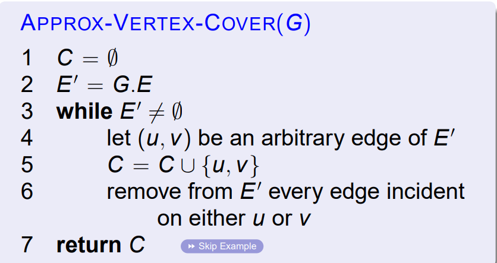
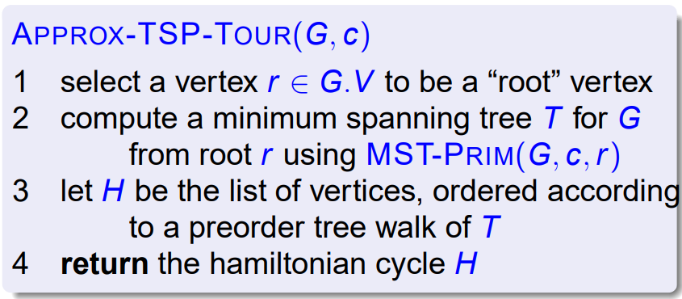
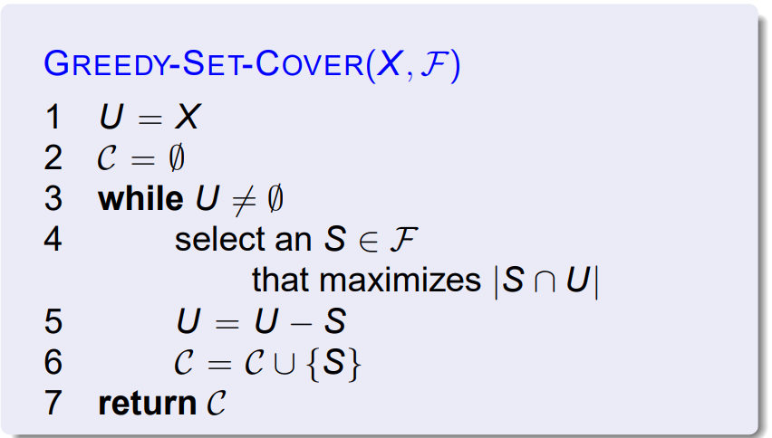
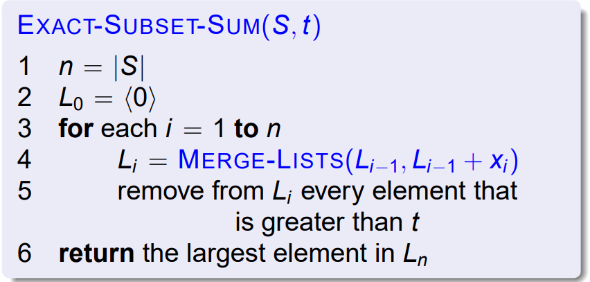
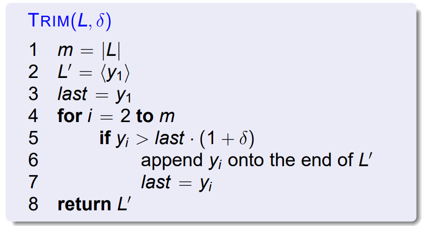
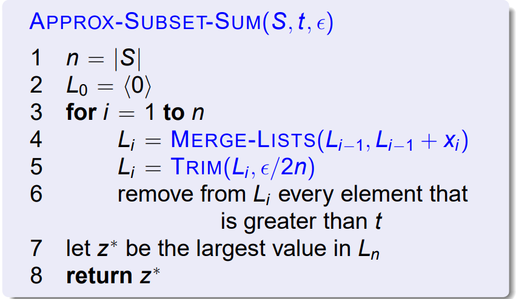

# 近似算法

对于 NP-complete 问题的几个近似算法。

## 定义

对于一个最优化问题，每个解都有可能有一个正的代价。

输入规模 $n$ ，近似算法的代价为 $C$ 最优解的代价为 $C^*$，那么如果有

$$
\max\left( \frac{C}{C^*}, \frac{C^*}{C}\right) \leq \rho(n)
$$

则称近似比 $\rho(n)$ 。

!!!note
    这个定义对最小化代价和最大化代价问题都成立。

!!!note
    如果是随机化算法，那么 $C$ 就是期望。

!!!definition "定义：多项式时间近似模式"
    对于问题实例和一个常数 $\varepsilon$，该模式都能给出一个 $(1+\varepsilon)$ 近似算法。

    假如该近似算法有关于 $n$ 的多项式复杂度，成为**多项式时间近似模式**。

    假如该近似算法有关于 $\frac{1}\varepsilon$ 和 $n$ 的多项式算法，成为**完全多项式时间近似模式**。

## 顶点覆盖问题

> Hint: 随机选没被覆盖的边。把两个顶点并进去。

这个算法的近似比为 2，运行时间为 $O(V+E)$

近似性质的证明：

> 设第四行选出来了 $A$ 条边，显然有 $|C^*| \geq A$（因为 A 条边中没有两条边共顶点），所以 $|C| = 2|A| \leq 2|C^*|$

## 旅行商问题

有三角不等式时：

> Hint：做一个最小生成树，遍历一遍

近似比：2

没有三角形不等式的时候，没有多项式近似算法。

> Hint: 如果有的话，可以解决 Hamilton 回路问题。在原图中有的边给较大的权，不在原图中的给 0 。

## 集合覆盖问题

是一个  $(\ln |X| + 1)$ 近似算法

> Hint:
>
> 调和级数 $H(d) = \sum_{i=1}^d 1 / i$，则 $\rho(n) = H(\max\{ |S| : S \in \mathcal F \})$
> 
> 每次选一个集合新增的代价 1 平均分给首次被覆盖的元素。
> 
> 证明有些复杂。贪心性质用来保证某次选出的 $S$ 不会比之前已经选出的集合 $S_i$ 能覆盖更多的元素，从而获取到一个覆盖元素的上界。

## 随机化和线性规划问题

## 子集和问题

是否存在某个子集的和恰好为 $t$。

（指数算法）

多项式剪枝：

> Hint: 离的太近的就不要了。

时间复杂度证明：

> 用 $\epsilon$ 限制总共可能的个数
>
> $L_i$ 的元素至多为 $\log_{1+\epsilon/2n} t + 2 = \frac{\ln t}{\ln(1 + \epsilon/2n)} + 2 \leq \frac{2n(1+\epsilon/2n)\ln t}{\epsilon} + 2 < \frac{3n \ln t}{\epsilon} + 2$
