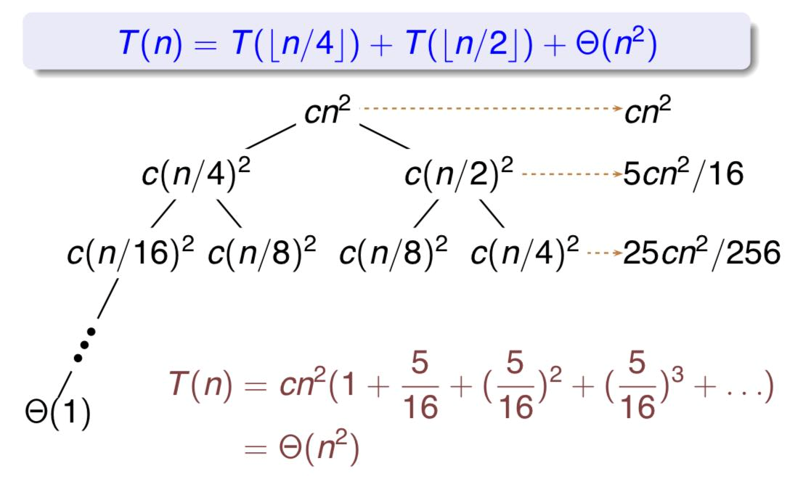
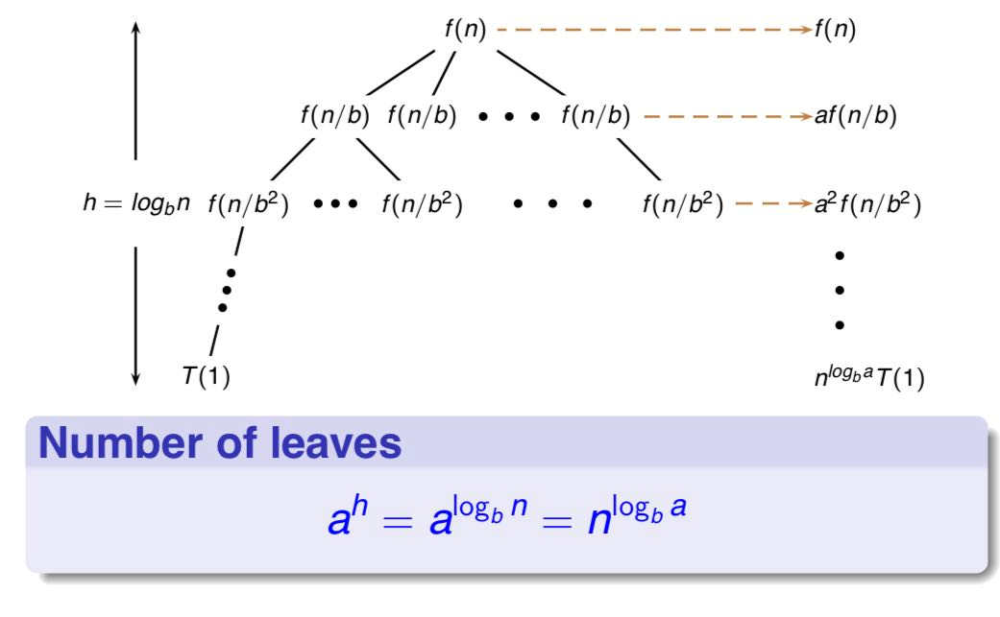

# Recurrence and Divide-Conquer Algorithms

## Recurrence

!!!definition "Definition: Recurrence"
    A recurrnece is an equation that describes a function in terms of its value on smaller inputs.

e.g:

$$
T(n) = \left\{\begin{aligned}&\Theta(1),&n = 1\\&2T(\frac{n}{2}) + \Theta(n),&n>1\end{aligned}\right.
$$

The solution of $T(n)$ is $\Theta(n \lg n)$ .

We have three method to solve this recurrence:

1. substitution method: Guess & verification
2. recursion-tree method
3. master theorem

### Recursion Tree Method

### Master Theorem Method

Suppose the recurrence has the form:

$$
T(n) = a T\left(\frac{n}{b}\right) + f(n)
$$

where $a \geq 1, b > 1$, and $f$ is asymptotically positive.

Then compare $f(n)$ with $n^{\log_b a}$:

1. Dominated by recurrence:
    * if $f(n) = O(n^{\log_b a - \epsilon})$, then $T(n) = \Theta(n^{\log_b a})$
2. Equal recurrence and $f(n)$:
    * if $f(n) = \Theta(n^{\log_b a})$, then $T(n) = \Theta(n^{\log_b a} \log n)$
3. Dominated by $f(n)$:
    * if $f(n) = \Omega(n^{\log_b a + \epsilon})$ (, and $af(\frac{n}{b}) \leq cf(n)$ for some constant $c < 1$ and all sufficiently large $n$), then $T(n) = \Theta(f(n))$

> Remember: $b$ is on the bottom

Failure Cases:

+ $f(n)$ is smaller/larger than $n^{\log_b a}$, but not **polynominally smaller/larger** (between 1 & 2)
+ Regularity condition failed

General method with calculus:

The recurrence:

$$
T(n) = \sum_{i=1}^k a_i T(\lfloor\frac{n}{b_i}\rfloor) + f(n)
$$

Then for p such that $\sum_{i=1}^p a_ib_i^{-p} = 1$

$$
T(n) = \Theta(n^p) + \Theta(n^p \int_{n'}^n \frac{f(x)}{x^{p+1}} \text dx)
$$

### Proof

Idea:

$$
T(n) = \Theta(n^{\log_b a}) + \sum_{j=0}^{\log_b n - 1} a^j f(n / b^j)
$$

Substitude with different formula in assumption.

Some techniques:

+ Changing varibles:
    + let $m = \lg n$, then we let $S(m) = T(2^m)$. 

## Divide and conquer

How to design a divide & conqueror algorithm:

1. **Divide** the problem (instance) into subproblems
2. **Conquer** subproblems by solving them recursively
3. **Combine** solutions of subproblems.

!!!example "Example: Merge sort"

!!!example "Example: Matrix Multiplication"
    8 --> 7

!!!example "Example: Closest pair of points"