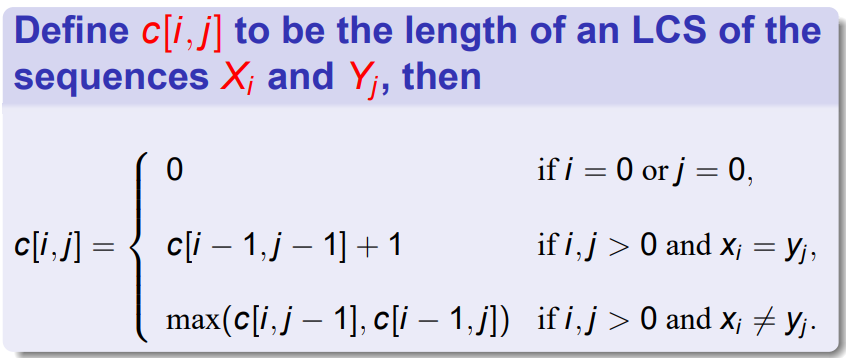
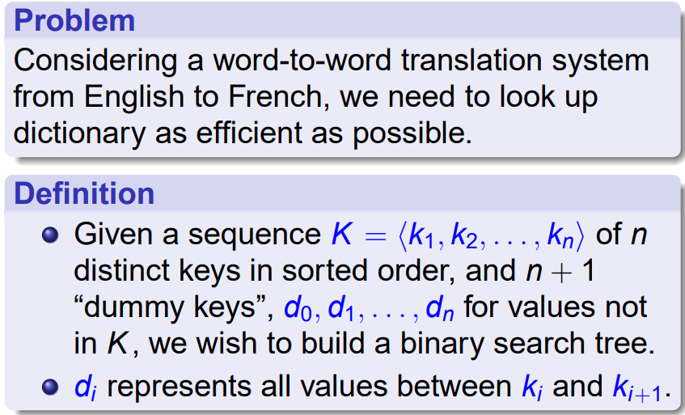
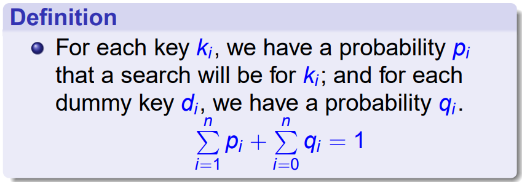
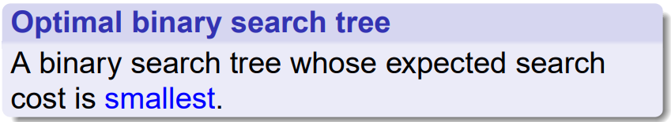
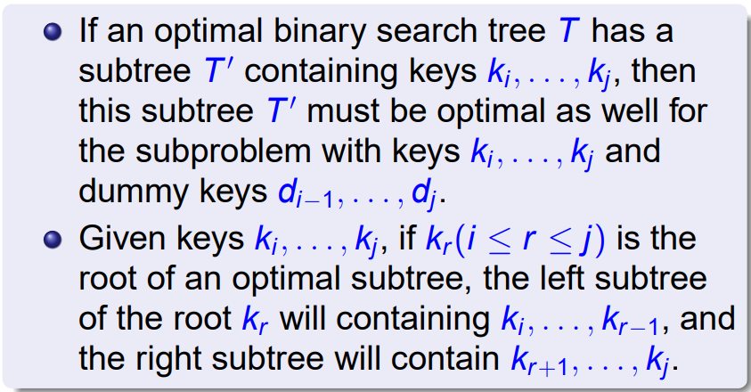
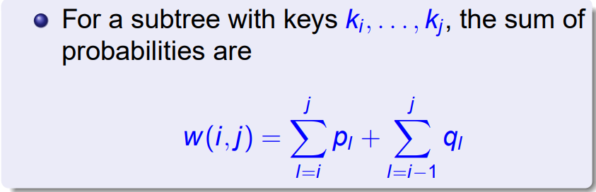
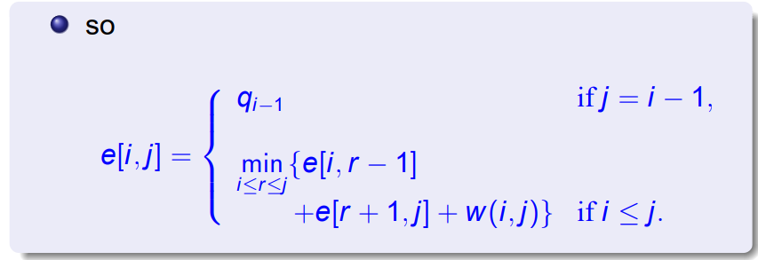

# Dynamic Programming

## Introduction

DP V.S. D.C.

Similarities:

1. partition the problem into subproblems
2. combining the solutions from subproblems

Differences:

1. **overlapping subproblems** vs. no overlapping subproblems
2. Synamic programming is typically applied to optimization problems
    + We want the **optimal value**, not every **optimal solution**

## Steps 

1. **Characterize** the structure of an optimal solution
    + use a function $f$ to characterize that "state"
2. Recursively define the value of an optimal solution
    + Find subproblems
3. Compute the value of an optimal solution in a bottom-up fashion
    + Give the "state" transformation formula
4. Construct an optimal solution from computed information
    + Sometimes it can be ignored
    + if we want the solution, we should maintain more information in step 3

## Principles - how to prove the optimial substructure proeperty

Build substructure, you may need to do some choice, which generates a series of subproblems.

Cut-paste method:

+ Suppose the solution of subproblem is not optimal, then we can replace it with " real optimal solution", then we can get a better solution. Contradicted.

The subproblems should be **independent**, that is to say, the solution to one subproblem does not affect the solution to another subproblem of the same problem.

Estimate running time:

1. The number of subproblems overall
2. The number of choices(The time we spent) for each subproblem

## Implementation

1. Recursive, top-down, but with a memoization
2. Bottom-up, with a array

## Problems

### Rot Cutting

Given a rod of length $n$. Assume that price of an $i$-inches rod is $p_i$. 

We want to cut the rod into several pieces to get the most price.

$$\begin{aligned}r_0 &= 0\\r_n &= \max_{1 \leq i \leq n}(p_i + r_{n-i})\end{aligned}$$

### Matrix Chain

We want to calculate $A_1A_2 \cdots A_n$. Since matrix multiplication has associativity, we can **parenthesized** it.

!!!example 
    $(A_1(A_2(A_3A_4)))$,$(A_1((A_2A_3)A_4))$,$((A_1A_2)(A_3A_4))$, $((A_1(A_2A_3))A_4)$,$(((A_1A_2)A_3)A_4)$.

Suppose that $A_i$ has size $p_{i-1} \times p_i$.

+ Step1: characterize the structure of optimal solution

$m[i,j]$ is the minimum price to multiply $A_i \cdots A_j$, the "optimal substructure" property is very trivial.

+ Step2: Get the recursive solution

$$
m[i,j] = \left\{\begin{aligned}&0 &,i = j\\&\min_{i \leq k < j} (m[i,k] + m[k+1,j] + p_{i-1}p_kp_j)&, i < j\end{aligned}\right.
$$

### Longest common subsequence

### Optimal Binary Search Trees

Optimal Substructure:

Solution:

