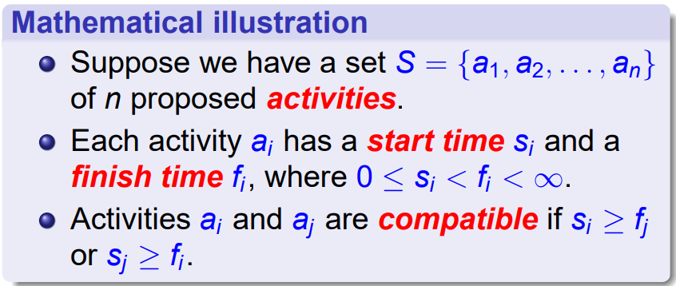

# Greedy Algorithm

When we are facing some multi-phase choice problems(like dp),
 
greedy algorithm tells us to do "current-optimal" choices, and hoping that we can get "global optimal" solution.

## Design and proof of a greedy algorithm

1. Choose a subproblem
2. Prove that choice is safe 
    + Prove that after every choice, there always exists a optimal solution

## Matroids

Ordered Pair $M = (S,\mathcal I)$

+ $S$: finite, nonempty set
+ $\mathcal I \subseteq 2^S$: hereditary(遗传的), if $A \in \mathcal I$, then for any $B \subseteq A$, $B \in \mathcal I$

Exchange property:

for $A, B \in \mathcal I$ and $|A| < |B|$, then there is some element $x \in B - A$ such that $A \cup \{x\} \in \mathcal I$.

Intuition: No "seam"

Extension: 

$x \not\in A$ is a extension of $A$ $\iff$ $A \cup \{ x \} \in \mathcal I$

Maximum property:

If $A$ has no extension, then $A$ is maximal.

!!!theorem "Theorem"
    All maximal independent subsets in a matroid has the **same** size.

### Weight Matroid

Every elemnt in $S$ has a weight, we use the function $w$ to represent it.

Definition on set: $w(A) = \max_{x\in A} w(x)$

### Graphic Matroid

$G = (V,E)$

1. $S_G = E$
2. $A \subseteq 2^E$, $A \in \mathcal I_G$ if and only if $A$ has no cycle(acyclic, forest)

### Transformation to greedy algorithm

Find the **maximum-weight independent subset** in a weighted matroid.

The "greedy" approach is right.

Intuitional proof of correctness:

+ If an element is not picked in the first place, then it won't be choosed afterward.

> 一方面：选择了 $x$ 之后，根据子集遗传的性质，$A - \{x\}$ 仍然是合法的独立集合。
> 
> 另一方面：刨除掉 $x$ 之后产生的 $A'$ 一定可以加上一个 $x$ 之后仍然是独立子集。

## Problems

### Activity Selection Problem

#### DP solution

...

#### Greedy Solution

!!!hint
    Consider $S_k = \{a_i \in S \mid s_i \geq f_k \}$ (start after $k$ finish) 
    
    The one with **earliest finish time** will be in some maximum-size subset of mutually compatible activities of $S_k$

Intuitional Proof:

> Proof by contradiction(?).
>
> Change the first of activity

The result:

+ We reduce the size of subproblmes.
+ We only need to consider one choice.(choose the first-finished task)

### Huffman Tree/Codes

+ Varibale-length 0/1 code;
+ Prefix-free codes 
    + The codes in which no codeword is also a prefix of some other codeword

Code method can be represented in a tree, like:

The tree had a cost, which is the total length of encoded text.

We want to **minify** that cost.

Correctness:

!!!theorem 
    $C$ : alphabet, with frequency $c.freq$ for $c \in C$

    $T$ : tree, with optimal cost  

    From $C$ to $C'$:

    + choose two least frequent character $x,y$
    + $C' = C - \{x, y\} \cup \{ z \}$
    + $z.freq = x.freq + y.freq$

    Then we can construct $T$ from $T'$, by adding $x,y$ as two sons of $z$ in $T
    '$.

Intuitional proof: 

1. 在最优的树中，最小权值的两个结点一定是兄弟。
    + 用反证法
2. 这样的话，两个点和缩成一个点就是等价的；
    + 用反证法

### Task-scheduling problem(solved by using matroid)

Input:

+ $n$ unitary tasks $a_1, \cdots, a_n$
    + each with a deadline: $d_1, \cdots, d_n$
    + each with a penalty: $w_1, \cdots w_n$

Output:

+ minify the total penalty

Solution:

If there are two tasks,

+ 超时的在前面，没超时的在后面
+ 那么我们可以交换两者，前者仍然没超时，后者仍然超时
+ 所以我们一定可以找到最优方案，让某点前面都没超时，后面都超时了。

Construct Independent set $\mathcal I$. We have a no penalty schedule over $a \in \mathcal I$.

Easy to see this formed a matroid.

We want to find the maximum-weight independent set in $\mathcal I$

