# 多线程算法

## 多线程斐波那契数算法

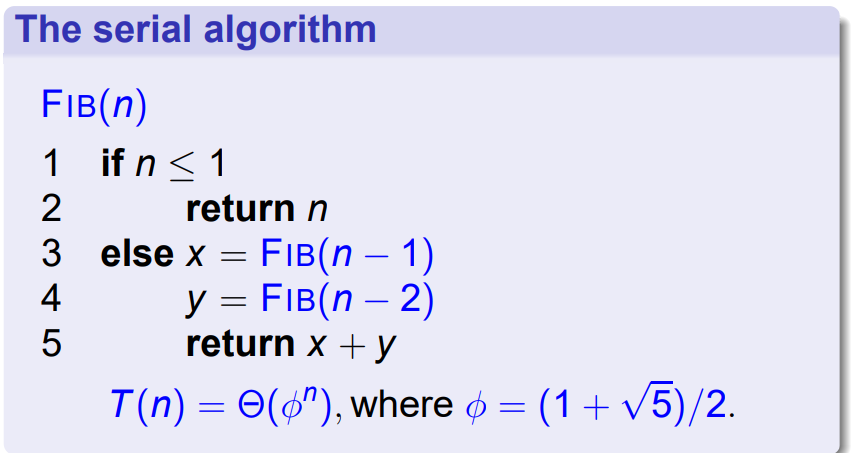

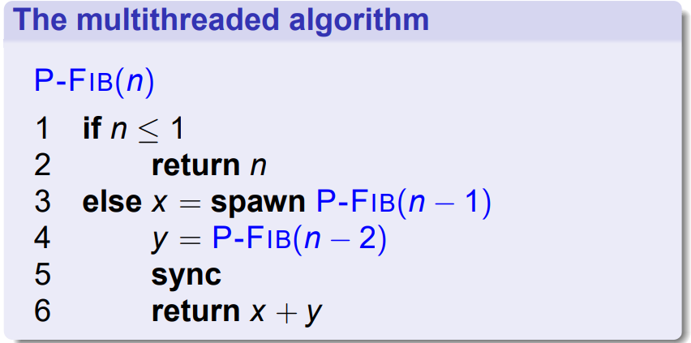


## 性能指标

1. 工作量(work): 在一个处理器时尚执行整个计算的总时间，记作 $T_1$
2. 持续时间(span): 有无限个处理器的时候，执行计算需要的时间，记作 $T_\infty$

!!!definition
    Work Law: $T_p \geq T_1 / P$ 

    Span Law: $T_p \geq T_\infty$

    Speedup: $T_1/T_p$

!!!definition
    Linear Speedup: $T_1/T_p = \Theta(P)$

    Perfect Linear Speedup: $T_1/T_p = P$

    Parallelism: $T_1/T_\infty$

!!!theorem
    Ideal parallel computer with $P$ processors, a greedy scheduler executes a multithreaded computation with work $T_1$ and span $T_\infty$ in the time 

    $$
    T_p \leq \frac{T_1}{P} + T_\infty
    $$

## Parallel Structure

### Parallel For

```c
parallel for 
    // ...
end for 
```

$$
T_\infty = \Theta(\lg n) + \max_{1 \leq i \leq n} iter_{\infty}(i)
$$

## 竞争

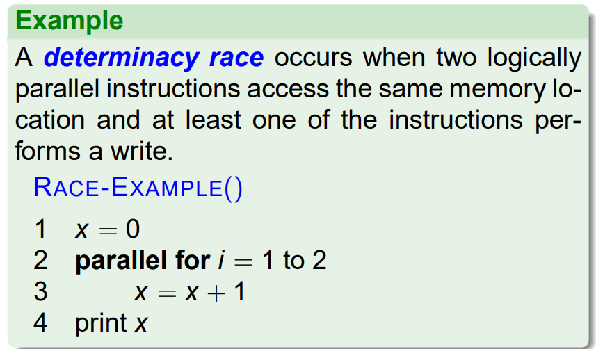

处理竞争：

1. 在 parallel for 里面用 new 来避免修改同一个变量
2. 在 spawn 和 sync 之间的代码应该是独立于其他线程的代码

## 多线程矩阵乘法

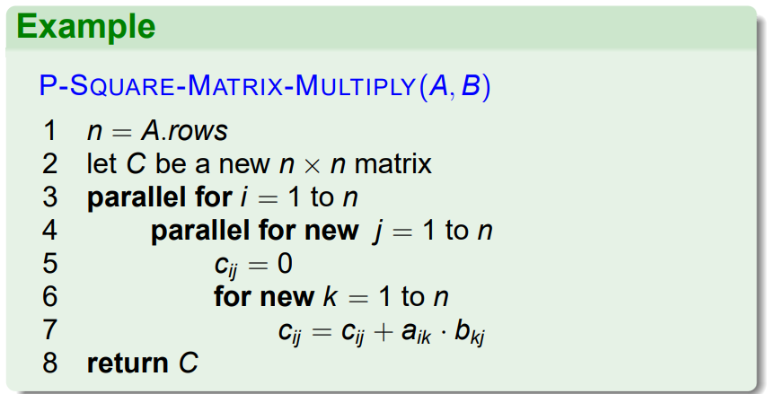

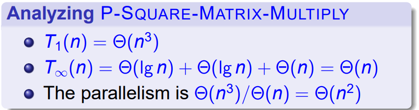

（分块分治的算法仍然有效）

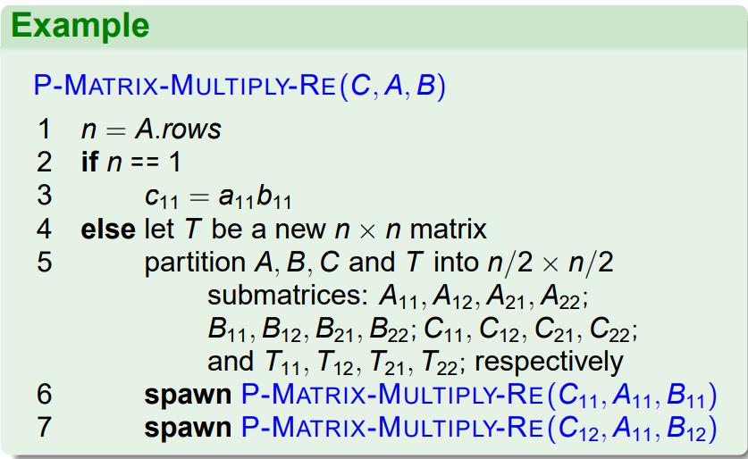
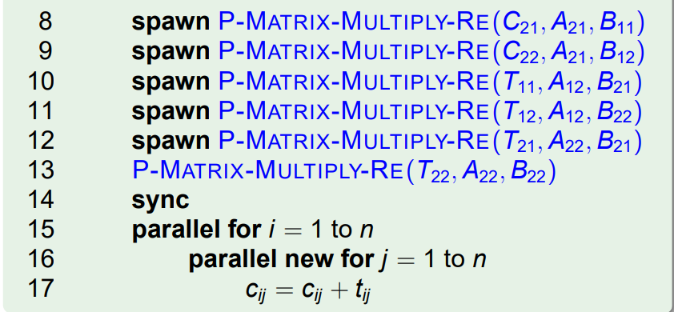

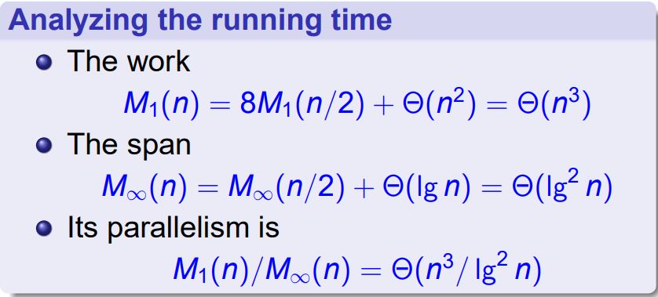

也可以采用 8 --> 7 的分块矩阵乘算法

## 多线程归并排序

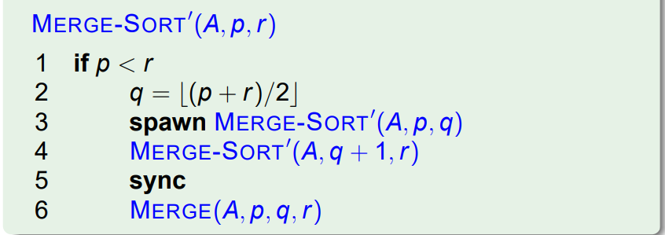

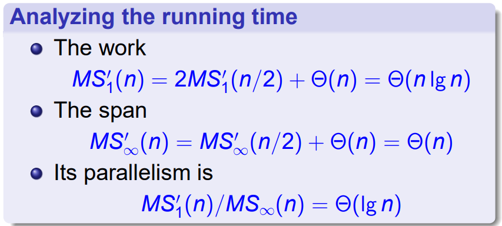

（多线程归并两个列表）

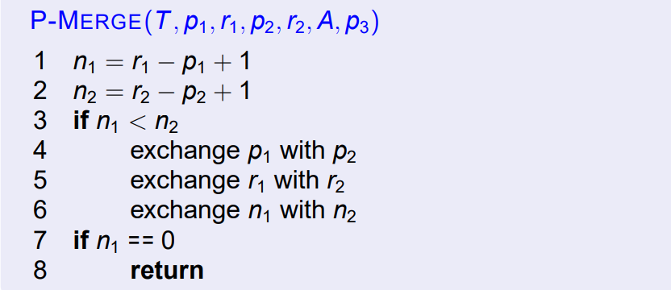
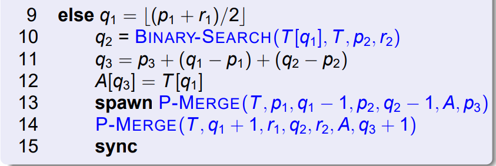

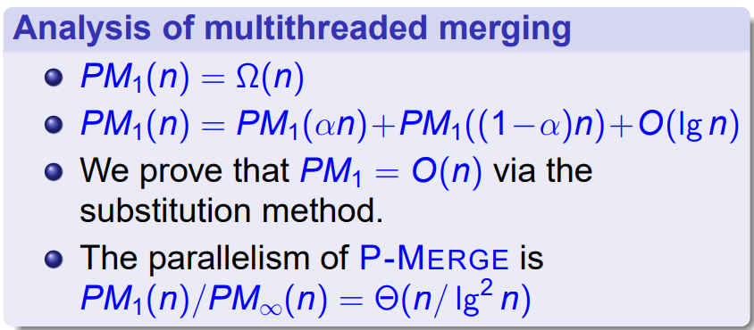

（有多路归并的版本）

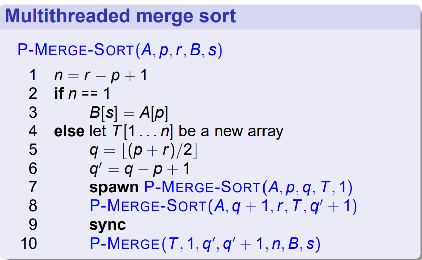

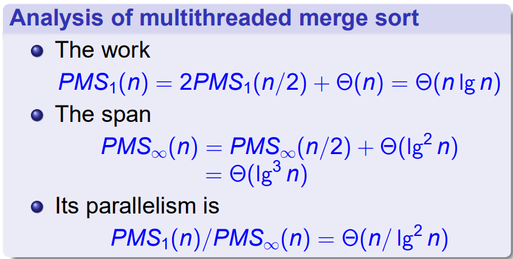