# Sorting Algorithm

Sorting is probably the most basic question in algorithm analysis

## Lower Bounds for comparing-based sorting

Input array $a_1, a_2, \cdots, a_n$

We assume that all elements are different.

We use Decision Tree to model our comparison sort.

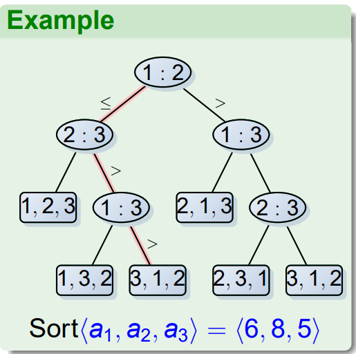

We view the algorithm as constructing a decision tree; and the running time is the length of path on that tree.

!!!theorem "Theorem: Any comparison sorts algorithm needs $\Omega(n \lg n)$ times of comparison."
    1. There are $n!$ leaves in the tree
    2. A binary tree of height $h$ has at most $2^h$ leaves

    So the decision tree with $n!$ should have height larger than $\lg(n!)$, which is $\Theta(n \lg n)$.

## Heapsort

### Binary Heap

A nearly complete binary tree.

Use array to implement tree structure:

+ parent(i): 
    + return $\lfloor i/2 \rfloor$
+ left(i):
    + return $2i$
+ right(i):
    + reutrn $2i+1$
+ height():
    + return $\lfloor \lg n\rfloor$ 

Every node $i$ has a value: $A[i]$. 

Min/Max heap properties:

+ The root node in a subtree has the min/max property in this subtree

> Or more explicit way: $A[parent(i)] \leq / \geq A[i]$

### Operations on a Max Heap

1. max-heapify(A, i): $O(\lg n)$
    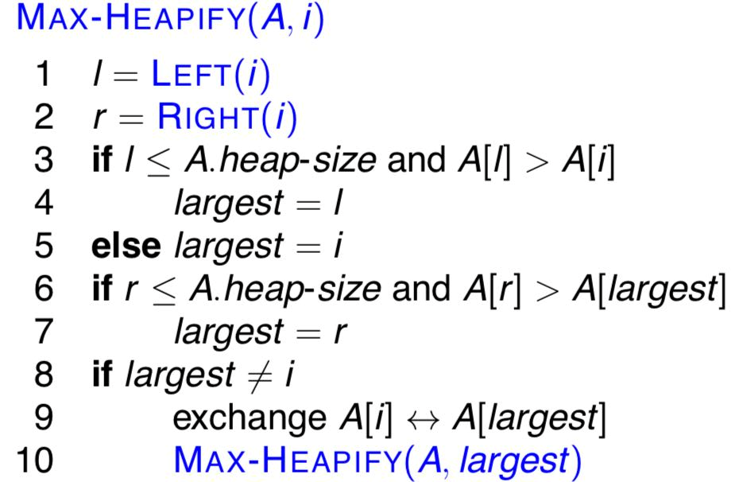
2. build-max-help(A): $O(n)$
    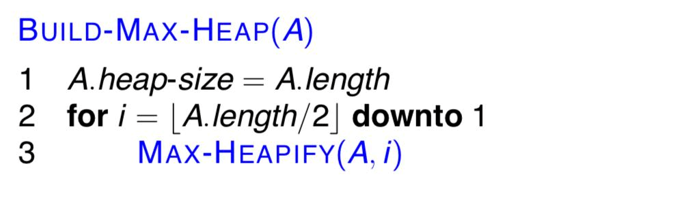
3. heapsort(A): $O(n \lg n)$ 
    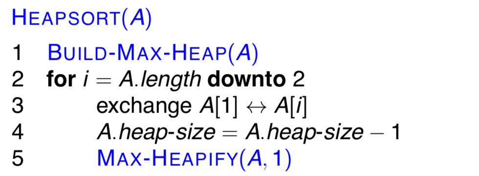

### By the way: Priority queue

A **priority queue** is a data structure for a set $S$:

+ each element has a "key"

Operations:

+ insert(S, x)
+ maximum(S)  
+ extract-max(S) 
+ increase-key(S, x, k) 

Implementation of max priority queue by using **max-heap**:

1. 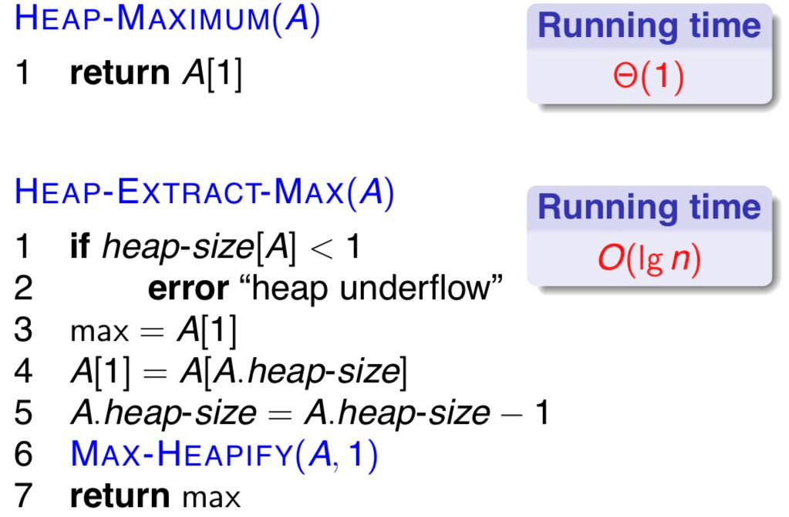
2. 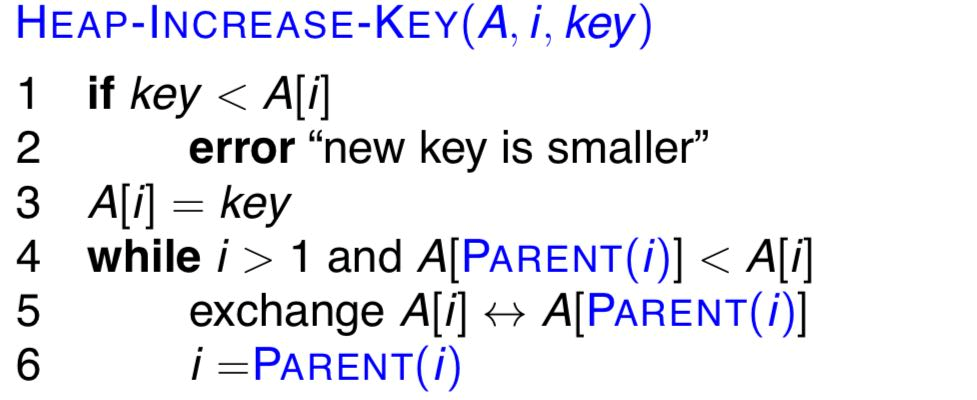
3. 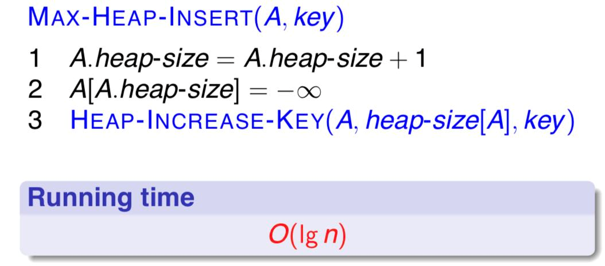
      
## Quicksort

1. Divide: use a pivot $A[r]=x$ to partition, lower part $\leq x \leq$ higher part
2. Conquer: recursively sort the two subarrays
3. Combine: Trivial

Worst Case: $O(n^2)$

Average Case: $O(n \log n)$

!!!hint "An Important Clue: Worst case is rare"
    Use **randomization**.      

### partition & randomize partition

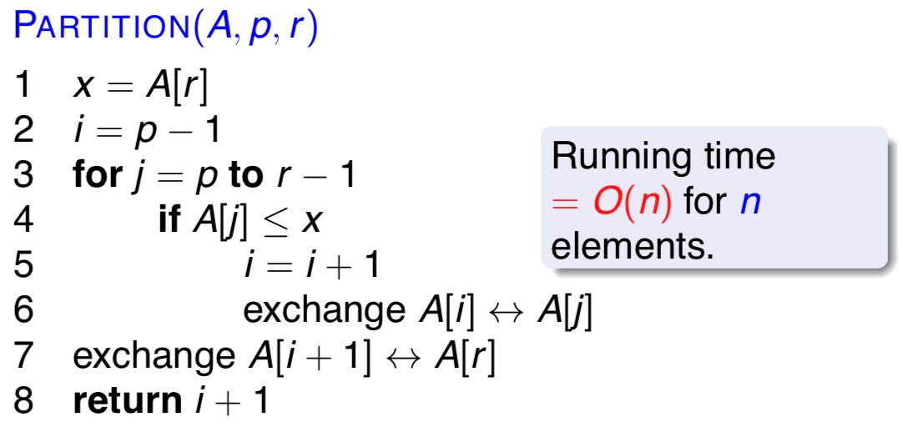

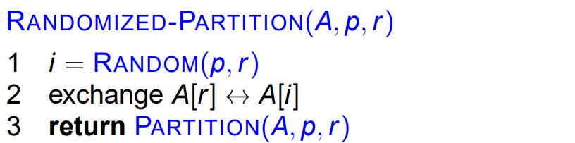

### Quick Sort & random quicksort

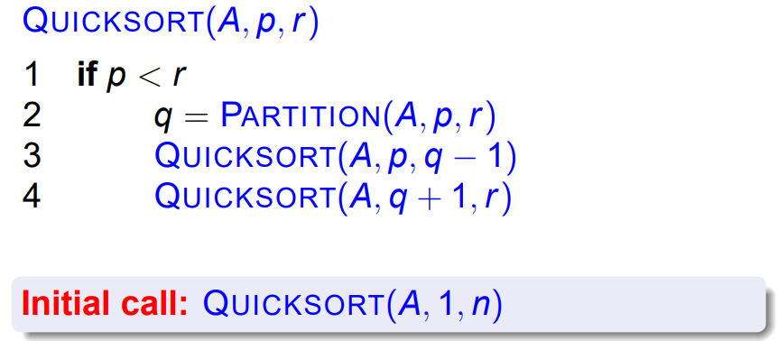

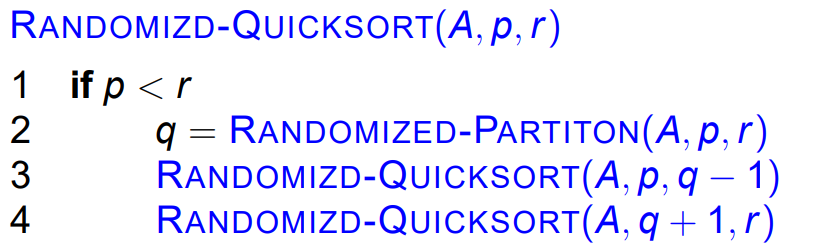

### Expectation Time

Method 1:

Use the recurrence of running time and then split it.

(Too complex.)

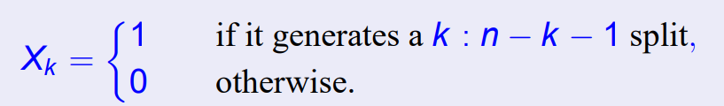
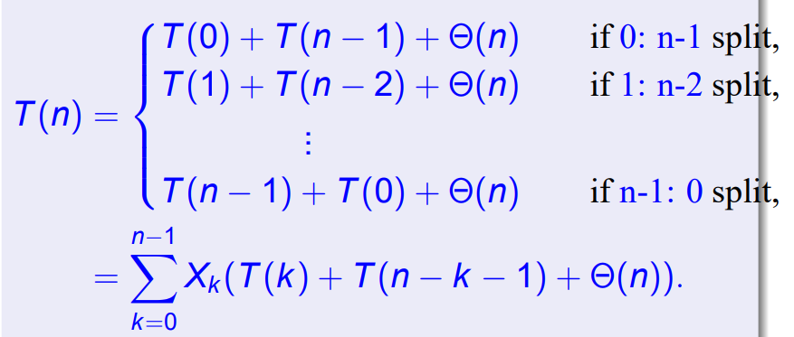
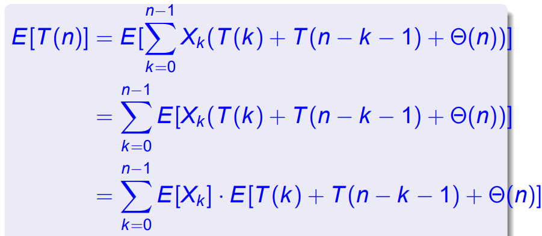

$E[X_k] = \frac{1}{n}$

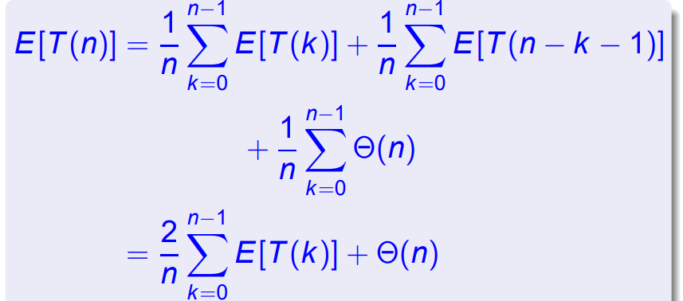
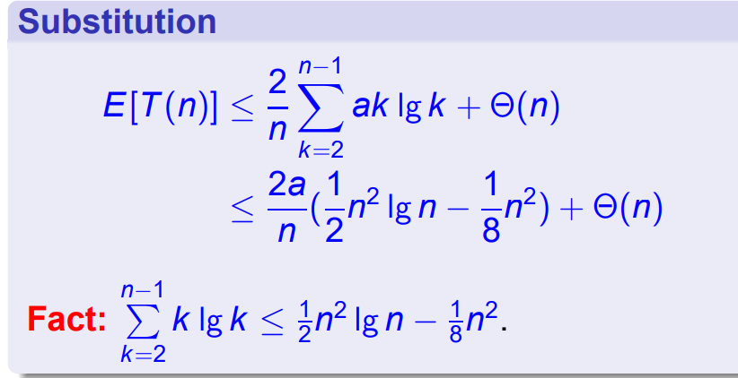

Method 2:

Count the number of comparisons performed during the partition, named $X$.

Let $X_{ij} = I\{z_i \text{ is compared with }  z_j\}$, then $X = \sum_{i < j}X_{ij}$ .

Calculate the expectation:

$$
\begin{aligned}
E[X] &= E[\sum_{i < j} X_{ij}] = \sum_{i < j} E[X_{ij}] \\
&= \sum_{i < j} Pr(\{z_i \text{ is compared with }  z_j\})\\
&=\sum_{i < j} \frac{2}{j-i-1}\\
&=\sum_{i=1}^{n-1} \sum_{k=1}^{n-i} \frac{2}{k+1}\\
& \leq \sum_{i=1}^{n-1}\sum_{k=1}^n \frac{2}{k} = \sum_{i=1}^{n-1} O(\lg n) = O(n \lg n)
\end{aligned}
$$

## Linear Time Sort

### Counting Sort

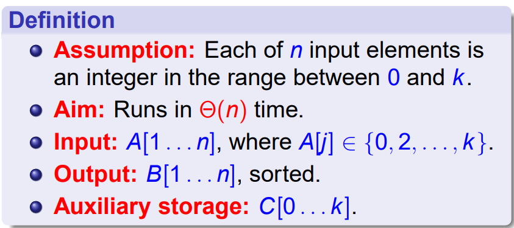
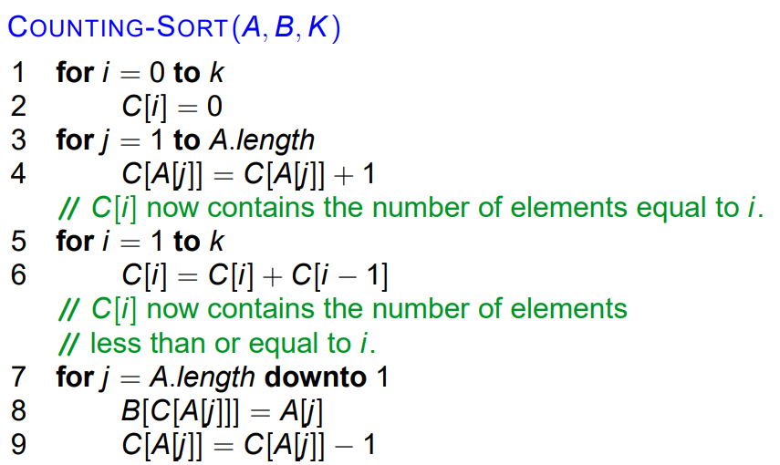

(Actually Runs in $\Theta(n+k)$)

### Radix Sort

**Digit**-by-**Digit** sort.

!!!hint inline end
    "**Digit**" can be very large!

Idea: Sort on least-significant **digit** first with auxiliary **stable** sort(usually counting sort).

We choose $2^r$ as "digit". Suppose the number has $b$ bits, then $r$ should be equal to $\lfloor \lg n \rfloor$ to get $\Theta(bn/\lg n)$ sorting algorithm.

!!!note
    Since there are $b/r$ passes, we have: $$T(n,b) = \Theta(\frac{b}{r}(n+2^r))$$ to minify.

    We can pick $r = b$ to get a $\Theta(n)$ algorithm, and pick $r = \lg n$ to get a $\Theta(bn/\lg n)$ algorithm.

    However, they use different size of memory.

### Bucket Sort

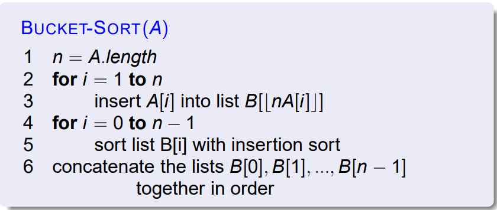
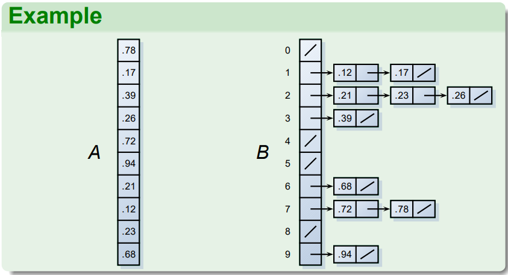

Expectation $\Theta(n)$ time. (On random data)

## Selection Question

**Input:** A set $A$ of $n$ distinct numbers and an integer $i$, with $1 \leq i \leq n$

**Output:** The element $x \in A$ that is larger than exactly $i − 1$ other elements of $A$. ($i$-th smallest element)

### Expected Linear Algorithm

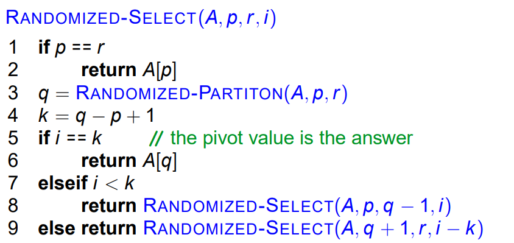

### Worst-case Linear Algorithm

(Choose pivot)
1. Divide $n$ elements into 5-elements' group. Total $\lceil \frac{n}{5}\rceil$ groups.
2. Find the median of each group. (Use insertation sort)
3. Find the median over the $\lfloor \frac{n}{5}\rfloor$
4. Use this median to partition

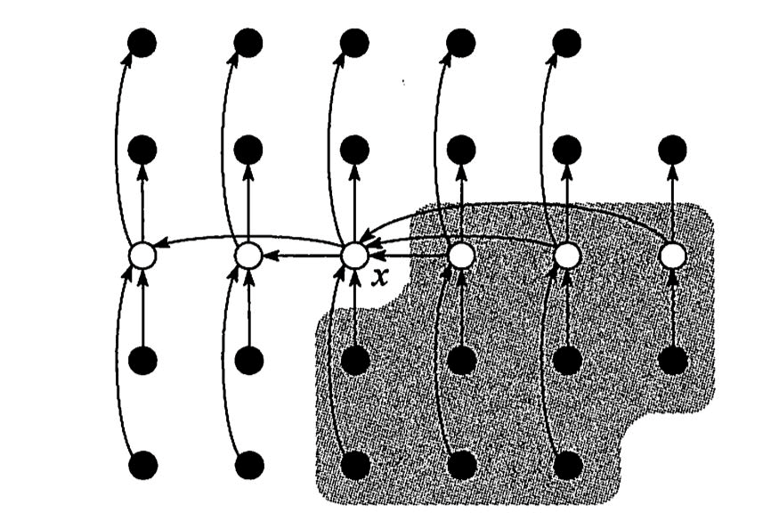

!!!hint
    It's easy to tell that this metthod won't give a too unbalanced partition.

Proof:

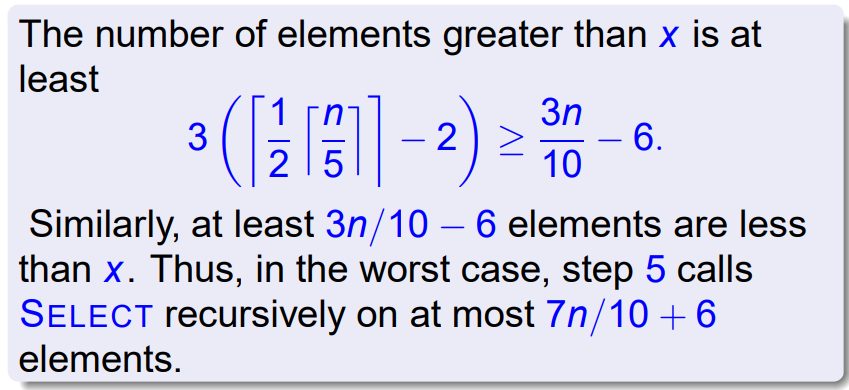
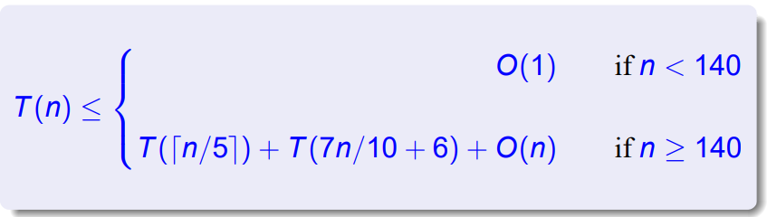
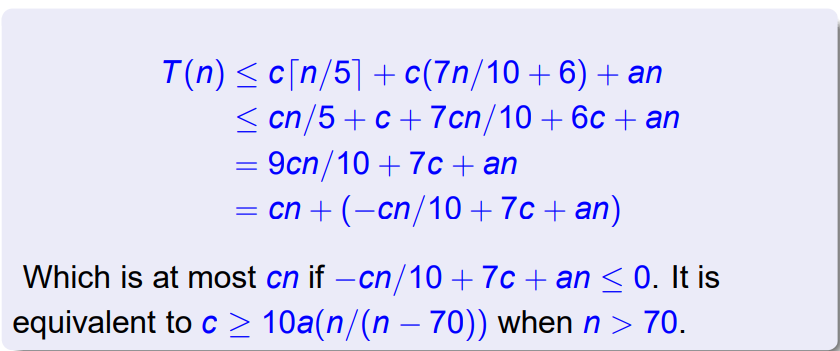

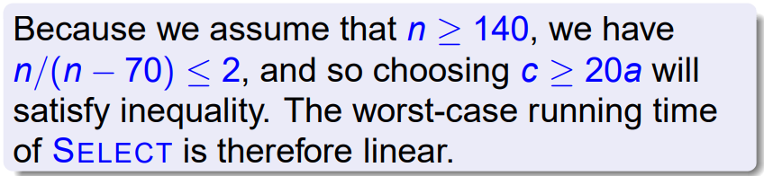