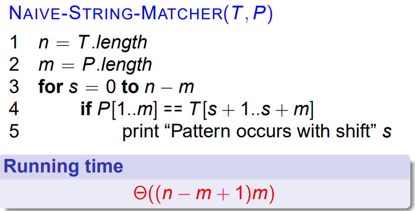
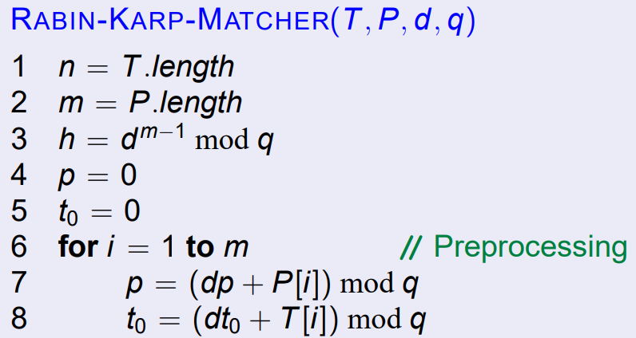
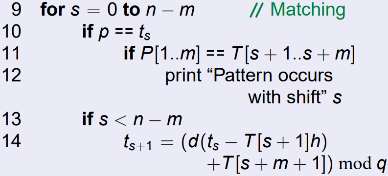
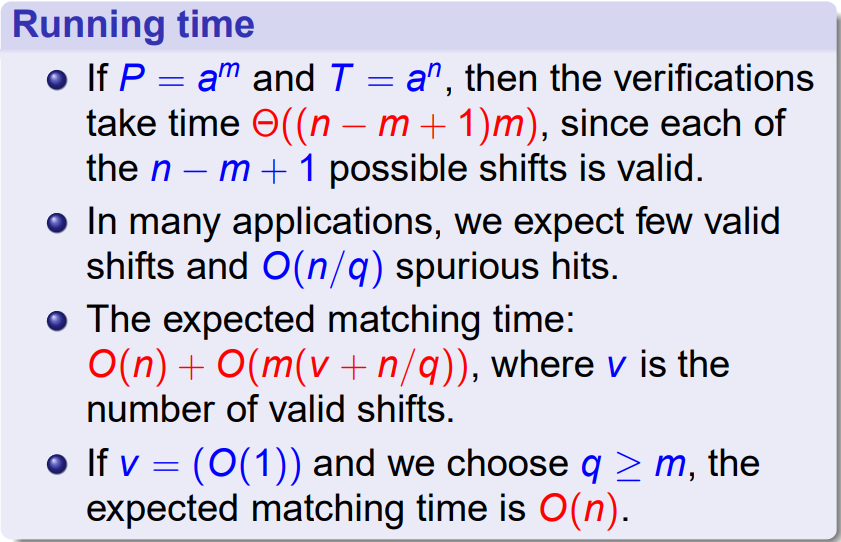

# 字符串匹配算法

## 记号与术语

$\Sigma$: 字母表

$\Sigma^*$: 所有字符串的集合

前缀：$w \sqsubset x$

后缀：$w \sqsupset x$

字符串：$P[1..m]$

子串：$P[1..k] = P_k$

## 后缀重叠性质

!!!theorem
    $x \sqsupset z, y \sqsupset z$.

    1. 若 $|x| \leq |y|$，则 $x \sqsupset y$
    2. 若 $|x| \geq |y|$，则 $y \sqsupset x$
    2. 若 $|x| = |y|$，则 $x = y$

## Naive String Match

## Rabin-Karp

多项式 Hash + 检测

## Finite Automaton

构造后缀函数 $\sigma$：

$\sigma(x) = \max\{k \mid P_k \sqsupset x\}$

$\delta(q,\text{a}) = \sigma(P_q\text{a})$

!!!theorem
    $\sigma(x\text a) \leq \sigma(x) + 1$

!!!theorem
    $\sigma(x\text a) =\sigma(P_{\sigma(x)}\text a)$

## Knuth-Morris-Pratt 算法

前缀函数 $\pi: \{1, \cdots, n\} \to \{0, \cdots, n-1\}$:

$\pi[q] = \max \{k \mid k < q \text{ and } P_k \sqsupset P_q\}$

计算：

闭包或多次迭代：$\pi^*[q] = \{\pi[q], \cdots, \pi^{(t)}[q]\}$，当 $\pi^{(t)}[q] = 0$ 时停止。

!!!theorem
    $\pi^*[q] = \{k \mid k < q \text{ and } P_k \sqsupset P_q\}$

    感性：一个类似链状的结构

!!!theorem
    $\pi[q] - 1 \in \pi^*[q-1]$

    感性：把两者的最后一个字符都去掉

!!!theorem
    $E_{q-1} = \{k \in \pi^*[q-1] \mid P[k+1] = P[q]\}$

    则 $E_{q-1} = \{k \mid k < q-1, P_{k+1} \sqsupset P_q\}$

    且

    $$
    \pi[q] = \begin{cases}0, E_{q-1} = \emptyset\\1 + max\{k \in E_{q-1}\}, E_{q-1} \neq \emptyset\end{cases}
    $$
    
    感性：如何扩展计算

KMP正确性 模仿 FAM

KMP 时间复杂度：$\Theta(n)$

## Boyer Moore