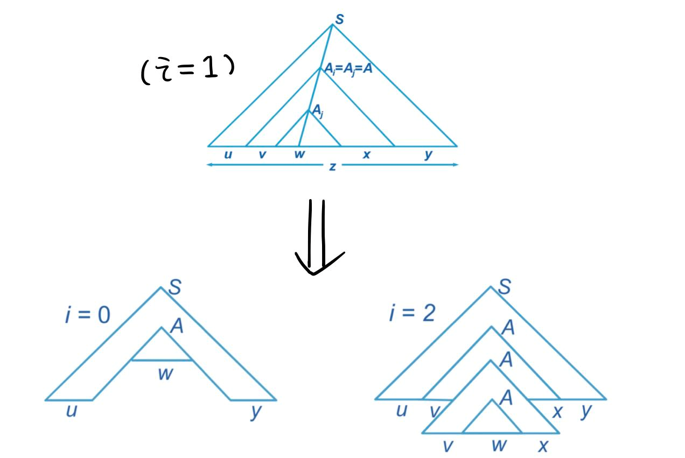

# 上下文无关语言的性质

## CFL 的泵引理

!!!theorem "CFL 的泵引理"
    设 $L$ 是 CFL，则存在常数 $n$，对任意 $z \in L$, $|z| > n$，$z$ 可以表示为 $z = uvwxy$，且满足：
    
    1. $vx \neq \epsilon$
    2. $|vwx| \leq n$
    3. 对任意的 $k \geq 0$ ， $uv^kwx^ky \in L$

证明：

1. $L = \emptyset$ 或 $\{\}$ 时，结论显然成立。

2. 我们考虑构造语言 $L - \{ \epsilon \}$ 对应的 CFG $G = (V,T,S,P)$ 的 CNF 形式。

若 $|z| \geq m = 2^m$ 则分析树的高度至少为 $m+1$，则在分析树的最长路径中必然有相同的变量。

> 感性来理解，下面小的生成可以用上面大的来替代，$v$ 和 $x$ 就可以无限扩张。

如图所示。

### 证明不是 CFL 的步骤

1. 选取任意的正整数 $n$
2. 找一个字符串 $z \in L$，满足 $|z| > n$
3. 对于任意的划分 $z = uvwxy, vx \neq \epsilon, |vwx| \leq n$ 
4. 找到 $k \geq 0$，使得 $uv^kwx^ky \not\in L$

!!!example "例：证明语言 $L_{012} = \{0^k 1^k 2^k \mid k \geq 1\}$ 不是 CFL"

!!!example "例：证明语言 $L = \{ww \mid w \in \{0,1\}^*\}$ 不是 CFL"

## CFL 的闭运算

并、闭包、连接、反转运算都保持 CFL 性质。

### 并运算

加入一条 $S \to S_1 \mid S_2$ 即可。

### 闭包运算

加入一条 $S_1 \to S S_1 \mid \epsilon$ 即可。

### 连接运算

加入一条 $S \to S_1S_2$ 即可

### 反转运算

把每一个产生式右侧反转。

## CFL 的同态运算

!!!definition "定义：CFL 的替换"

    $\Sigma$ 是字符集，$\mathcal 定理L$ 为语言集合。 

    替换：$s: \Sigma \to \mathcal L$ 

    替换拓展：$s : \Sigma^* \to \mathcal L$，定义为 $s(w) = s(a_1 \cdots a_n) = s(a_1) \cdots s(a_n)$

    CFL 的拓展：$s(L) = \bigcup_{w \in L} s(w)$

!!!theorem "定理：CFL 的替代运算"
    若 $L$ 是 $\Sigma$ 上的 CFL，则 $s(L)$ 是一个 CFL .

