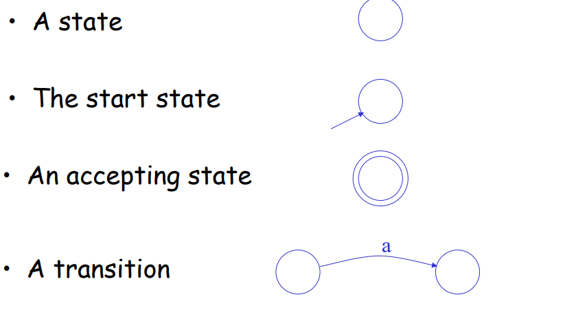

# 形式语言与自动机前置知识

## 文法

用有限严格定义的的规则和描述**生成**一门语言（很可能是无穷）的所有句子（？）；同时对应到自动机去**识别**这种语言的句子。

###  术语

字母表（Alphabet）$\Sigma$ ，是有限的“符号”的集合

在 $\Sigma$ 上的串（String）$s$ ，是一个有限的符号的序列。（$\varepsilon$ 代表空串）（$|s|$ 表示串 $s$ 的长度）

前缀、后缀、子串、子序列

### 文法的形式化定义

一个文法定义为四元组 $(V_N,V_T,P,S)$ ，其中

+ $V$ 是“词汇表”，划分（$V = V_N \cup V_T, V_N \cap V_T = \emptyset$）为：
    + $V_N$ 是**非终结符号**集；
    + $V_T$ 是**终结符号**集；
+ $P$ 是**规则**集（什么是规则？）；
+ $S$ 是“开始识别符号”，必然是非终结符号；必须在某条规则的左部分出现。

注：

+ $V_N,V_T, P \neq \emptyset$ 

### 规则

也被称为重写规则、产生式、生成式

写作 $\alpha \rightarrow \beta$ ，$\alpha$ 是 $V$ 上**非空**的串（$V^+$），$\beta$ 是 $V$ 上任意的串（$V^*$）。

$\alpha$ 称为左部， $\beta$ 称为右部。

### 推导

直接推导：对给定的文法，若 $v,w$ 满足：$v = \gamma {\color{red}{\alpha}}\delta$, $w = \gamma {\color{red}{\beta}}\delta$  ；且 $\alpha \rightarrow \beta \in P$  ，则称 $v$ 直接推导（归约）到 $w$ ，记作 $v \Rightarrow w$ 。

间接推导：若干步（可以是 $0$）直接推导，记作 $v \Rightarrow^* w$

规范推导：最右推导【对最右侧的非终结符号进行替换】【得到规范句型】

## 语言

在 $\Sigma$ 上的语言（Language）$L$ ，就是所有串构成的集合的某个子集。

### 文法与语言的关系

有文法 $G(V_N,V_T,P,S)$ 生成的语言记作 $L(G)$ ，定义为 $L(G) = \{x | X \Rightarrow^* x, x \in {V_T}^* \}$ （$x$ 是**只包含终结符**的串）

文法 $G$ 的**句型**：从 $S$ 生成的，**可以包含非终结符**的串。

文法 $G$ 的**句子**：从 $S$ 生成的，**只能包含终结符**的串。

文法的等价：$L(G_1) = L(G_2)$ 

## 分类

| 文法 | 特点 / 约束 $\alpha \rightarrow \beta$                       | 限制                                     | 生成的语言     | 自动机                 |
| ---- | ------------------------------------------------------------ | ---------------------------------------- | -------------- | ---------------------- |
| 0 型 | $\alpha \in V^+$ , $\beta \in V^*$                           | 没有限制                                 | 0 型语言       | 图灵机                 |
| 1 型 | $len(\beta) \geq len(\alpha)$ ，除了 $S \rightarrow \varepsilon$   | 长度不会变短                             | 上下文有关语言 | 非确定性线性有界自动机 |
| 2 型 | $\alpha \in V_N$                                             | 左侧为 $1$ 个非终结符                    | 上下文无关语言 | 非确定的下推自动机     |
| 3 型 | $A\rightarrow aB$ 或 $A \rightarrow a$  $A,B \in V_N, a \in {V_T}^*$ | 最多一个非终结符号，在最右侧【线性文法】 | 正则语言       | 有穷自动机             |

范围从 0 型到 3 型 逐渐缩小。

注：程序设计语言可以用上下文无关文法完全描述。

## 其他

### 语法树

根节点是文法的开始符号 $S$ ；

每个内部节点都是**非终结符** $A$ ；

每个内部节点 $A$ 的所有儿子节点，从左到右为 $A_1, \cdots,A_n$ ，那么 $A\rightarrow A_1 \cdots A_k$ 为 $P$ 中的一条规则。

结果：叶子节点从左往右读取，构成一个“句子”

注：语法树与推导的**过程**一一对应；但不与推导的**结果**一一对应。这被称为二义性。

### 二义性

文法二义：句子对应两个不同的语法树；句子对应两个不同的规范推导（最右推导）。（这两个有什么区别？）

语言先天二义：每一个文法都是二义的。

### 一些简化

去除有害规则（$U \rightarrow U$）和多余规则（任何推导都不会用到）

去除不可到达的非终结符（不出现在任何规则右部的） 和 不可终止的非终结符（不能推导出终结符号串）

$\varepsilon$ 规则（没看懂），意思就是无关紧要，可加可删。

## 自动机

### 非确定性有限状态机（NFA）

$(S,\Sigma,S\times(\Sigma \cup\{\varepsilon\})\to 2^S,S_0,F\subseteq S)$

### 确定性有限状态机（DFA）

$(S,\Sigma,S\times\Sigma\to S,S_0,F\subseteq S)$