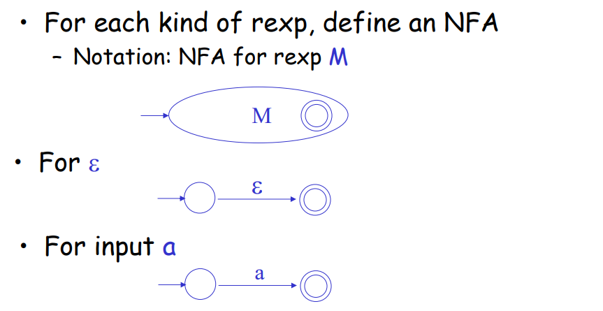
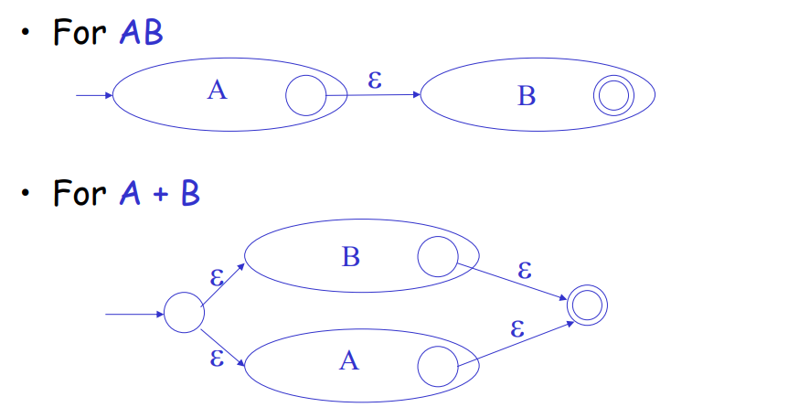
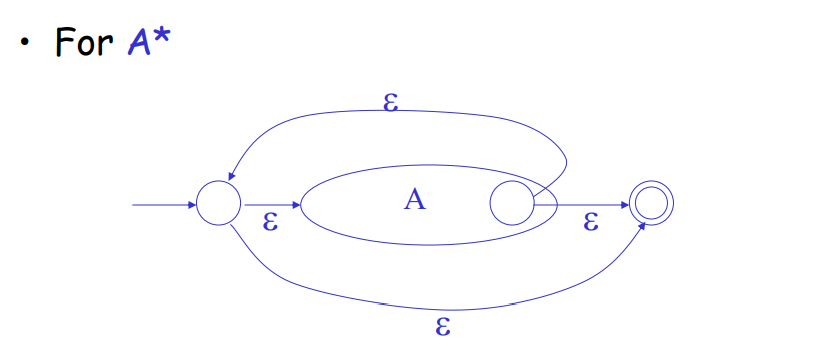

# 词法分析（Lexical Analysis）

词法分析的目标：从字符流（character stream flow）生成 词法单元流（token stream）

## 分离词法语法的好处

1. 让概念模型更加简单
2. 让编译效率更高
3. 增强了可移植性

## 概念

词法单元（token）：包括 【词法单元名，（可选的）属性值】，概念性的东西

词素（lexeme）：词法单元对应的串的集合

模式（pattern）：描述词素集合的规则（并不同于上面形式语言推导规则），而是用正则表达式刻画

## 正则定义（Regular Definitions）与正则表达式（Regular Expression）

### 正则表达式

原子正则表达式： `'c' = {"c"}` ，`\varepsilon = {""}`

并：$A+B = \{s \mid s \in A \vee s\in B\}$ （课件中用的 A ｜ B ）

连续：$AB=\{ab \mid a \in A \wedge b \in B\}$

闭包（？）：$A^* = \bigcup_{i\geq 0} A^i$ 

注：简写 

+ $A^+ = AA^*$ （一个以上） 
+ $A? = \varepsilon \mid A$ （零到一个）
+  $[a-z]='a'\mid  ... \mid 'z'$ （范围）

### 正则定义

$d_1,\cdots,d_n$ 是 $n$ 个不同的 （token）名称，$r_1, \cdots, r_n$ 是 $n$ 个在 $\Sigma \cup \{d_1,\cdots,d_n\}$ 上的正则表达式。

以下的 $n$ 条定义：

$$
\left\{
\begin{aligned}
&d_1 \to r_1\\
&\cdots\\
&d_n \to r_n
\end{aligned}
\right.
$$

## 正则语言的自动机表示

### $\varepsilon$-NFA 表示

基本元素：

操作：

### NFA 转换成 DFA

本质思路：假装有很多状态在 NFA 上走，令 NFA 上“可能到达的状态的集合”作为 DFA 的状态

重要的概念：$\varepsilon$ 可达（就是后面的闭包），也就是只走 $\varepsilon$ 边能够到达

DFA 的状态：NFA 状态集合的子集（除了空集），也就是幂集的元素（最多 $2^N-1$ 个）

DFA 的开始状态：NFA 开始状态的 $\varepsilon$ 可达的集合

DFA 的状态转移：考虑 $\varepsilon$ 转移边，在 $S$ 对应的 NFA 状态集合的每一个状态都走一下。

## DFA 的表实现

密集的话用矩阵，稀疏的话用邻接表。

完全是图论和自动机的知识了。