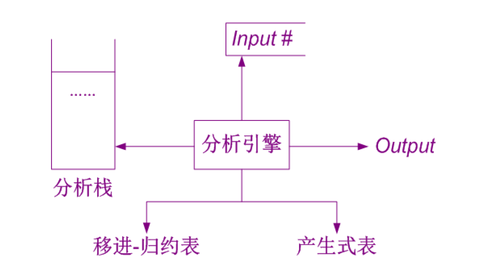

# 句法分析（Syntax Analysis）

使用上下文无关文法

核心：针对 上下文无关文法的句型分析

输入：词法单元流；输出：抽象语法树

其他功能：报告语法错误

## 自顶向下分析

### 基本思想

1. 从文法开始符号开始推导

2. 每一步都获得文法的一个“句型”（通过对句型中的某个非终结符进行扩展）

3. 最终产生期望的句子

在第二步中可能产生的两类不确定性：

1 选择哪一个非终结符；2 选择哪一个产生式

分析成功的结果：得到一个推导

### 带回溯的自顶向下分析

说人话：DFS 嗯搜

每次都选择最左侧的非终结符（消除了第一类不确定性），任选一个推导展开（在第二类不确定性面前躺平）。

原理：合法的表达式至少有一个最左推导。

缺点：

1. 不能处理左递归。

2. 复杂度很差。

### 预测分析(lookahead)

可能需要向前看若干个token，从而确定采用哪一个推导展开。

问题：

1. 还是无法处理左递归。
    1. 可以消除左递归
2. 有大量左侧公因子（`abCD` 与 `abEF`）时候预测失效。
    1. 可以消除左侧公因子
    1. 有非终结符的公因子的时候甚至可能因为非终结符可以无限展开而无法预测分析

## LL(1) 分析

L：从左到右扫描，L：产生最左推导，1：表示仅仅向前查看一个 token 。

要求语言可以用 LL(1) 文法，具体由下面的 First 和 Follow 集合约束。

下面讨论一个上下文无关文法：$G = (V_T,V_N,P,S)$ 。

First 集合关注的是某个符号如果不变成空（或者后面没有东西才变成空），他能推出什么。

Follow 集合关注的是某个符号变成空之后，那么下一个终结符号是什么。

### First 集合

$\text{First}(X) = \{ t \mid X \Rightarrow^* t \alpha\} \cup \{\varepsilon \mid X \Rightarrow^*\varepsilon\}$ 。

（$t \in V_T$ ，是终结符）,  $\text{First}(X) \subseteq V_T \cup\{\varepsilon\}$

直观理解：$X$ 可以推导出所有的可能的句子中的**第一个终结符号**的集合

构建算法：

1. $\text{First}(t) = t$
2. $\varepsilon \in \text{First(X)}$ ，当
    1. $X \rightarrow \varepsilon$ 或者
    2. $X \rightarrow A_1\dots A_n$ ，且 $\varepsilon \in \text{First}(A_i), \forall 1 \leq i \leq n$
3. $\text{First}(\alpha) \subseteq \text{First}(X)$ ，当
    1. $X \rightarrow A_1 \dots A_n\alpha$ 且 $\varepsilon \in \text{First}(A_i), \forall 1 \leq i \leq n$ 【其实，$i = 0$ 应该也是成立的...吧】

直观感受：就是有可以推导成空的就往后走，否则就取当前的 $\text{First}$ 集合。

### Follow 集合

$\text{Follow}(X) = \{t \mid S \Rightarrow^* \beta X t \delta\}$

直观感受：从 $S$ 开始推，到 $X$ 后面的第一个终结符可能是什么。【什么都没有的结束符号】

构建算法：

1. $\ \in \text{Follow}(S)$
2. 对于 $A \rightarrow \alpha X\beta$ ：$\text{First}(\beta) - \{\varepsilon\} \subseteq \text{Follow}(X)$
3. 对于 $A \rightarrow \alpha X \beta$ 且 $\varepsilon \in\text{First}(\beta)$ ：$\text{Follow}(A) \subseteq \text{Follow}(X)$ 。

直观感受（？）

### LL(1) 文法

背诵：【

对于 $G$ 的每个非终结符 $A$ ，若 $A \rightarrow \alpha \mid \beta$ ，满足：

1. First 集合不交；
    1. $\text{First}(\alpha) \cap \text{First}(\beta) = \emptyset$
2. 不会一个能推出空串，另一个的 First 和 A 的 Follow 相交。
    1. 若 $\beta \Rightarrow^* \varepsilon$ ，那么 $\text{First}(\alpha) \cap \text{Follow}(A) = \emptyset$ 。

】

性质：

1. 文法无二义性
2. 文法无左递归
3. 文法无左侧公因子

注：以上条件不是充分的。

### LL(1) 分析

核心思想：目前有目标串和用来生成的非终结符号。

当你看到目标串的一个终结符号，就能知道用非终结符号的哪个产生式，（才有可能产生最终的目标式）。

#### 递归下降

```cpp
void parseS(){
	switch(lookahead){
        case 'a': // a \in First(A), S -> AaS
            parseA();
          	matchToken('a');
           	parseS();
            break;
        case 'b': // ...
            // ...
            break;
        case 't': // means S --> \varepsilon
            // t is in Follow(S)
            // actually impossible
          	break;	
        default: // not a match
            printf("syntax error");
            exit(0);
    }   
}
```

#### 表驱动 

利用预测分析表 + 下推（？）栈实现

表的构造方法：

如果有 $A \rightarrow \alpha$ 的规则：

1. 对于 $t \in \text{First}(\alpha)$ ，就有 $T[A,t] = \alpha$ 

2. 若 $\varepsilon \in \text{First}(\alpha)$ ，那么对于 $t,\ \in \text{Follow}(A)$ ，就有 $T[A,t] = \alpha$ 

（每个 $T[A,t]$ 不能被填两次（二义性），没有填的位置就是出错）

以上的构造可以同 LL(1) 文法的性质联系起来。

算法实现：

1. 维护一个栈，加入 $\#$， 加入非终结符号 $S$ （栈要从上往下读）；维护指向目标串某个位置的指针（记录分析到的位置，用于 lookahead）
2. 进行以下循环
    1. 如果栈顶是终结符，则和目标串进行匹配；弹栈和向右移动指针
    2. 如果栈顶是非终结符号，则根据 lookahead 的结果**选择一个产生式展开**，把结果按照**正确的顺序**放回栈
3. 直到栈空，且指针已经指到最后一位

### 文法变换

有可能能将一个非 LL(1) 文法转换为一个 LL(1) 文法。

#### 左递归消除

【当然，不能成环： $A \rightarrow A$ ，否则谁也救不了】

直接左递归的消除：

$P \rightarrow P\alpha_1 \mid \cdots \mid P\alpha_m \mid \beta_1 \mid \cdots\mid \beta_n$

改写为：

$P \rightarrow \beta_1 Q \mid \cdots \mid \beta_nQ$

$Q \rightarrow \alpha_1Q \mid \cdots \mid \alpha_m Q \mid \varepsilon$ 

直观理解：无论递归多少次，最后总要变成一个 $\beta$ 和若干个 $\alpha$ ，为了满足这个条件，我们就先搞出来一个 $\beta$ ，再用 $Q$ 的右递归生成 $\alpha$ 

间接左递归的消除：（需要无 $\varepsilon$ -产生式）

1. 对非终结符号（任意）排序；
2. 让每个非终结符号，任意的推导右部的，第一个非终结符号都在其排序顺序的后面（或者本身）；
    1. 对于非终结符号的顺序从小到大去执行。**【消除第 n 个的时候，第 1 至 n-1 个应该已经消除了左递归】**
    2. 如果在前面，把右部的第一个非终结符号推导（保留所有可能的推导！），直到不存在任何非终结符号或者只有本身
    3. 如果是本身，那么应用直接左递归的消除；新构建的符号放到最后。

【这块有点乱】

#### 提取左公因子

$P \rightarrow \alpha\beta_1 \mid \cdots \mid \alpha \beta_m \mid \gamma_1 \mid \cdots \mid \gamma_n$ 

转化为：

$P \rightarrow \alpha Q \mid \gamma_1 \mid \cdots \mid \gamma_n$

$Q \rightarrow \beta_1 \mid \cdots \mid \beta_m$

很符合直觉。多创建一个符号来处理左公因子，多走一小步。

### 应急错误处理

如果 lookahead 在表里查不到就会错误；

处理方法：丢掉 lookahead，往下走指针，直到能找到。

## 自底向上分析

### 基本思想

从终结串开始进行规约；

每一步规约：

+ 在当前串中找到与产生式的右部相匹配的子串【找哪一个子串，使用哪一个产生式都是不确定性】
+ 用该产生式的左部来替换该字符串。
+ （失败另说）

直到规约到文法开始符号。

优点：功能强大

缺点：构造较为复杂

###  移进-规约分析

减少不确定性。

+ 使用最左规约（等价于最右推导）
    + 扫描线：移进

减少失败的复杂度。

+ 使用可规约串（就是下面提到的句柄）

### 基本概念

#### 句柄 = 可归约串

对于文法 $G(V_N,V_T,P,S)$ 而言：

$S \Rightarrow^*_{rm} \alpha A \beta$ 且 $A \rightarrow \gamma$ ，则称 $\gamma$ 是**右**句型【仅有最右推导】 $\alpha \gamma\beta$ 相对于非终结符 $A$ 的句柄。【注意，$\beta \in {V_T}^*$，也就是句柄一定是最右侧的推导】

注：句柄不唯一 $\Leftrightarrow$ $G$ 是二义文法，右句型的最右推导有多个

#### 项目

是...更复杂的状态，在不同的分析方法有不同的体现

附加了更多的信息，具体再说

#### 活前缀

$S \Rightarrow^*_{rm} \alpha A \beta$ 且 $A \rightarrow \gamma$ ，则 $\alpha \gamma$ 的任何前缀都是活前缀

翻译：任何右句型的前缀；也就是我们规约过程中可能且仅可能出现的前缀；一个活前缀规约完成之后仍然是活前缀

#### 拓广文法

对于起始符号 $S$ ，新建一条规则 $S’ \rightarrow S$ 。

这样的话，新的起始符号 $S'$ 就不会出现在任何规则的右侧。

### 实现

完整的流程是 `[  |w] --> [S|  ]`（这个就叫格局），通过：

1. 扫描线的不断右移
2. 对紧邻扫描线左侧的子串，采用某个规则进行规约

达成。以上两者被称为动作（Action）。

我们需要决定的动作的序列是什么。

#### 数据结构

模拟以上流程，使用以下的两个结构：

+ **自动机**，作用是识别当前左侧前缀句柄。
    + 具体实现上，其状态是对应方案的“项目”的集合。

+ **分析栈**，作用是记录符号串的移动、规约的过程。
    + 具体实现上，是记录自动机的状态过程。

#### 分析表

具体实现上，我们需要构造两个表格（虽然但是， GOTO 表格无需构造）

`ACTION[k,a]`：目前自动机在 $k$ 状态，下一个字符是 `a` ，需要采取的动作。 

+ `s1,s2,...` 扫描线右移(shift)，到达自动机的状态 1,2, ...（并更新分析栈）
+ `r1,r2,...`对紧邻扫描线左侧的子串规约，使用第 1,2,... 条规则（接下来需要用 GOTO 表）
+ Accept?(扫描完了，只有 `[I_0,#]` ) Rejected?(自动机上没有这个出口)

注：ACTION 表要考虑 `#` 字符

`GOTO[i,A]`: 在依 $A \rightarrow \beta$ 规约之后，自动机状态为 $i$ 时该做什么

+ 就走向 $i$ 状态对符号 $A$ 的出口 
+ 注：规约之后，分析栈会弹掉所有被规约的部分（也就是 $\beta$ 对应的各句法符号），这个时候需要再加入一个 $A$

### 格局

栈内容. 余留输入串

## LR分析



分析引擎可以共用，以下四种分析只是构造分析表的模式不同

## LR(0) 分析

### 项目

在某一个位置（可以在最左，可以在最右）有原点的产生式。

e.g. $A \rightarrow .xyz$ 或者 $A \rightarrow x.yz$ 或者 $A \rightarrow xy.z$ 或者 $A \rightarrow xyz.$  

注：圆点表示自动机读取串“目前已经处理到的位置”

注：圆点不在最左侧，内核项；否则非内核项（都可以通过内核项求一次闭包得到）。

【这里感性上可以用 $\varepsilon$-NFA 上的闭包和转移来理解，这是一种高效构造的方法】

### （状态）的闭包(closure)

`CLOSURE(I)`

构造：

```c
function CLOSURE(I）{ 
	J:= I;
    repeat for J 中的每个项目A -> a.Bb 和 产生式 B -> c
    	do 若 B -> .c 不在J中，则加 B -> .c 到 J 中
    until 上一次循环不再有新项目加到J中
    return J
};
```

【其实用 NFA 的 $\varepsilon$-边（展开的时候） + 闭包更好理解...】

感性理解：我在这个地方，对后面的符号可以进行递归的展开

### （转移）函数 GO

`GO(I,X) = CLOSURE(J)`

其中的 $J = \{A \rightarrow \alpha X.\beta \mid A \rightarrow \alpha.X \beta \in I\}$

直观感受：有点像用子集来表示的 DFA 的转移，把其中（能转移的）每一个状态都**分别**转移后再共同构成新状态（同时还要求个闭包）

### 构造

初态 $I_0 = \text{CLOSURE}(\{S' \rightarrow .S\})$ ；

根据初态，对所有的 $V_N \cup V_T$ 进行转移，得到新状态；

直到没有可以转移的。

【得到最后的状态集就是 “项目集规范族”】

自动机的语言就是所有活前缀的集合。

### 冲突

LR(0) 会产生规约-规约冲突，当某个状态拥有两个规约项目（点在最右侧）

LR(0) 会产生移进-规约冲突：当某个状态拥有规约项目和移进项目

## SLR(1) 分析

项目，自动机的状态（项目闭包）、转移函数都与 LR(0) 相同。

修改 `ACTION[k,t]` ，只有对于 $t \in \text{Follow}(A)$ 才允许用 $A \rightarrow \beta$ 规约。

### 问题

条件太强：并未考虑 $t$ 是否在**当前**（考虑了规约的）前缀【也就是 状态 k 对应的前缀】的 Follow 集合中。

### 文法

背诵！【

SLR(1) 文法的自动机中，每个状态都满足：

+ 对该状态的任何项目 $A \rightarrow u.av$ ，不存在项目 $B \rightarrow w.$ 使得 $a \in \text{Follow(B)}$  （移进 - 规约冲突）
+ 对任意的两个项目 $A \rightarrow u.$ 和 $B \rightarrow v.$ 满足 $\text{Follow}(A) \cap \text{Follow(B)} = \emptyset$ （规约 - 规约冲突）

】

## LR(1) 分析

解决方法：细化自动机的状态，也就是细化项目，往后看 1 个 token 。

### 项目

细化为：$A \rightarrow \alpha.\beta, t$  

注：

+ 这个 $t$ **仅对**形如 $A \rightarrow \alpha.,t$ 的（规约）项目有信息
    + 代表只有下一个输入是 $t$ 的时候**才能进行规约**
        + 显然，这样的 $t$ 是上文 SLR 分析中考虑的 $\text{Follow}(A)$ 的子集【且很可能是真子集】
+ 对其它的 LR(1) 项目，只是起到一个消息**传承**的作用
    + 其是在自动机项目求闭包的“递归”过程中实现

### （状态）的闭包(closure)

`CLOSURE(I)`

构造：

```c
function CLOSURE(I）{ 
	J:= I;
    repeat for J 中的每个项目A -> a.Bb,t 和 产生式 B -> c
    	do 若 B -> .c,d 不在J中，则加 B -> .c,d 到 J 中，其中 d \in First(bt)
    until 上一次循环不再有新项目加到J中
    return J
};
```

重点需要分析一波 $d \in \text{First}(bt)$ ：我希望在下一层的规约的时候，我看到下一个终结符 $d$ 和我上一层，我希望能够规约到的规则的在这个非终结符，后方的后缀是有可能匹配的。

### （转移）函数 GO

`GO(i,X) = CLOSURE(J)` 

`J = { [A->aX.b,t] | [A->a.Xb,t] }`

注意：后面的终结符不变

### 构造

初态 是 $\text{CLOSURE}([S' \rightarrow S, \#])$ 

### 分析表

差不多，需要考虑的只有：

>  $A \rightarrow \alpha.,t$ 的（规约）项目，只有下一个输入是 $t$ 的时候**才能进行规约**【也就是 ACTION[k,t] 】

## LALR(1) 分析

思路：合并一些状态，根据 逗号 前面的 “芯” 的部分。

结果：与 LR(0) 的状态一样多，分析力 SLR < LALR < LR

### 构造方法

1. brute force：把所有的 LR(1) 都算出来之后，合并同芯的状态；注：同芯的状态合并完成后仍然是同芯的。
2. step by step merging：没产生一个新状态，先判断是不是同芯的，如果是，就合并。

## 二义性文法的使用

可以规定优先级和结合性的情况下，构造出较为简单的 LR 分析器。