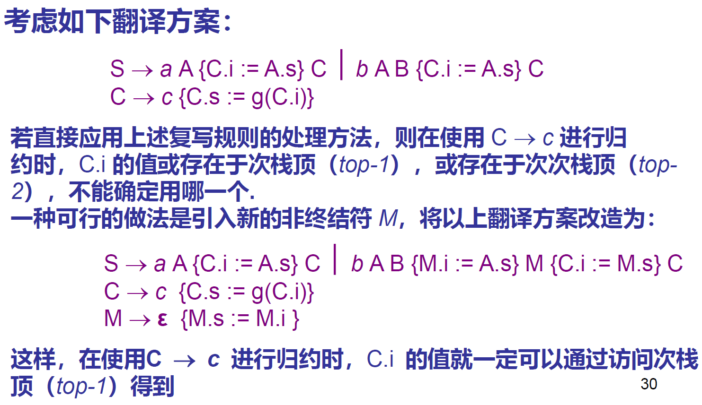
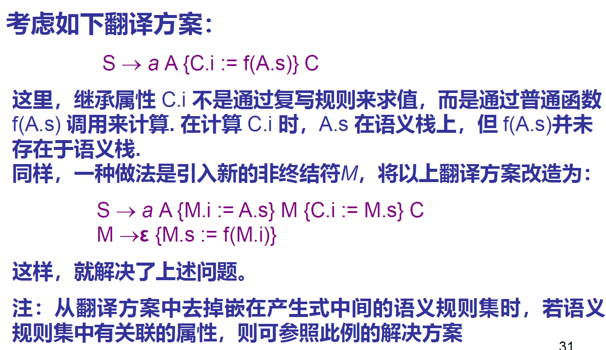

# 语法制导翻译（Syntax-Directed Translation）

## 语义处理概述

两项工作：

+ 静态语义分析
+ 中间(目标)代码生成

注：语义处理跨越了：

+ 分析和综合的两个阶段（分析阶段：理解源程序；综合阶段：生成等价目标程序
+ 前端和后端

### 语法制导的语义处理

应用语法制导定义（也就是说，在语法的基础上推导语义）

## 概念

语法制导定义（Syntax Directed Definition, SDD）

属性文法（Attribute Grammar）对上下文无关文法扩展如下：

+ 为**文法符号** 关联**属性**（attribute）
    + 我们关心的任何的“特性”，用 `x.a` 来访问文法符号 x 的属性 a
    + 两种属性：
        + 综合属性（自下而上传递）：语义规则中的 `b` 是**左部** `A` 的属性
        + 继承属性（自上而下传递）：语义规则中的 `b` 是**右部**某个文法符号 `X` 的属性
        + 这块定义比搅乱
+ 为文法的每个产生式关联若干**语义规则**【就是，这个属性怎么算，在产生式两端有什么联系】
    + 两种可能的语义规则（可能有更多）：
        + Copy 规则，形如 `X.a := Y.b`
        + 基于函数：`b = f(c1,c2,...,ck)` 

## 基于 SDD 的语义处理

(Syntax-Directed Semantic Process)

(Syntax-Directed Translation)

两种处理的方法：

1. 树遍历方法：单独遍历一次语法树进行属性的计算
2. 单遍的方法（on the fly 方法）：在语法分析生成语法树的同时进行属性计算

计算过程称为：对语法分析树的标注（annotating）或修饰（decorating）

### 树遍历方法

#### 步骤

1. 构造输入串的语法分析树
2. 构造依赖图
    1. 若该依赖图无环，就可以按照该图的拓扑序对分析树进行遍历
    2. 若该依赖图有环，这个 SDD 不是良定义的，我们不和他玩

#### 构造（依赖图的）算法

注意：这个是对于具体的一棵语法分析树而言的！而不是对于语法规则而言。

对于每一个语法规则 `b = f(c_1,c_2,...,c_k)` （如果没有左侧的 `b` 就把 f 当作 b ，所谓虚结点）：建立从 `c_k` 指向 `b` 的有向边。

### 单遍的方法(on the fly)

#### 适用范围

S-SDD：只包含综合属性

L-SDD：可以包括综合，也可以包括继承；但是：产生式右端文法符号的**继承属性**的计算 仅仅取决于 该符号**左边**的文法符号（包括产生式左部）【人话：就是 dfs 序在前呗】

注：S-SSD 是 L-SSD 的一个特例

#### 对 S-SSD：自下而上

采用 LR 分析技术的时候：

+ 扩充分析栈中的域(？)，形成语义栈来存放属性的值。【翻译：和分析栈同时搞一个语义栈，用来存放属性】

+ 计算左部文法符号的属性的值，正好发生在规约的时候

#### 对 L-SSD：后序遍历语法树

采用 LL(1) 文法的时候就可以。

【感性理解：在 LL(1) 递归的时候多插一步计算属性值】

## 语法制导的翻译方案

（Syntax-Directed Translation Scheme, SDT） 

【或者可以理解为...ANTLR 中语法规则对应的 action ？】

在产生式**内部**嵌入了程序片段

例如： `S -> {S.f = 1} B {S.f = S.f + 1} S_1 {S.v = B.v + S_1.v}`

### 限制——怎么放才合理

核心问题：需要保证每个属性在（动作中）被访问到的时候已经存在！

#### S-SDD 的限制

如果只有综合属性，那么都放在产生式末尾即可。

#### L-SDD 的限制

1. 产生式右部，某符号的继承属性计算，必须要放在**该符号之前**
2. 某个符号的计算规则都**不能**访问其**右侧符号的综合属性**
3. 产生式左部符号的综合属性的计算，放在产生式末尾。

## 根据翻译方案构建语法翻译程序

### 自上而下（L-SDD）

对每个非终结符 A ，构造函数：

+ 以继承属性为参数；
+ 以综合属性为返回值；
+ 函数体，通过产生式右侧（产生的目的和代码）构造：
    + 对终结符：match_token
    + 对非终结符号，递归调用，传继承参数，返回值更新继承属性
    + 对语义规则集（就是 `{...}` 里面的类似 code 的东西），直接 copy 到程序中来

### 自下而上

目标：将 L-SDD 语义规则转化为 S-SDD 

1. 去除在产生式内部的语义规则：
    1. 本质：想办法把这些移到最后
    2. 方法：加入一个形式的非终结符号 $N \rightarrow \varepsilon$ ，替代原来的规则的位置；并且将原来的规则移动到最后（如果有属性的话，可能需要用复写规则把属性拷贝回到上一层） 

2. 分析栈中的（就是，怎么说，平瞰？的）继承属性
    1. 注：这个命名是从结果来的，所以并不能说明什么
    2. 就访问就好
    3. 如果要规约 $A \rightarrow XY$ ，那么在试图规约 $Y$ 的时候，X 的综合属性已经被计算出来了；就可以使用这个来计算继承属性
3. 继承属性的模拟求值
    1. 需要保证继承属性可以通过某个文法符号的综合属性体现出来
    
    2. 
    
    3. 
   
      

## 静态语义分析

类型检查

作用域分析

控制流检查

唯一性检查

名字相关检查

利用符号表

# 符号表与运行时存储组织

## 符号表(Symbol Tables)

### 存储的内容

+ 符号名
+ 符号的类型
+ 符号的存储类别，存储分配
+ 符号的作用域/可见性（可以在组织中体现）
+ 其他属性：数组的内情向量，结构体的成员信息，函数和过程的形参列表

### 对符号表的操作

+ 创建
+ 插入：新的标识符的声明
+ 查询：引用标识符的时候进行
+ 修改：语义值（属性值）更改
+ 删除：标识符不可见、不需要的时候
+ 释放（符号表）

### 符号表的实现

数据结构：线性表、有序表，二叉搜索树，Hash 表

解决好不等长的名字、属性值的问题（采用...池，另外开辟空间存储，指针指过去就可以了）

#### 作用域规则

符号表的组织可以体现作用域规则

## 运行时存储组织

### 作用和任务

代码生成前如何安排目标机**资源**的使用

#### 数据表示

如何在目标机中对源语言变量的值进行表示。

例：

+ char 1 字节...
+ 指针 4/8 字节
+ 数组：连续的存储区
+ 结构/记录（？）：所有域存放在一块的存储区
+ 对象：变量放在一个块里面，成员函数放到代码区

#### 存储分配

不同类型的资源怎么布局，不同作用域的变量如何布局

典型的：（低）代码区-静态数据段-动态数据段（高）

策略：静态分配；动态分配（栈【层次、递归、嵌套】---> 活动记录（Action Record），堆【灵活】）【会有分配算法，最佳适应、最先适应、循环最先适应算法；会有碎片整理算法】

关于活动记录（栈帧）：

+ 内容：包括数据信息以及必要的控制信息（例如返回地址？）
+ 间接寻址：起始地址（ebp）+偏移量（offset）
+ 典型：低【临时工作单元 | 动态数据区 | 固定大小的局部数据区 | 控制信息 | 过程实际参数】高

如何访问嵌套的活动记录，从而访问非局部量（但何必呢？）：

1. 采用 Display 寄存器表：用寄存器存每一层的基址【新建一层的时候，一种是抄录，一种是只新建一个】【会使用很多寄存器】
2. 静态链（static link）：只保留一个寄存器指向当前 AR 的基础地址，每个 AR 维护一个域（也就是一个量...吧）；再从当前的 AR 链式查找之前的 AR 的基址【退出作用域的时候需要回卷，把 sp 抄一份】

#### 表达式计算

#### 过程实现