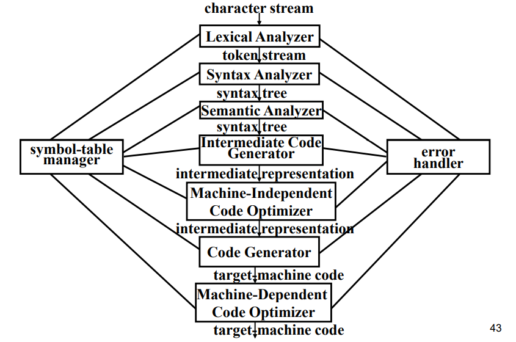

## 编译原理-绪论

### 为什么要学习编译原理？

### 编译与解释

| 编译程序                                           | 解释程序                                     |
| -------------------------------------------------- | -------------------------------------------- |
| 把 高级程序设计语言 转换成 低级程序设计语言 的程序 | 直接接受并运行高级程序设计语言的程序。       |
| 编译和运行是两个独立分开的阶段。                   | 一条条获取源程序语句。一旦分析完就开始运行。 |
| 会生成目标代码，不支持交互环境                     | 不生成目标代码，支持交互环境                 |

### 编译器的基本构造

| 前端包括：                                                   | 后端包括：                                                   |
| ------------------------------------------------------------ | ------------------------------------------------------------ |
| 词法和句法分析 符号表的创建 语义分析  生成中间代码 以上过程的错误处理 | （与目标机器相关的部分） （通常与源程序无关） 代码优化 机器代码生成 可能的错误处理和符号表 |