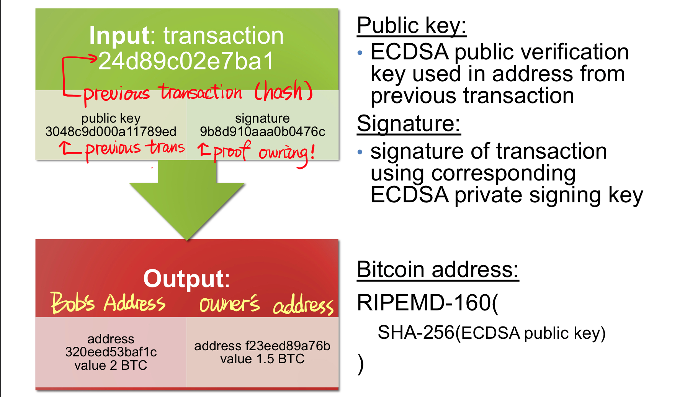
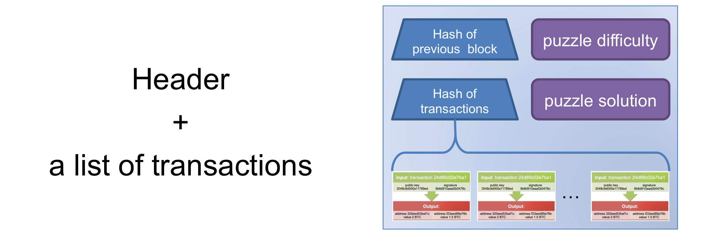
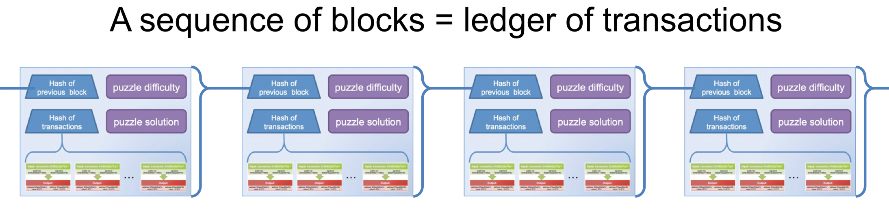
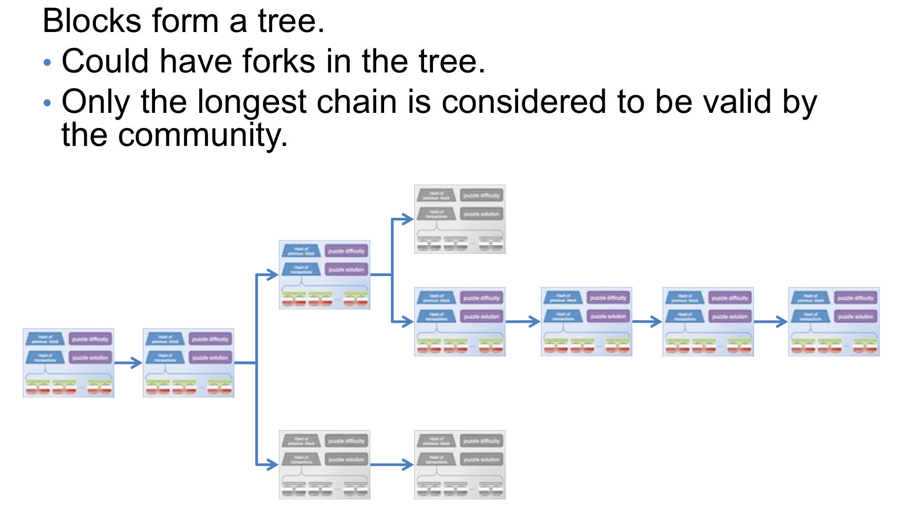
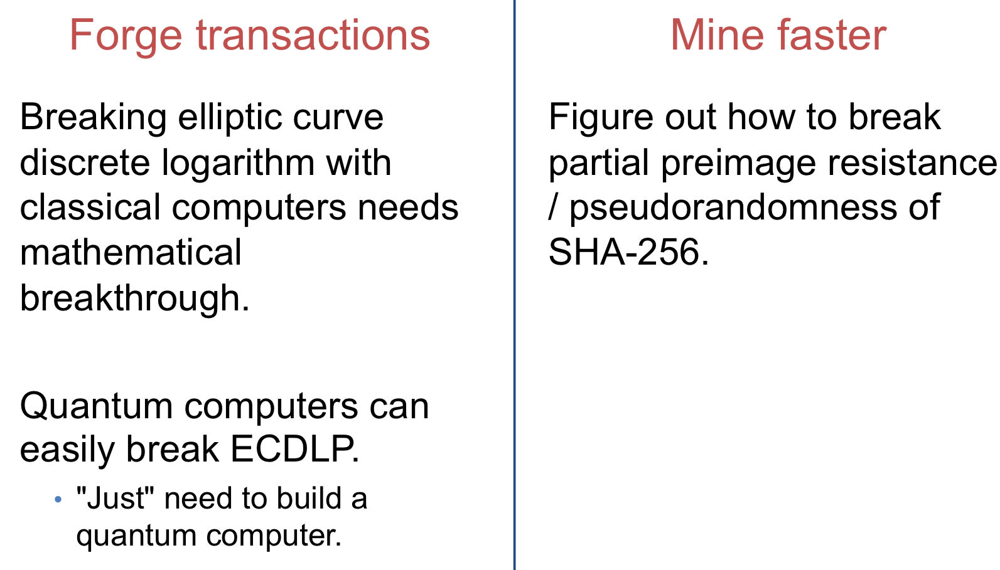

# Electronic Cash and Bitcoin

## Electronic Cash

Electronic version of paper cash!

Features that we desire:

* Recognizable (as legal tender)
* Portable (easily carried)
* Transferable (without involvement of the financial network)
* Divisible (has the ability to make change)
* Unforgable (difficult to duplicate)
* Untraceable (difficult to record where the money is spent)
* Anonymous (no record of who spent the mone)

### Basic concepts

Three parties:

1. Payer/buyer/consumer
2. Payee/seller/merchant
3. Financial network/central authority

**Token/Electronic Coin:** cash

**Card/Wallet:** devices stores/accesses coins

Payment types:

* On-line payments: must communicate with central authority in real-time
* Off-line payments: no real-time communication is required

### Security Properties

For the payer:

1. Payer anonymity
2. Payment untraceability

Por the payee and (optional) central authority:

1. Unforgeable coins: User cannot forge a valid-looking coin
2. No double-spending: A coin cannot be used more than once 

Other non-security related properties:

1. Off-line,
2. Cheap,
3. Efficient,
4. Transferable,
5. Divisible

## Bitcoin

Satoshi Nakamoto, Bitcoin: A Peer-to-Pero Electronic Cash Sytem, http://bitcoin.org/bitcoin.pdf

### Basic Concepts

1. There's a public ledger that every one can read with everyone's balance.
2. Alice wants to pay Bob 3 units.
3. Alice requests to put a transaction in the ledger saying "Alice pays Bob 3 units."
4. The maintainer of the ledger checks
    1. that Alice has big enough balance and 
    2. that Alice really made the request, then records the transaction in the ledger
5. Bob now has a higher balance.

Problems:

!!!question "No anonymity?"
    * Use public keys rather than names
    * Use transaction references rather than accounts

!!!question "How to verify someone own Alice's account?"
    Use digital signiatures to demonstrate ownership of currency from previous transaction.

!!!question "Who maintains the ledger?"
    Distributed ledger! incentivize the community to maintain

### Terminlogy & Structure

#### Transaction

#### Block

#### Blockchain

Adding blocks to the chain:

* A block can onlu be added to the chain if the hash of the block is small (which is a cryptographic puzzle)
* Motivation: whoever constructs the block includes one transaction paying themselves 6.25 BTC ("Mining")

Why people agree on a single ledger?

* If I success, I will receive rewards!
* If someone else beats me, the probability I'll find the next block is the same regardless of whether I use the new block or not!

### Puzzles

A moderately hard computational task.

!!!example
    * Let $H$ be a hash function with 256 bits of output
    * Find a value $x$ such tht $H(x)$ starts with ~45 zeros.

    Need to try about $2^{45}$ different $x$  to find a satisifying value!

!!!example
    * Let $H$ be a hash function with $\lambda$ bits of output
    * Let $s$ be a string
    * Let $t$ be an integer

    Find a value $x$ such that $H(s\|x) \leq t$

**In bitcoins:**

Constructing block header that:

$$H(H(\text{block header} \| \text{solution})) \leq \text{difficulty target}$$

where $H = \text{SHA-256}$

Difficulty target adjusted every two weeks.

**Mining pools:** worker together, split the reward (by the result of higher difficulties tasks to demonstrate that you work hard!!!)

Scrypt: An alternative puzzle that is memory-bound.

### How to break?

