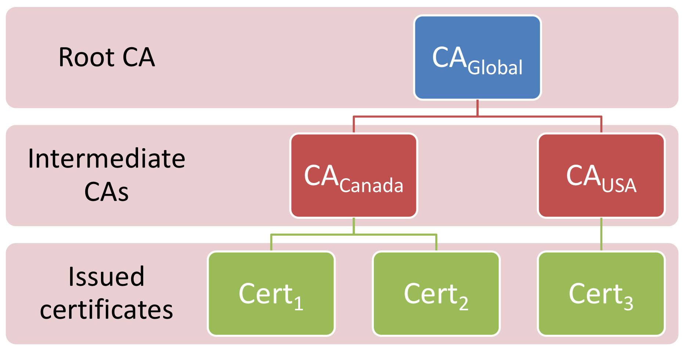

# Key Management System

## Motivation: Public key distribution problem

!!!note inline end
    We use public key to encrypt data.

Man-in-the-middle who replaces public keys can then decrypt. So we must get **authentical** public key to build the security. But who can we **trust**?

### Ways to distribute public key

1. Direct: HUMAN-TO-HUMAN TRANSMISSION(x)
    * business card, scan QR code
2. Web of Trust: a friend, and a friend of a friends
3. From a public directory: PGP key server, or Public Key Infrastructure

## Models

Name | Web of trust| Column C
---------|----------|---------
 **Implementation** | Each user maintains **a key ring** containing trusted users' public key | Trusted **authorities** perform checks and issue **certificates** and endorsing public keys 
? | User decide which key to trust | User trusts all certificates issued by an authority 
 **Examples** | PGP(pretty good privacy), GPG(GNU Privacy Guard, open source version of PGP) | PKI in web browsers! 

## Web of trusts

### PGP: Pretty Good Privacy

* Invented by Phil Zimmerman in 1991
* Software and standards for encryption and signing files and email

### OpenPGP: Open standards for PGP

### GPG: GNU Privacy Guard

Open source implementation

### Pros & Cons

Advantages:

* Simple
* Free
* Works well for a small number of users
* Cheap, doesn't need infrastructure

Disadvantages:

* Relies on human judgement
    * how can general public deal with that?
* Doesn't scale to large number of parties
* Not appropriate for trust-sensitive areas

## Public Key Infrastructure

### Basic concepts

**Certificate authorities:** trusted authorities that prove public keys belong to certain subjects

**Certificate:** an assertion by a trusted third party(authorities) that a particular public key belongs to a particular entity

**Digital Certificate:** contains

* The subject's identity
* The subject's public key
* Additional Information(e.g. validity period)
* The issuer's digital signature

### Certificate generating process

1. Get subject's public key (by some trusted mechanism)
2. Verifying the subject (authentic)
3. Signing (with authority's private key)

!!!notes "The process of establishing trust"
    1. Exchange certificates
    2. Do authentication (rely on the authorities they trust)
    3. They can trust each other!!!

### Standard Certificate: X.509

By International Telecommunication Union(ITU-T), current version: v3

Important Fields: (www.gov.cn)

| Field                                           | Value                                                        |
| ----------------------------------------------- | ------------------------------------------------------------ |
| Version Number                                  | Version 3                                                    |
| Serial Number (Set by CA)                       | 10:C4:2C:C9:49:BE:E8:EA:C9:CF:E8:F4                          |
| Signature Algorithm identifier (algorithm used) | PKCS #1 SHA-256 With RSA Encryption                          |
| Issuer (Name of CA)                             | CN = GlobalSign RSA OV SSL CA 2018  O = GlobalSign nv-sa  C = BE |
| Subject(Name of the entity)                     | CN = *.www.gov.cn  O = 国务院办公厅秘书局  L = 北京  ST = 北京  C = CN |
| Subject Public Key information                  | Modulus (2048 bits):   `B5 56 25 05 B7 2D 2F E9 4F 7A 5F 9B 06 E6 76 CF`  `68 55 DD 78 49 F7 7B 6E C0 52 96 2C FB 8C B3 2B`  `A1 84 5B C7 AD C9 F6 AC E5 00 E3 CF C9 D7 36 52` `23 EB 76 58 43 61 D8 EF 09 EA F3 2E 79 22 19 72`  `AE 18 3A 32 D2 62 BC 5A FF 8B 3F 36 FD DD 81 01` `74 3E 2A 30 EE 04 E4 EA 05 20 B3 5E A7 8D D7 17` `35 DE 6A 1E 43 BB 5E 3A 06 5D 28 77 B2 90 2F 24` `F7 DD C4 D3 F4 D1 E1 46 1E 29 4D CE 8A EF F7 E8` `9C 2E FE 13 66 AE AC B4 3C 81 6E F4 7C 39 90 F9` `B6 C5 0F 4D 69 B9 E7 DA 17 58 A1 C7 42 36 36 44` `91 03 2E 83 82 1D 9B 88 EA FF 5A 48 49 A2 8B 47`  `A7 F6 C2 52 50 B2 1B 30 C2 3F 82 E8 B6 26 41 01`  `B0 00 3E 0A FF 17 78 AA 51 CE D3 DC C4 DB D9 35 ` `06 A8 F8 70 7F 1C F5 49 56 F2 68 5B 9A 02 73 A4` `C5 52 31 72 C5 92 4E 27 F3 A1 27 34 B8 53 19 99` `24 D1 DE DF 40 7E EE C4 0F 0E E8 F7 8D 08 CD 7B`  Public Exponent (17 bits):  `01 00 01` |
| Validity                                        | Not before: `1/28/22, 3:52:02 AM EST` Not after: `2/27/23, 2:01:08 AM EST` |
| Signature value(On everything)                  | `3F D5 17 55 49 E8 3B C4 B3 9F 16 B1 41 81 95 23` `95 C6 6A 35 51 30 13 EA B7 AC 07 65 90 E9 C0 59` `29 6D 11 90 54 B3 D1 BF 26 41 D1 E6 20 65 0F 11` `76 7B 80 6B BB E2 78 42 B2 3B 77 EE 6C C7 AA 79` `60 79 D0 70 68 DC 34 8B CF F4 25 7F 5A E5 E9 E5` `5E 97 81 3B 74 12 F2 C6 0A 0F 42 63 6A 36 26 F8` `22 28 83 CF CC 99 1D 1F E1 96 0D B1 B5 51 F0 F4` `8C AF 98 66 01 96 76 66 72 E2 3F 0B DD 50 B0 B9` `53 14 0E 91 3D 5A 93 DB 7F 84 FF F2 E5 53 53 D1` `43 A2 BB 30 AA E4 C8 B2 68 D4 C4 66 51 CB 82 D9` `0A 50 25 85 B2 4F 21 03 47 2E 01 72 7D CE C3 A1` `9F 3D E3 A9 36 63 0D 34 E0 8E E6 7E FA 3E A1 9C` `0C 7D 78 23 07 2F 8B 1C 9A BD 18 5E 4A 37 3E AC` `5D E6 23 A8 2D A5 FE 12 FE 81 B9 37 0E AE 9E CF` `40 14 95 66 93 2C EC 5B FF FA 25 A2 62 50 22 8C` `4E D3 1A 97 52 52 FF E5 52 F7 00 84 41 B2 B2 61` |
| Fingerprints                                    | SHA-256:  `41 A9 2F EB B5 E1 E2 C3 92 F1 D3 94 22 26 77 C7`  `CD 70 14 23 2A 39 16 A5 6A BD C8 52 1B A2 DA B6` SHA-1: `58 C3 D4 5F B8 6A 04 90 DD 36`  `7A 92 FF EB D9 7C 36 74 3A 24` |
| Extensions                                      |                                                              |

#### Revocation

Happen when private key is compromised or blabla

**Certificate Revocation lists (CRLs):** each CA publish lists of revoked certs

* Have to download whole list

* Address included in certificate

**Online Certificate Status Protocol (OCSP):** An online service run by CA to check cert. real-time

* Not widely implemented
* Users privacy?

### PKI definition

!!!definition "Definition: Public key infrastructure(PKI)"
    * A set of systems(hardware, software, policy, procedure)
    * for managing (creating, distributing, storing, revoking)
    * **digital certificates**

Include:

* Certificate authorities(CA)
* subjects
* users
* relying parties
* timestamp server
* directory server storing certificates
    * LDAP server
    * Active Directory server

### Hierarchical CAs

### Use cerificates

Alice use Bob's public key in a certificate to encrypt/validate, she must trust that:

1. CA has checked the identity of subjects before issuing the certificate
2. CA won't issue fraudulent certificates
3. she has the authentic public key of CA
4. CA protect their own signing(private) keys

### Application

* Web site authentication(TLS)
    * Domain validation: validating control over DNS record
    * Organization validation: check the legal status of organzition
    * Extended validation: More rigourous check of organization's existence
* Email authentication
    * S/MIME(Secure/Multipurposee Internet Mail Extensions)
        * supported in most desktop mail program
        * relies on PKI
    * PGP
        * available as an add-on in desktop mail program
        * doesn't need PKI, web of trusts
    * Depends on users to encrypt!
    * Little to no support in webmail
* Domain names(DNSSEC)
* Digital identity
    * e.g. national identity cards
* Business-to-business e-commerce

Transparentcy: everyone can monitor CAs to watch fro malicious behaviour

!!!example "Example: Let's Encrypt"
    * Used automated issuance process: ACME protocol, can be reached from command line
    * domain validation
    * 300 million active cerificates as of November 2022
