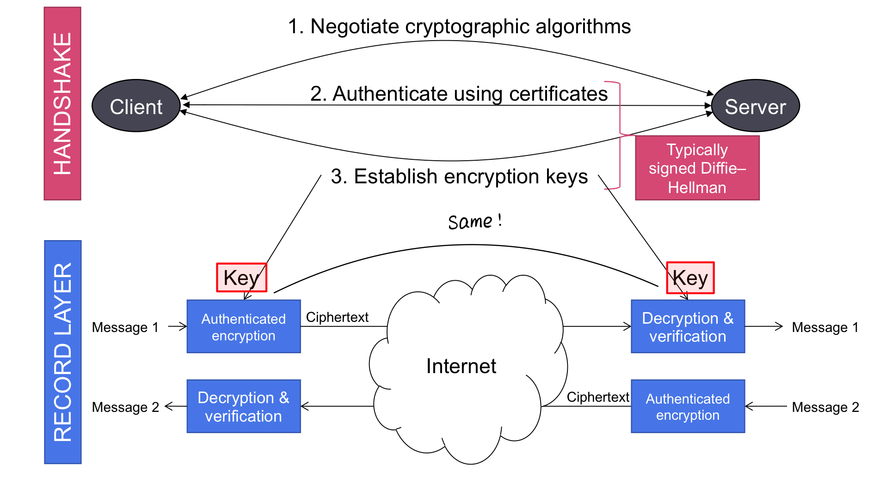
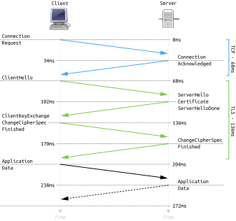
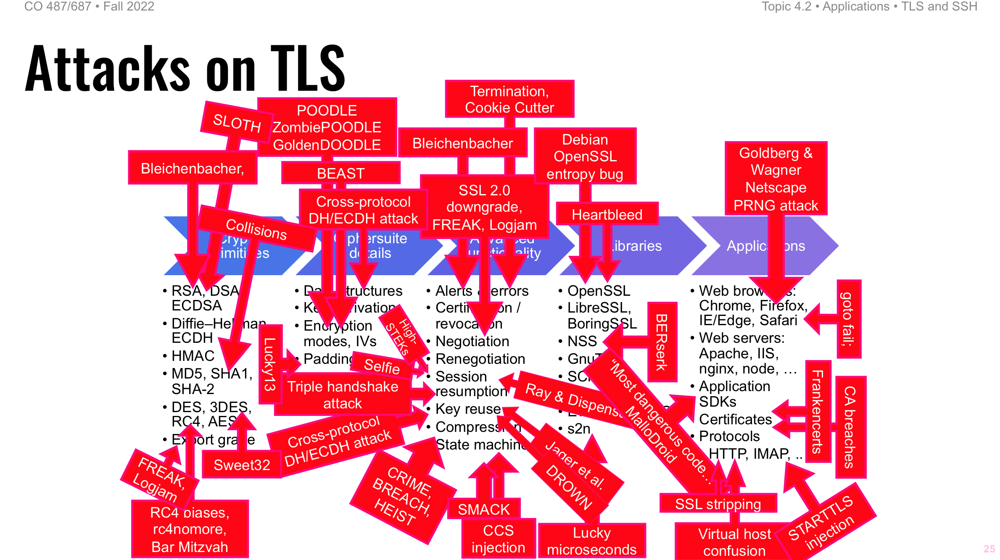

# TLS and SSH

SSL: Secure Sockets Layer

Proposed by Netscape

* SSLv2: 1995
* SSLv3: 1996

HTTPS: Hypertext Transport Protocol over SSL
## Transport Layer Security(TLS)

### Basic information

IETF standardization of SSL

Cryptographic protocol that operates above the **transport layer(TCP, UDP)** to provide security to application (layer)

!!!note 
    TLS runs over TCP, and Datagram TLS(DTLS) runs over UDP

* TLSv1.0 = SSLv3: 1999
* TLSv1.1: 2006
* TLSv1.2: 2008
* TLSv1.3: 2018

### TLS Process 

!!!example "Example: TLS 1.2 Handshake"
    The following full example shows a client being authenticated via TLS 1.2 using certificates exchanged between both peers.

    1. Negotiation Phase:

        !!!note ""
            Client $\Longrightarrow$ Server
        *	A client sends a **ClientHello** message specifying 
            * the highest TLS protocol version it supports
            * a random number, a list of suggested cipher suites and compression methods.
        
        !!!note ""
            Client $\Longleftarrow$ Server
        
        *	The server responds with a **ServerHello** message, containing
            * the chosen protocol version
            * a random number, cipher suite and compression method from the choices offered by the clien
            * (optional) a session id to perform a resumed handshake.
        *	The server sends its **Certificate** message (may be omitted).
        *	The server sends its **ServerKeyExchange** message (may be omitted)
        *	(ONLY MUTUAL AUTH) The server sends a **CertificateRequest** message, to request a certificate from the client.
        *	The server sends a **ServerHelloDone** message, indicating it is done with handshake negotiation.

        !!!note ""
            Client $\Longleftarrow$ Server (same)

        *	(ONLY MUTUAL AUTH) The client responds with a **Certificate** message, which contains the client's certificate, but not its private key.
        *	The client sends a **ClientKeyExchange** message, which may contain a *PreMasterSecret*, public key, or nothing. (Again, this depends on the selected cipher.) 
            * This *PreMasterSecret* is encrypted using the public key of the server certificate.
        *	(ONLY MUTUAL AUTH) The client sends a **CertificateVerify** message, which is a signature over the previous handshake messages using the client's certificate's private key. This signature can be verified by using the client's certificate's public key. 
            * prove that the client has access to the private key of the certificate and thus owns the certificate.
        *	The client and server then use the random numbers and *PreMasterSecret* to compute a common secret, called the **"master secret"**. All other key data ("session keys") for this connection is derived from this master secret (and the client- and server-generated random values), which is passed through a carefully designed pseudorandom function.
    
        !!!note ""
            Client $\Longrightarrow$ Server

    2.	The client now sends a **ChangeCipherSpec** record, essentially telling the server, "Everything I tell you from now on will be authenticated (and encrypted if encryption was negotiated). "
        *	The ChangeCipherSpec is itself a record-level protocol and has type 20 and not 22.
        *	Finally, the client sends an encrypted **Finished** message, containing a hash and MAC over the previous handshake messages.
        *	The server will attempt to <u>decrypt</u> the client's Finished message and <u>verify</u> the hash and MAC. 
            * If the decryption or verification fails, the handshake is considered to have failed and the connection should be torn down.
    
        !!!note ""
            Client $\Longleftarrow$ Server
    
    3.	Finally, the server sends a **ChangeCipherSpec**, telling the client, "Everything I tell you from now on will be authenticated (and encrypted if encryption was negotiated)."
        *	The server sends its own encrypted **Finished** dmessage.
        *	The client performs the same decryption and verification procedure as the server did in the previous step.

        !!!note ""
            Client $\iff$ Server

    4.	**Application phase:** at this point, the "handshake" is complete and the application protocol is enabled, with content type of 23. 
        * Application messages exchanged between client and server will also be encrypted exactly like in their Finished message.

!!!notes "Notes: Key exchange in TLS 1.2"
    Option 1: RSA key transport
    
    1. Server sends its RSA public key to client inside cert.
    2. Client picks a random "premaster" secret
    3. Client send the encrypted "premaster" secret under server's RSA public key

    !!!failure
        No forward Secrecy, not permitted in TLS 1.3

    Option 2: Ephemeral Diffie-Hellman

    1. Server generates a temporary (EC)DH public key and sends to key, signs it using its signature key from cert
    2. Client generates a temporary (EC)DH public key and sends to server
    3. Compute (EC)DH shared secret

    !!!success
        "One time" Diffie-Hellman, has forward secrecy

#### Record protocol

Message Confidentiality

Message Integrity

Message Replay protection

Supplied by an authenticated encryption scheme (AEAD)

!!!hint "Hint: AEAD"
    Authenticated encryption with associated data, allows a recipient to check the integrity of both the encrypted and unencrypted information in a message

### Improvement: TLS 1.3

Only one handshake is needed!

!!!quote "Wikipedia: TLS 1.3 handshake"
    1. First the client sends a **clientHello** message to the server that contains a list of supported ciphers in order of the client's preference and **makes a guess** on what key algorithm will be used so that it can send a secret key to share if needed. 
        * By making a guess at what key algorithm will be used, the server eliminates a round trip. 
    2. After receiving the clientHello, the server sends a **serverHello** with its key, a certificate, the chosen cipher suite and the finished message.
    3. After the client receives the server's finished message, it now is coordinated with the server on which cipher suite to use.

### Security of TLS

!!!warning inline end
    Only protects confidentiality if authtication is correct. (no wrong party)

* **Authentication**: based on public key infrastructure
    * server-to-client: always
    * client-to-server: optional
* **Confidentiality and Intergrity**: message transmission

!!!warning "What doesn't TLS do?"
    * Hide source/destination
    * Hide length information
    * Password-based authentication
    * Prevent/stop denial of service attacks (DoS)
    * Prevent web application vulnerabilities

Typically, only server -> client side is authenticated by SSL.

Users usually don't have certificates

## SSH(Secure Shell) protocol

Used for secure remote access, runs over TCP, typically port 22.

Provides public key authentication of servers adn clients and encrypted communication

Standardized by IETF

User need to take care of the public key on server!

If the server's public key has changed, user will receive a notice!
