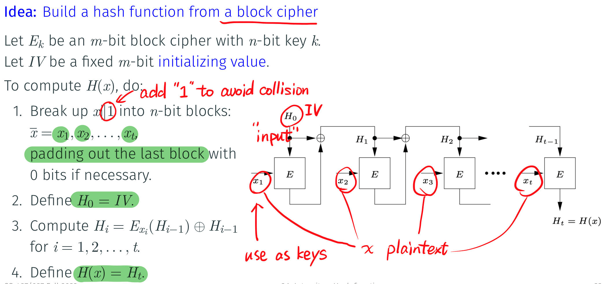
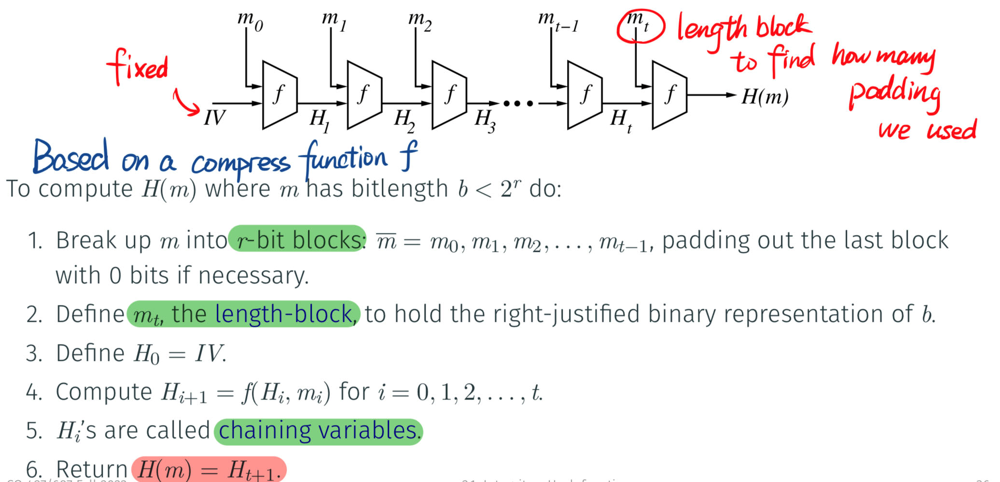

# Hash Functions

$n$-bit hash function $H:\{0,1\}^* \to \{0,1\}^{\color{red}n}$ . $H(x)$ is called as hash values, hash, message digest.

## Properties

Collision: $(x,x')$ such that $x \neq x' \wedge H(x) = H(x')$ . 

--> Collision resistance: computationally infeasible to find collision

Preimage: $x$ is $y$'s preimage if $H(x) = y$

--> Preimage resistance: randomly pick $y$, then computationally infeasible to find preimage $x$

-----> One way hash function OWHF

Second preimage: $x'$ is $x$'s preimage if $H(x) = H(x'), x \neq x'$ 

--> 2nd preimage resistance: randomly pick $x$, then computationally infeasible to find 2nd preimage $x'$

> With non-negligible probabilities!!! 

===> All of those three: cryptographic hash function.

### Relationships between them

Collison resistance $\implies$ 2nd preimage resistance

> Proof: Prove by contradiction

2nd preimage resistance $\not\Rightarrow$ Collision resistance

> Proof: Construction.
> $$
> \overline H(x) = \left\{\begin{aligned}&H(0)&,\text{if }x=1\\&H(x)&,\text{if } x=0\end{aligned}\right.
> $$

$$
\begin{matrix}
\end{matrix}
$$

Collison $\not\Rightarrow$ preimage resistance.

> Proof: Construction.
> $$
> \overline H(x) = \left\{\begin{aligned}1\|x&, \text{if } x \in \{0,1\}^n\\-\|H(x) &,\text{if } x \not \in \{0,1\}^n\end{aligned}\right.
> $$

H is somewhat uniform, then that will be right.

## Applications

## Generic Attack

### Find Collision

Brute force: 

* time of steps $\sqrt{2^n}$
* expected of spaces $\sqrt{2^n}$

Pollard's rho:

* calculate a "chain" of hash values, store them(too big!)
* $x_{i+1} = 2 H(i)$

Floyd's cycle finding algorithm: trade off time and space

* $y_0 = x_0$
* $y_{i+1} = H(H(y_i))$, $y_i = x_{2i}$
* Only store $x_i,y_i$, stop when $x_i = y_i$ . (3 times computational cost)

VW parallel collision search:

* reduce storage by a factor of $2^k$
* increases computational time by $2^k$
* can be distributed to different machines and calculate simultaneously

## Davis-Meyer Construction

## Merkle-Damgard Construction

Collision Resistance: $f$ is collision resistant $\implies$ $H$ is collision resistant. Prove

### Mdx Family of Hash Function

Use Merkle-Damgard construction.

Output: 128bits

### SHA1 

### SHA2

### Attacks on MD-x and SHA1/SHA2

## SHA-3 and sponge function