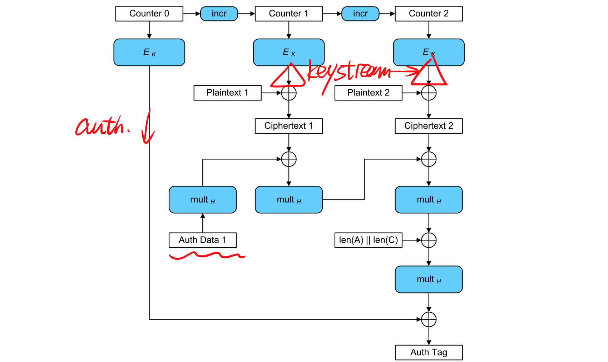
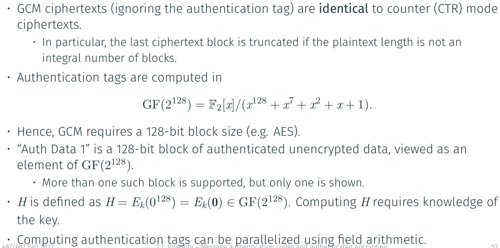
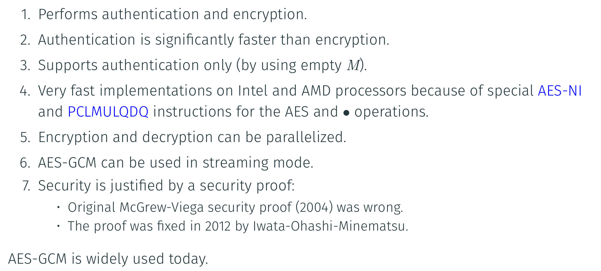

### MAC(Message Authentication Code)

#### Definition

An efficiently computable function $M:\{0,1\}^{l} \times \{0,1\}^* \to \{0,1\}^n$, written as $M(k,m) = t$ [k = key, m = message, t = tag]

> Or just: Hash function with a key

#### Application

1. Establish a secret key $k \in \{0,1\}^l$ 
2. Alice Computes $t = M(k,m)$ and sends $(m,t)$ to Bob
3. Bob verifies that $t = M(k,m)$

==> Provide **data integrity** and **data origin authentication**.

#### Security

#### Constructing MAC

##### CBC-MAC

##### Encrypted CBC-MAC(EMAC)

##### MACs based on hash function

* Secret prefix method: $M(k,m) = H(k\|m)$
    * Insecure, length extension attack to create a fake one.
* Secret suffix method: $M(k,m) = H(m\|k)$ 
    * If $H$ is not collision resistant, then it's not secure
* Sandwich Method: $M(k,m) = H(k\|m\|k)$

##### HMAC

$M(k,m) = H((k \oplus opad)\|H((k\oplus ipad)\|m))$

### Authenticated Encryption

Combining those two things are not easy as you think!

#### Basic 

* Don't use same key for send/recieve
* Don't use same key for auth/encrypt
* Create keys with key derivation function

#### First-class Primitives

can use same key!

##### MAC-then-encrypt(MtE)

* $t=\text{MAC}(m)$, and $c=\text{Enc}(m\|t)$, transmit $c$
* integrity is not checked first

##### Encrypt-then-MAC(EtM)

* $c = \text{Enc}(m)$ , and $t = \text{MAC}(c)$, transmit $c\|t$
* **Good**

##### Encrypt-and-MAC(E&M)

* $c = \text{Enc(m)}$, and $t = \text{MAC}(m)$, transmit $c\|t$
* No confidentiality, $t$ may leak some information of $m$

#### Padding

Right way: padding, then MAC, then encrypt.

#### Modes of Operations

* CCM mode(Counter with CBC-MAC)
* EAX mode
* GCM mode(Galois/Counter Mode)
* OCB mode(Offset Codebook Mode)

#### GCM mode of operation

