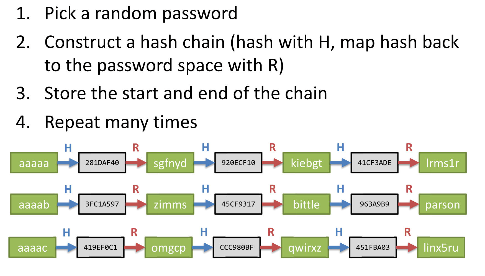
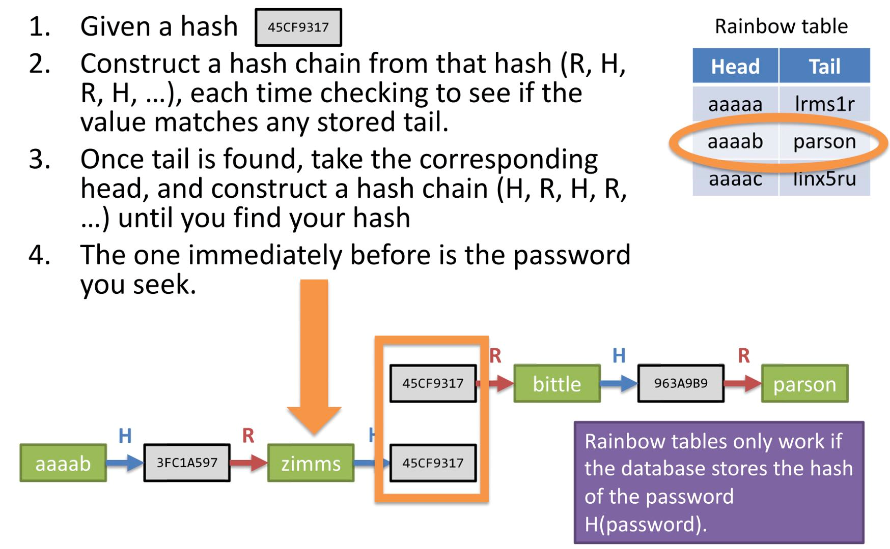

# Password hashing

## User Authentication

Authenticators can be categorised as:

* Knowledge-based: something you know
* Object-based: something you have
* ID-based: something you are
* Location-based: somewhere you are

Multi-factor authentication: combinations from multiple different authenticators

## Passwords

Human-memorizable strings that are used for authentication

Common attack:

* steal password from a user
* guess password
* steal password from a database
    * then offline computation

Security recommandations:

* strong password
* strong password securely
* don't share
* don't use same password

Can generated by computer!

### Entropy

Measure the uncertainty in values generated from a random guess

Process $X$, generate $n$ values $x_1, \dots, x_n$ with probabilties $p_1, \dots , p_n$

$$
H(X) = - \sum_{i=1}^n p_i \log_2{p_i}
$$

need $2^{H(x) - 1}$ operations in average to guess rightly

## Password Attack

### Brute Force

### Hash Table

A table containing hashes of many/all possible passwords

### Rainbow Table

Time-space trade of hash table.

Constructing:

Using:

## Password Scheme

### Process

#### Registration

1. Pick a random $\geq 80$-bit salt
2. Store username, salt, and $H(\text{password}, \text{salt})$ in database where $H$ is a password hardening function

#### Login

1. Suder supplies username and purported $\text{password}'$
2. Look up username, salt, and hash in database
3. Check if $H(\text{password}', \text{salt}) = \text{stored hash}$

### Components

#### Salting

* protect against rainbow table
    * different table for different salt
* make brute force attacks harder
    * cannot reuse brute force work

#### Password hardening function

A LOT OF(10000) times of hash.

Don't slow down login, but can slow down brute-force attacks

* PBKDF2(2000)
    * Widely used; fairly secure
* bcrypt
* scrypt
* Argon2(2015)
    * best available approach