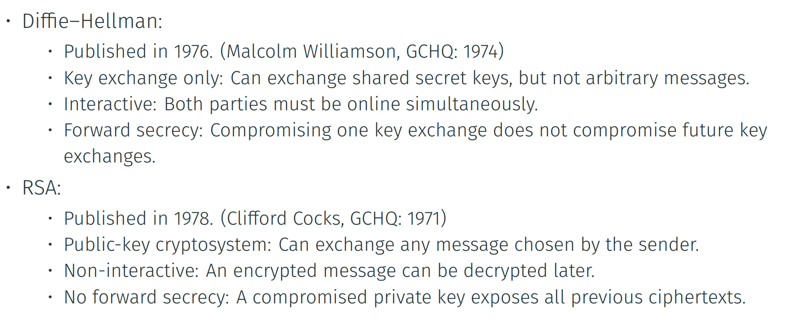
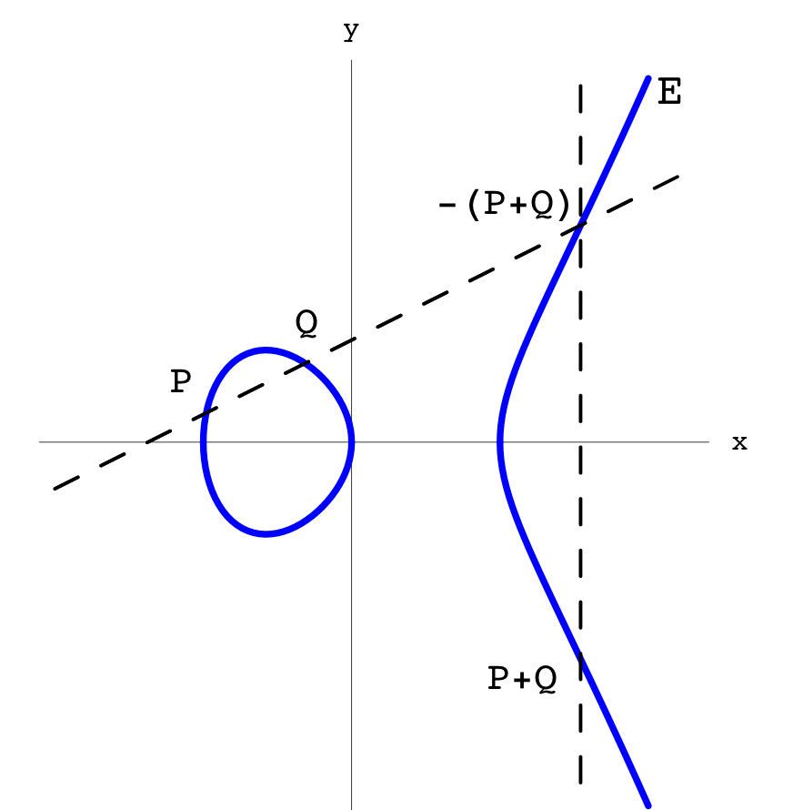
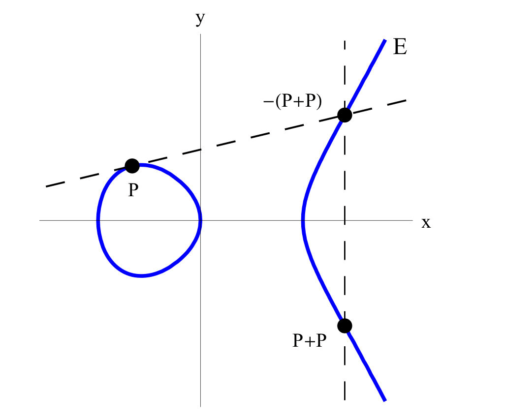

# Asymmetric Encryption Schemes: Example

All algorithms here have different mathematical foundations:

1. RSA: integer factoring problem
2. Diffie-Hellman & Elgamal: discrete logarithm on group $\mathbb Z_p^*$
3. Elliptic Curve: group of points in $E/\mathbb Z_p$ (Discrete elliptic curve)

## RSA encryption

Ronald Rivest, Adi Shamir and Leonard Adleman, 1977

### RSA key generation

public key: $k_{pub} = (n,e)$, private key: $k_{pr} = (n,d)$

1. choose random prime $p$ and $q$ with $\log_2 p \approx \log_2 q \approx l/2$
2. compute $n = pq$ and $\phi(n) = (p-1)(q-1)$
    * $\phi$ is euler function
3. select integer $e$ with $1 < e < \phi(n)$ and $\gcd(e, \phi_n) = 1$
    * make sure the inverse in next step exist
4. compute $d = e^{-1} \bmod \phi(n)$
    * like the inverse in "pow" space

### RSA encryption/decryption

Encrypt: $\mathcal E((n,e), m) = m^e \bmod n$

Decrypt: $\mathcal D((n,d), c) = c^d \bmod n$

#### Correctness

!!!theorem
    Let public key $(n,e)$, private key $(n,d)$, then:

    $$
    \mathcal D((n,d), \mathcal E((n,e),m)) = m
    $$

    for all $m \in \mathbb Z_n$ such that $\gcd(m,n) = 1$

Prove:

1. By definition of $\mathcal D$ and $\mathcal E$: $\mathcal D((n,d), \mathcal E((n,e),m)) = m^{ed} \bmod n$
2. By definition of $e$ and $d$, we have $ed \equiv 1 \pmod{\phi(n)}$ In other words, $ed = 1 + k \cdot \phi(n)$ for some $k \in \mathbb Z$.
3. $m \not\equiv 0 \pmod p$, then $m^{\phi(n)} = m^{(p-1)(q-1)} = (m^{p-1})^{q-1} \equiv 1^{q-1} \equiv 1 \pmod p$
4. Similarly, $m^{\phi(n)} \equiv 1 \pmod q$, and hence $m^{\phi(n)} \equiv 1 \pmod n$
5. Therefore $m^{ed} = m^{1 + k \cdot \phi(n)} \equiv m^1 \cdot 1^k = m \pmod n$

#### Effectiveness

!!!note
    Algorithm's effeciency is measured by

    * **input size:** numbers of bits $l$ required to write down the input using a reasonable encoding ( $n$ --> $\lfloor \log_2 n \rfloor + 1$ bits)

    * **running time:** upper bound of worst case number of basic steps the algorithm takes over all inputs of a fixed size

    * **efficient**: polynominal time $O(l^c)$

Basic integer operation for two $l$-bit integer $a$, $b$:

- Addition/subtraction: $O(l)$
- Multiplication/division: $O(l^2)$
- GCD: $O(l^2)$ ([Extended Euclidean Algorithm]())

Basic modular operations for two $l$-bit integer $a$, $b$:

- Inverse: $O(l^2)$ ([Extended Euclidean Algorithm]())
- Exponentiation: $O(l^3)$ ([Square and Multiply]())

#### Fast Implementation

1. Fast Encryption with Short Public Exponents
2. Fast Decryption with the Chinese Remainder Theorem

### Security

!!!summary "Textbook RSA's security level"
    * Not totally insecure, assuming integer factorization is hard.
    * One-way secure, assuming the RSA problem is hard. 
    * Not semantically secure.

Open problem: Is integer factoroization equivalent to the RSA problem?

#### Totally insecure

!!!theorem "Integer Factorization v.s. RSA"
    integer factorization is easy $\iff$ RSA encryption is totally insecure.

Proof:

$\Longrightarrow$ side:

Given $(n,e)$.

1. Factor $n = p \times q$
2. Euler function is known: $d = e^{-1} \bmod (p-1)(q-1)$
3. Secret key: $(n,d)$

$\Longleftarrow$ Side:

For any RSA public key $(n,e)$ we can calculate $(n,d)$

1. Repeat 20(lots of) times:
    1. choose $(n,e_i)$ where $e_i$ is large prime less than $n$
    2. compute $(n,d_i)$
    3. let $x_i = e_id_i - 1$ (as $e_id_i = 1 + k \cdot \phi (n)$)
2. Let $x = gcd(x_1, x_2, \dots, x_{20})$. Note that $x$ is very likely equal to $\phi(n) = (p-1)(q-1)$
3. Solve this equation: $\{p,q\} = \frac{1+n-x\pm\sqrt{(1+n-x)^2 - 4n}}{2}$

!!!definition "Definition: RSA problem" 
    > get message from ciphertext
    
    Given an RSA public key $(n,e)$, and an element $c \in \mathbb Z_n$ such that $\gcd(c,n) = 1$ (*ciphertext*),

    find an element(*plaintext*) $m \in \mathbb Z_n$ such that

    $$
    c = m^e \bmod n
    $$

#### One-way secure

!!!theorem "On one-way security"
    RSA problem is computationally infeasible $\implies$ RSA encryption scheme one-way secure under a chosen plaintext attack (OW-CPA).

#### Semantically secure

!!!theorem "On semantically secure"
    RSA is **not** semantically secure under a ciphertext-only attack

!!!note inline end
    **No** <u>deterministic</u> encryption algorithm can yield semantic security!

- $c = 1 \implies m = 1$
- $c \neq 1 \implies m \neq 1$

Some partial information!

!!!note "Achieving semantic security for RSA encryption"
    Add random padding to RSA.

    Standardized in PKCS#1

#### Malleable

!!!example inline end
    Replace ciphertext $y$ to $s^e y$ can replace the plaintext from $x$ to $sx$

The attacker is capable of transforming the ciphertext into another ciphertext which leads to a known transformation.

### Factor problem

!!!note "Measures of Running time"
    * Polynomial-time
    * Exponential-time
    * Fully exponential-time: $2^{cl}$, where $c$ is a constant
    * Subexponential-time algorithm: worst run time $2^{o(l)}$, and not of the form $O(l^c)$ for any constant $c$

!!!example "Trial Division"
    $O(\sqrt n)$, not polynomial time, $O(2^{l/2})$

Formulas to form subexponential time:

$$
L_n[\alpha, c] = O(\exp(c+o(1))(\log n)^\alpha (\log \log n)^{1-\alpha})
$$

where $c$ is positive and $\alpha \in (0, 1)$

- When $\alpha = 0$: $L_n[0,c] = O(l^{c+o(1)})$ --> polytime
- When $\alpha = 1$: $L_n[1,c] = O((2^l)^{c+o(1)})$ --> fully exponential time

Special-Purpose factoring algorithms: Trial division, Pollard's p-1 algorithm, Pollard's $\rho$ algorithm

General-Purpose factoring algorithms

1. Quadratic sieve factoring algorithm(QS): $L_n[\frac{1}{2}, 1]$
2. Number field sieve factoring algorithm(NFS): $L_n[\frac{1}{3}, 1.923]$

Quantum factoring algorithm: Shor algorithm

- use $O((\log n)^2)$ quantum gates to factor $n$

!!!warning
    Use 2048-bit RSA!

### Other concerns

* Find large prime: random & test
    * $P(\tilde p \text{ is prime}) \approx \frac{1}{\ln(\tilde p)}$
* Other attack methods:
    * Side-channel attack
    * Bad random number generators
    * Implementation bugs

## Diffie-Helleman key exchange

W. Diffie & M. Hellman, 1976

!!!definition "Definition: Key-exchange Protocol"
    a protocol specifically designed to establish shared secret keys from scratch

order, generator of a group

Notation:

- $p$ is a prime
- $\mathbb Z_p^* = \{1, \cdots, p-1\}$
- $g \in \mathbb Z_p^*$ is an element of $\mathbb Z_p^*$ of large **prime** order $q$
    * $g$ is not the generator, but does generate a subgroup of $\mathbb Z_p^*$

### Process

Publicly pick a prime $p$ and an element $g \in \mathbb Z_p^*$ of large **prime** order $q$

1. Alice picks $a \in \mathbb Z_q$ randomly, sends $g^a \bmod p$ to Bob.
2. Bob picks $b \in \mathbb Z_q$ randomly, sends $g^b \bmod p$ to Alice.
3. They agree on the secret key $k_{AB} = g^{ab}$

Then:

- Alice can compute $k_{AB}$ by $(g^b)^a \bmod p$
- Bob can compute $k_{AB}$ by $(g^a)^b \bmod p$

### Correctness

!!!theorem "Diffle-Hellmean assumption(DH)"
    Let $a, b \in_R Z_q$. Given $g, g^a, g^b$, it is computationally infeasible to determine $g^{ab}$.

    > In short: $g, g^a, g^b \not\to g^{ab}$

!!!theorem "Discrete logarithm assumption(DLOG)"
    Let $a \in_R \mathbb Z_q$. Given $g$ and $g^a$, it is computationally infeasible to determine $a$.

    > In short, $g,g^a \not\to a$

!!!theorem "Equivalence (U. Maurer & S. Wolf, 1999)"
    For alomost all values of $p$, the DH assumption and the DLOG assumption are equivalent.

    > In short: $DH \iff DLOG$

#### Discrete Logarithm

Suppose we want to find $x$ such that $g^x = 2$.

1. For $i = 1, \dots, t+1$, choose integers $x_i$ at random until $g^{x_i}$ completely using only the first $t$ primes.

    $$
    \begin{aligned}
    g^{x_1} \bmod p &= 2^{e_{1,1}}3^{e_{1,2}} \cdots p_t^{e_{1,t}}\\
    g^{x_2} \bmod p &= 2^{e_{2,1}}3^{e_{2,2}} \cdots p_t^{e_{2,t}}\\
    &\vdots\\
    g^{x_{t+1}} \bmod p &= 2^{e_{t+1,1}}3^{e_{t+1,2}} \cdots p_t^{e_{t+1,t}}\\
    \end{aligned}
    $$

2. take $\log_g$ operation on both sides: --> into $\pmod{p-1}$

    $$
    \begin{aligned}
    x_1 \equiv e_{1,1} \log_g 2 + e_{1,2} \log_g 3 + \cdots + e_{1,t} \log_g p_t \pmod{p-1}\\
    x_2 \equiv e_{2,1} \log_g 2 + e_{2,2} \log_g 3 + \cdots + e_{2,t} \log_g p_t \pmod{p-1}\\
    \end{aligned}
    $$

3. Only $\log_g p_i$ are unknown. $t+1$ equations and $t$ unknown variables. Solve!

    !!!note "Why $t+1$ equations?"
        I don't know. Check it later.

We can compose to get logarithms of non-prime numbers' logarithm

Running time: $L_p(\frac{1}{3}, \sqrt{\frac{64}{9}})$

### DH versus RSA

## Elgamal encryption

Taher Elgamal, 1985.

### Process

- Setup:
    - Choose a single, globally public prime $p$
    - Choose a single, globally public element $g \in \mathbb Z_p^*$ of large **prime** order $q$
- Key generation
    - Choose $x \in_R \mathbb Z_q$
    - Set $k_{\text{pubkey}} = g^x \bmod p$, $k_{\text{privkey}} = x$
- Encryption: Given $m \in \mathbb Z_p^*$
    - Choose $r \in_R \mathbb Z_q$
    - $\mathcal E(m) = (g^r, m \cdot (g^x)^r) \bmod p$
        - Use $g^r$ to hide the random value $r$, but not to one who own $x$
- Decryption: Given ciphertext $(c_1,c_2) \in (\mathbb Z_p^*)^2$
    - compute $D(c_1, c_2) = c_2 \cdot (c_1^{-1})^x \pmod p$

!!!note
    Half part of the Diffle Hellman key exchange!

Elgamal is a **randomized** encryption operation.

### Security

!!!definition "Definition: Decisional Diffie-Hellman assumption(DDH)"

    Let $x,y,z \in_R \mathbb Z_q$. Given $g, g^x, g^y$ and either $g^{xy}$ or $g_z$, it is computationally infeasible to determin wheather you were given the real $g^{xy}$ or the random $g_z$.

    !!!note
        This doesn't always hold!

        1. knwon to be false when $g$ is a generator of $Z_p^*$
        2. fails in some elliptic curve groups

!!!theorem "Theorem: (Tsiounis and Yung, 1998)"
    Elgamal is **semantically secure** under <u>Decisional Diffle-Hellman assumption</u>

## Elliptic Curve Cryptography

Idea: Use the **points on an elliptic curve** (of the form $y^2 = x^3 + ax + b$) to create a group, then do **Diffie-Hellman**.

### Motivation

!!!warning inline end
    Shor algorithm can break ECC on quantum computers!

No specialized algorithm are known for discrete logarithm on elliptic curve.

Can achieve a given security level using much smaller parameters

### Notation

Group of points on a elliptic curve (form like $y^2 = x^3 + ax + b$) over field

- real number $\implies$ $E/\mathbb R:Y^2 = X^3 - 2X + 1$
- $\mathbb Z_p$ $\implies$ $E/\mathbb Z_{p}:Y^2 = X^3 - 2X + 1$, $\#E(\mathbb{Z}_{89}) = 96$
    - The one used in computer

Identity element in the group: $\mathcal O$ point

### Operations of points

| Adding points                                                                                   | Doubling points                                                                                     |
| ----------------------------------------------------------------------------------------------- | --------------------------------------------------------------------------------------------------- |
|                                                                          |                                                                                 |
| Draw a line through $P$ & $Q$, cross $E$ at $-(P+Q)$, then reflect around $x$-axis to get $P+Q$ | Draw the tangent line through $P$, cross $E$ at $-(P+P)$, then reflect around $x$-axis to get $P+P$ |

Formulae of adding point $P$ and $Q$:

If $P = \mathcal O$, $P+Q = Q$; else if $Q = \mathcal O$, $P+Q = P$.

Else, suppose $P = (x_P, y_P)$ and $Q=(x_Q, y_Q)$, then:

1. if $x_p = x_Q$ and $y_P = -y_Q$, set $P+Q = \mathcal O$
2. Otherwise

    $$
    \begin{aligned}
        m &= \left\{\begin{aligned}
            \frac{y_Q-y_P}{x_Q-x_P} & \text{ if }P \neq Q\\
            \frac{3x_P^2+a}{2y_P} & \text{ if }P = Q
        \end{aligned}\right.\\
        x_{P+Q} &= m^2 -x_P - x_Q\\
        y_{P+Q} &= -m((x_{P+Q} - x_P) + y_P) 
    \end{aligned}
    $$
    
    and set $P+Q$ be the point $(x_{P+Q},y_{P+Q})$

!!!note 
    In order to ~~create~~ avoid confusion, we write $xP$ instead of $P^x = P + \dots + P$

    scalar multiplication/scalar exponentiation

### Diffie-Hellman with elliptic curve

Agree on a curve $E$ and element $P$ of large prime order $q$

1. Alice pick $x \in_R Z_q$ at random, send $xP \in E$ to Bob
2. Bob pick $y \in_R Z_q$ at random, send $yP \in E$ to Alice

Both Alice and Bob can get $xyP = x(yP) = y(xP) \in E$

### Standard

#### P-256

NSA, 1998

128 bits of security level

$p = 2^{256} -2^{244} + 2^{192} + 2^{96} - 1$ is prime!

$E: Y^2 = X^3 - 3X + b$, where b = 41058363725152142129326129780047268409114441015993725554835256314039467401291

$n = \#E(Z_p)$ is prime, where n = 115792089210356248762697446949407573529996955224135760342422259061068512044369

#### Curve 25519

128 bits of security level

$p = 2^{255} - 19$

$E: Y^2 = X^3 + 486662X^2 + X$ over $\mathbb Z_p$

$\#E(\mathbb Z_p) = 8n$, where $n$ is the prime: $2^{252} + 27742317777372353535851937790883648493$