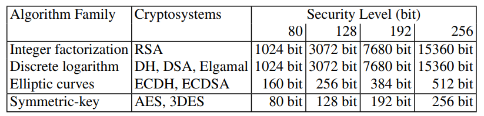

# Public key cryptography

## Problem with symmetric methods

### Key Establishment Problem

How do Alice and Bob establish the secret key $k$?

1. Point-to-point key distribution: Alice selects the key and sends it to Bob in a secure channel
    1. trusted courier
    2. face-to-face meeting
    3. physical
    
    !!!error
	    Not practical

2. Use a trusted third party(TTP) $T$
    + $A$ wants to communicate with $B$
    + Each user $A$ shares key $k_{AT}$ with $T$ for symmetric scheme $E$
    + $T$ selects session $k$ and sends encrypted copies to $A$ & $B$

    !!!error
        1. TTP cannot be trusted
        2. TTP could be an attractive target
        3. TTP may be off-line(bottleneck & reliability)

!!!note "History: Merkles Puzzle"

    1. Alice create $N$ **(extremely huge number)** puzzles $P_i$, each puzzle can reveal session key $sk_i$ and random serial number $n_i$
    2. Alice sends $P_1, \dots, P_N$ to Bob
    3. Bob random chooses one puzzle, solve $P_j$ and get $sk_j$ and $n_j$
    4. Bob sends $n_j$ to Alice
    5. Then Alice knows the session key $sk_j$

    The broker must solve $N/2$ puzzles (average) to get the session key.  

### Key Management Problem

$n$ users need $\Theta(n^2)$ pairs of keys.

### Non-repudiation protection

!!!definition "Non-repudiation"
    Preventing an entity from denying previous actions or commitments.

Core problem: they hold the **same** keys!!

!!!example
    For instance, in e-commerce applications it is often important to prove that Alice actually sent a certain message, say, an online order for a flat screen TV. If we only use symmetric cryptography and Alice changes her mind later, she can always claim that Bob, the vendor, has falsely generated the electronic purchase order.

Need to rely on an on-line TTP.

## Principles of Asymmetric Cryptography

### Key pair

For every entity $A$:

1. Generate a key pair $(P_A,S_A)$
    * $P_A$: public key
    * $S_A$: secret key

Security requirement: infeasible to recover $S_A$ (secret) from $P_A$ (public).

### Encryption & Decryption

!!!note inline end
    **Public key** for <u>encryption</u>, **secret key** for <u>decryption</u>

Alice wants to send $m$ to Bob:

1. Obtain an authentic(how?) copy of Bob's public key $P_B$
2. Encrypt: $c = E(P_B,m)$
3. Send $c$ to Bob

Bob wants to get $m$ from $c$:

1. Decrypt: $m = D(S_B, c)$

### Digital Signatures

!!!note
    Sign with secret key;

    Verify with public key.

Alice signs a message $m$:

1. compute $s = \text{Sign}(S_A, m)$
2. send $m$ and $s$ to Bob

Bob verify the message $m$:

1. Obtain an authentic(how?) copy of Alice's public key $P_A$

2. Accept if $\text{Verify}(P_A,m,s) = \text{Accept}$

> Anyone who has an authentic copy of Alice's public key can verify!

### Formal definition

Formal definition is needed to build the "security", correctness

!!!definition "Definition: Public-key encryption scheme"
    Consist of:

    * $M$ - plaintext space, $C$ - ciphertext space
    * $K_{\text{pubkey}}$ - public keys space, $K_{\text{privkey}}$ - private keys space
    * Key-generation function: $\mathcal G: {1^l:l \in \mathbb N} \to K_{\text{pubkey}} \times K_{\text{privkey}}$
    * Encryption: $\mathcal E: K_{\text{{pubkey}}} \times M \to C$
    * Decryption: $\mathcal D: K_{\text{privkey}} \times C \to M$

Correctness:

For any key pair $(k_{\text{pubkey}}, k_{\text{privkey}})$ produced by $\mathcal G$, and all $m \in M$,

$$
\mathcal D(k_{\text{privkey}}, \mathcal E(k_{\text{pubkey}},m)) = m
$$

> Encrypt then decrypt, get the same message

### Attack

#### Adversary's interaction

Passive attacks:

* key-only attack: the adversary only have public key(always actually)
* chosen-plaintext attack: the adversary can choose some plaintext(s) and obtain the corresponding ciphertext(s). (Equivalent to key-only attack)
* ciphertext-only attack: the adversary is given a public key and some ciphertext(s) encrypted under the public key (weaaak)

Active attacks:

* chosen-ciphertext attack
* adaptive chosen-ciphertext attack: can iteratively choose which ciphertexts to decrypt, based on the result of previous queries

#### computational power

same

#### Adversary's goal // designer's goal

1. Total break: private key --> **Totally insecure**
2. Decrypt a given ciphertext --> **One-way**
3. Learn some partial information about a message --> **Semantically secure**

#### Security definitions

1. **OW-CPA:** One-way secure, chosen-plaintext attack, computationally bounded
2. **IND-CPA:** Semantically secure, chosen-plaintext attack, computationally bounded
3. **IND-CCA2:** Semantically secure, adaptive chosen-ciphertext attack, computationally bounded

#### Security Level

### versus symmetric encryption

Advantages:

1. No requirement for a secured channel to exchange key
2. Each user has only one key, easy managemtn
3. signed message can be verified by anyone
4. non-repudiation

Disadvantages:

* Slow and expensive
* Not every input is valid (in RSA and Elgamal)
* Not every key is valid
* Based on mathematical *assumptions*
* Security level is low (comparing to symmetric)

## Hybrid encryption

### Basic idea

Combine symmetric-key and public-key schemes.

Encryption:

1. use public-key encryption to encrypt a session key: $c_1 = E(P_B, k)$
2. sign-then-encrypt scheme: $c_2 = \text{AES}_k(m,s)$, $s = \text{Sign}(S_A, m)$
3. Ciphertext is $(c_1,c_2)$, with signature $s$.

Decryption: $c_1 \to c_2 \to \text{Verify}$ with authentic public key

!!!theorem "Theorem: On Security"
    If public-key & symmetric systems are both IND-CCA2 secure, then hybrid scheme is IND-CCA2 secure.

### Characteristic

Advantages:

1. solve key-management problem like public-key scheme
2. performance is clode to symmetric scheme
3. security improves comparing with separate scheme

Disadvantages:

* attack surfaces increase

### Improvement

1. Hash the symmetric key $k$ before using it.
    * Encryption: $(c_1,c_2) = (\mathcal E(k_{\text{pubkey}}, k), E(H(k),m))$
    * Decryption: $m = D(H(\mathcal D(k_{\text{privkey}},c_1)),c_2)$
    * > Only elgamal's security is proved. 
2. Add a MAC
    * Encryption: $r$ is randomly chosen,
        * $(k_1,k_2)= H((g^\alpha)^r)$
        * $c = E(k_1,m)$
        * $t = \text{MAC}(k_2,c)$
        * ciphertext is $(g^r,c,t)$
    * Decryption: Given $(c_1,c_2,c_3)$,
        * $(\hat k_1,\hat k_2) = H(c_1^\alpha)$
        * $\hat m = D(\hat k_1, c_2)$
        * $\hat t = \text{MAC}(\hat k_2,c_2)$
        * if $\hat t = c_3$, output $\hat m$
3. Diffie-Hellman Integrated Encryption Scheme(DHIES)
    * hash + MAC
    * IND-CCA2 secure
    * ...
4. Fujisaki-Okamoto cryptosystem: instead of a MAC, a simple hash check is enough
    * Encryption: $(c_1,c_2,c_3) = (\mathcal E(k_{\text{pubkey}}, k), E(H_1(k), m), {\color{red}{H_2(m,k)}})$
    * Decryption:
        * $\hat k = \mathcal D(k_{\text{privkey}}, c_1)$
        * $\hat m = D(H_1(\hat k), c_2)$
        * output $\hat m$ if $c_3 = {\color{red}H_2(\hat m, \hat k)}$
5. Shoup's KEM/DEM approach
    1. Key Encapsulation Mechanism(KEM)
        * Choose random $r \bmod pq$
        * Encrypt $r$ with RSA ($c_1 = r^e \bmod pq$)
        * set $k = H(r,c_1)$
    2. Data encapsulation mechanism(DEM)
        * $c_2 = \text{AES-GCM}(k,m)$
        * send $c_1$ & $c_2$
    3. Decrypt: $c_1 \to k \to c_2$
    4. Secure! Efficient! Robust against implementation errors!

### Example

* PGP
* SSL/TLS
* SSH
* S/MIME

