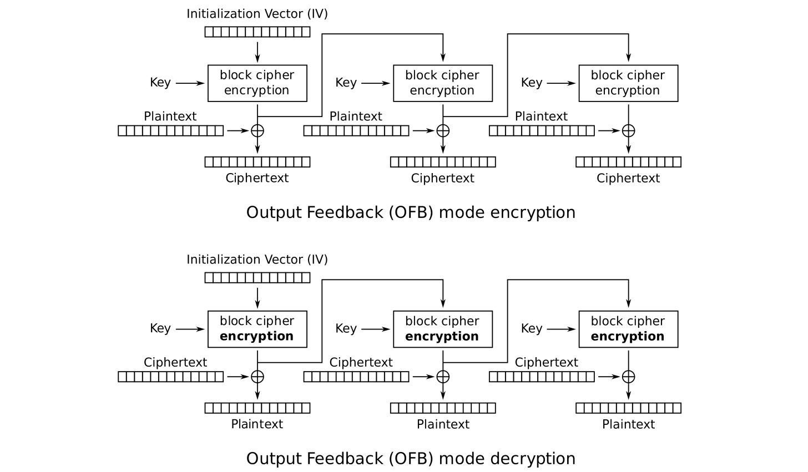

# Mode of operations (on block cipher)

How to encrypt arbitrary length of message with a block cipher?

## Padding

1. Add a single "1"
2. then add "0"s to complete the final block

## ECB(Electronic CookBook) mode 

Independently.

TOTALLY INSECURE: like a great substitution cipher

## CBC(Cipher Block Chaining) mode

Generally secure.

## CFB(Cipher Feedback) Mode

## OFB(Output Feedback) Mode

## CTR(counter) Mode

