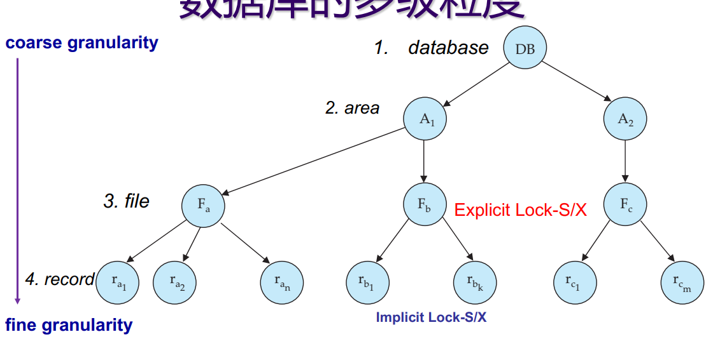
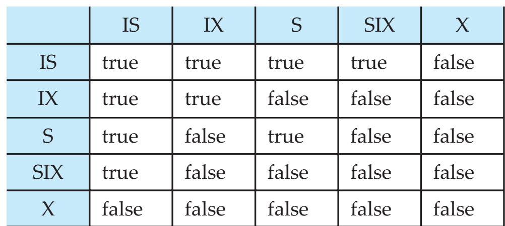

# 并发控制(Concurrency Control)

## 基于锁的协议

- 排他锁（X）：可读可写
- 共享锁（S）：只可写

锁相容矩阵：

|     | S     | X     |
| --- | ----- | ----- |
| S   | true  | false |
| X   | false | false |

### 两阶段封锁协议：（2 Phase Locking）

保证冲突可串行化（Conflict Serializable）

第一阶段：增长阶段，一个事务可以获得锁，不能释放锁

第二阶段：缩减阶段，一个事务可以释放锁，但不能够获得新锁

可以保证冲突可串行化，串行化顺序根据获得最后一个锁的时间排序。

+ 严格二阶段封锁协议：一个 transaction 必须在 commit/abort 之前持有它的全部排他锁
    + 避免级联回滚，实现了读提交隔离级别
+ 强二阶段封锁协议：一个 transaction 必须在 commit/abort 之前持有它的全部锁
    + 避免了级联回滚，实现了可串行化级联级别

#### 锁转换

增加锁的转换

+ 升级：共享到排他
+ 降级：排他到共享

锁升级只能在增长阶段，降级只能在收缩阶段

#### 锁管理器

## 死锁处理

### 预防

1. 同时获取所有需要的锁。效率很低
2. 要求事务只能按照给定的顺序来获取数据项的锁
3. 基于时间戳的
    + wait-die 仅当请求锁的事务更老时，才等待，否则自杀；
    + wound-wait 当请求锁的事务更年轻时，杀掉目前持有锁的事务
    + 杀掉的事务的时间戳不变（避免 Starvation）
4. 基于超时的预防策略，等太久了直接杀掉（可能有 Starvation）

### 检测与恢复

1. 死锁检测：构建等待图，选择牺牲者，回滚

## 基于图的协议（GBP）

只使用排他锁

## 多粒度封锁协议

### 意向锁

Intension 的意思就是，我肯定会在子结点加锁；所以某些其他的锁就不能够锁根了

在遍历过程中，给路径上每个结点都打上意向锁。

## 基于时间戳的协议

### 事务的时间戳

1. 每个事务 $T_i$ 关联一个时间戳 $TS(T_i)$

2. 时间戳较小的必须先进入系统

3. 时间戳的大小决定了可串行化的顺序

### 数据的时间戳

1. 每个数据 $Q$ 有两个时间戳，读和写
2. $WS(Q)$ 代表曾执行写数据的事务的，最大的时间戳
3. $RS(Q)$ 代表曾执行读数据的事务的，最大的时间戳

### 时间戳排序协议

只有在事务的时间戳大于数据的时间戳的时候，才能读写；否则回滚。

被回滚的事务将被赋予新的时间戳，重新启动

!!!note
    可能会有级联回滚

    Solution:

    1. 只在末尾写
    2. 对位提交的数据项的读操作推迟到更新该数据项的事务提交之后
    3. commit dependencies

#### Thomas Write Rule

过时的写不需要回滚

### 基于有效性检查的协议

一个事务分为三个阶段

1. 读阶段：write 到临时变量之中
2. 有效性检查阶段：检查是否存在冲突
3. 写阶段：有效的话就存进数据库

乐观的并发控制：我们假设没有什么冲突，继续进行

测试冲突的方法：

1. 事务关联三个时间戳：START开始时间，Validation 开始检查有效性的时间，Finish 完成其写阶段的时间
2. 利用 Validation=TS 时间进行串行化
3. 检查冲突的条件，所有 $TS(T_k) < TS(T_i)$ 的事务都必须满足如下条件之一：
    + $FinishTS(T_k) < StartTS(T_i)$
    + $T_k$ 写的 和 $T_i$ 读的并不相交。$StartTS(T_i) < FinishTS(T_k) < ValidationTS(T_i)$

## 多版本机制

每个 write 创建一个新版本，每次 read 需要选择正确的状态。