# ER models

## The Entity-Relationship Model

!!!definition "Data modeling language"
    Collection of symbols for describing data, data relationship, data semantics and consistency constraint.

### Meta Object Facility(MOF)

$M_0$ : the real world 数据

$M_1$ : model 元数据

$M_2$ : metamodel 语言

$M_3$ : metametamodel 元语言

represent the overall conceptual structure of a database

### Three basic concepts

1. entity sets(实体集) & attributes(属性):
    1. Entity: an object that exists and is distinguishable from other objects
    2. Entity set: a set of entities of the same type that share same properties
2. relationship sets(联系集)
    1. Relationship: an association among several entities
    2. Relationship set: a mathmatical relation among $n \geq 2$ entity sets $\{(e_1, \cdots, e_n) \mid e_1 \in E_1, \cdots, e_n \in E_n\}$
3. Attributes: a set of attributes describe an entity
    1. simple/composite; single-valued/multivalued; derived(dynamic from other attribute);
    2. domain
    3. super key: one or more attributes whose value uniquely determine each entity
    4. candidate key: minimal super key
    5. primary key: one of the candidate keys that is selected 

### Symbols of ER-model

Entity:

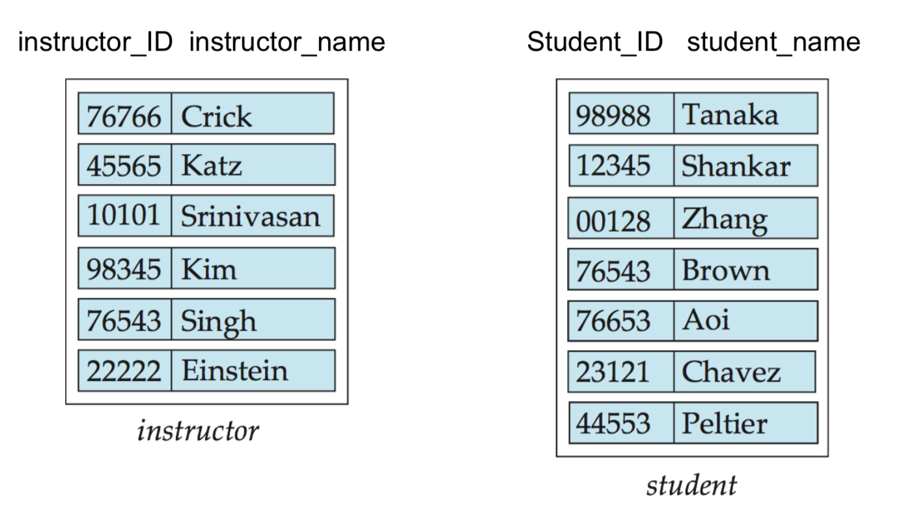

Entity set:

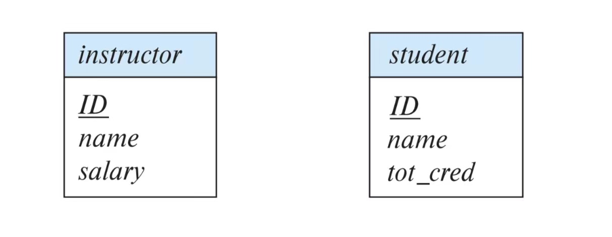

Complex attributes:

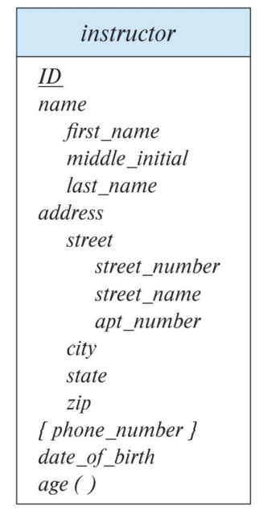

> `{...}` means multiple value attribute, `...()` means derived attribute

Relationship set:

(binary)

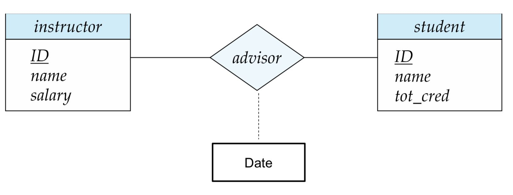

> The box below is an "attribute set"

(multiple)

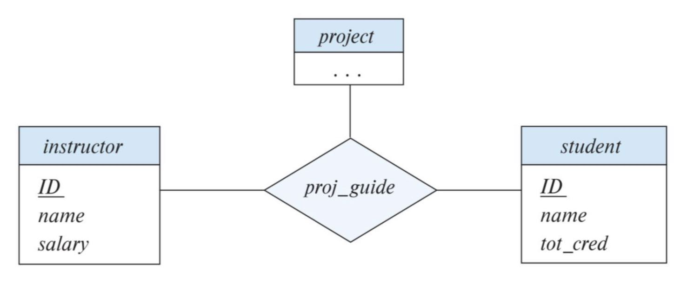

(multiple occurance, add a role)

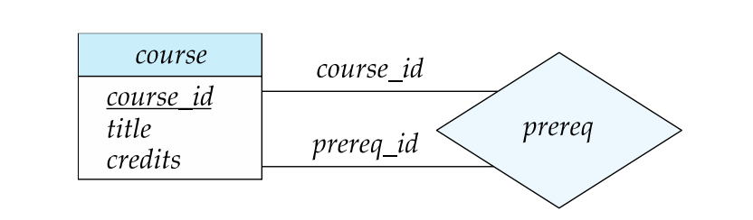

## mapping cardinality

Four types:

+ one to one
+ one to many
+ many to one
+ many to many

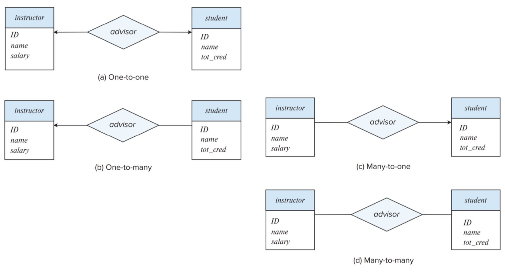

> arrow means: (the other side) can only appear once

## Participation

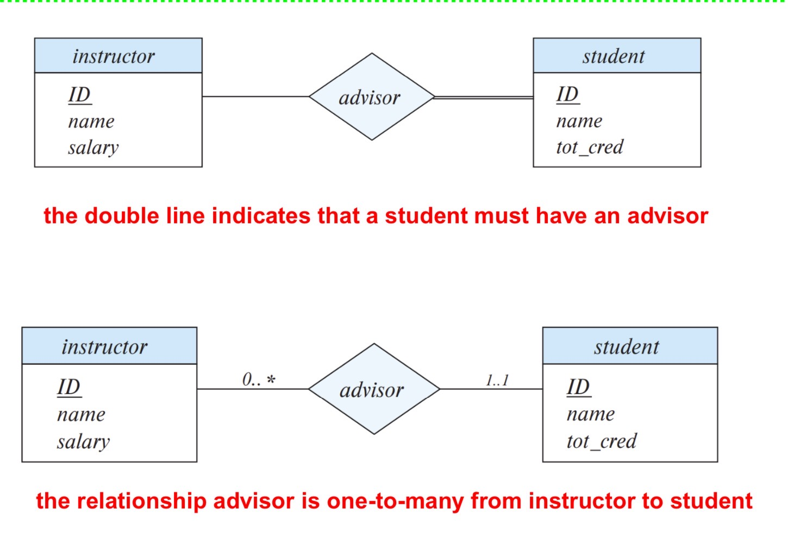

> double line means total partipation

## Weak Entity Sets

!!!definition "Weak Entity Set"
    the set whose existence is dependent on another **entity**(called identifying entity)

We use extra attributes called **discriminator** to uniquely identify a weak entity. 

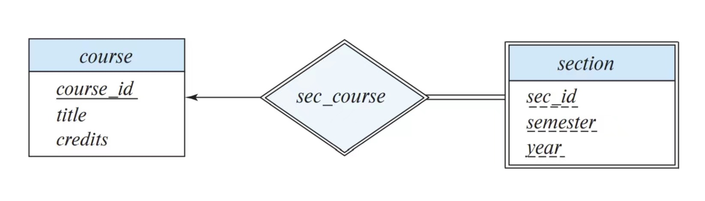

> double line frame, double line relationship set
> 
> mostly: all participation, one-to-many 
>
> dot lines to mark the primary key 

## Reduction to Relation Schemas

We can reduce *entity sets* and *relationship sets* uniformly as **relation schemas**

!!!definition "Schemas"
    Schema has a number of columns(generally corresponding to attributes), which have unique names.
    
+ Strong Entity set: to a schema with the same attributes
+ Weak Entity set: to a schema include a column for the primary key and other attributes
+ Many-to-Many relationship set: to a schema including primary keys of the two particiating entity sets
+ Composite attributes: flattened
+ Multivalued attributes: add a new schema that add this value as a primary key

### Redundancy of Schemas

one-one / one-many / many-one relationship: "many" can be added to the "one" side as extra attributes

The schema corresponding to **a relationship set linking a weak entity set to its identifying string entity set is redundant**

## Advanced Topic

### Redundant attributes

### Specialization & Generation

OOP extension

### Aggregation

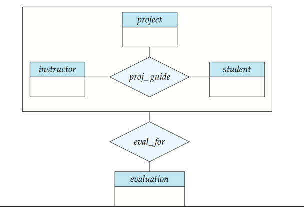

Aggregate some entities and relationship as a whole

## Design Issues

### entity set v.s. attributes:

### entity sets v.s. relational sets

relational sets are used to describe an action that occurs between entities

### binary v.s. non-binary realtionships

### UML: unifying modeling language

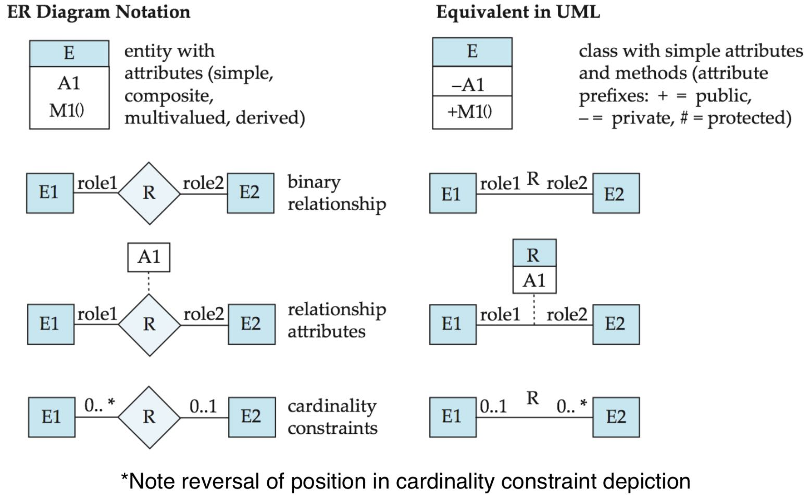

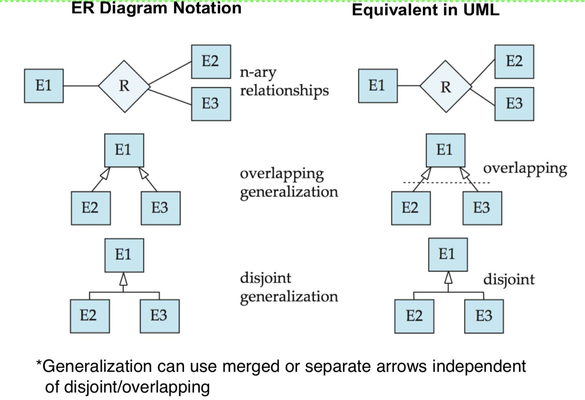

