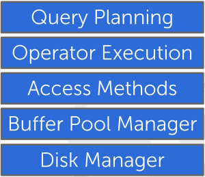

# 数据库

<https://15445.courses.cs.cmu.edu/fall2021/>

## 数据库存储结构

以下四个部分：

+ Internal Meta-Data: 一些数据库的元数据，例如 page table 和 page directories
+ Core Data Storage: 核心数据的存储，包括 Tuple 和 Page
+ Temporary Data Structure: 为了查询而临时建构的存储
+ Table Indices: 为了加速查询而建造的额外数据结构

有以下两个考虑的问题：
+ Data organization: 具体的数据如何组织成为数据结构
+ Concurrency: 如何保证并发的安全性

## 数据结构

### Hash Table 

