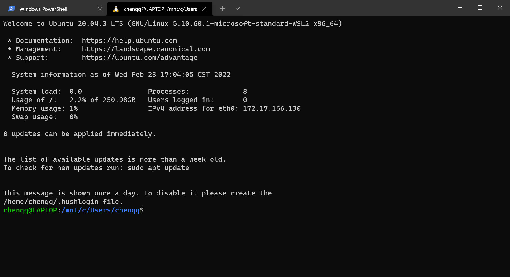
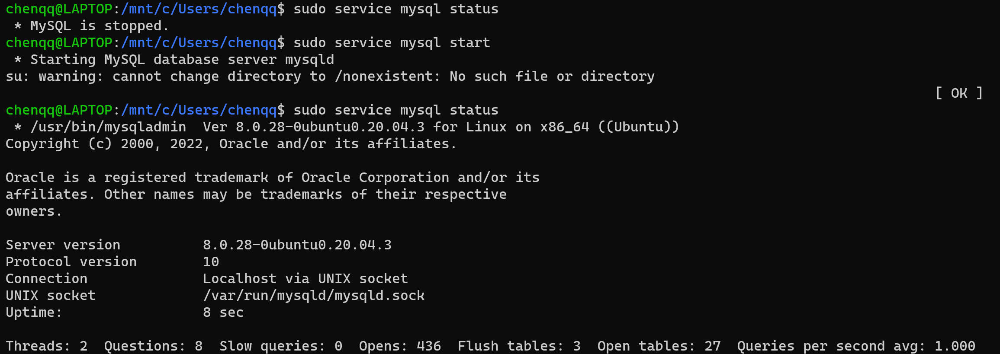
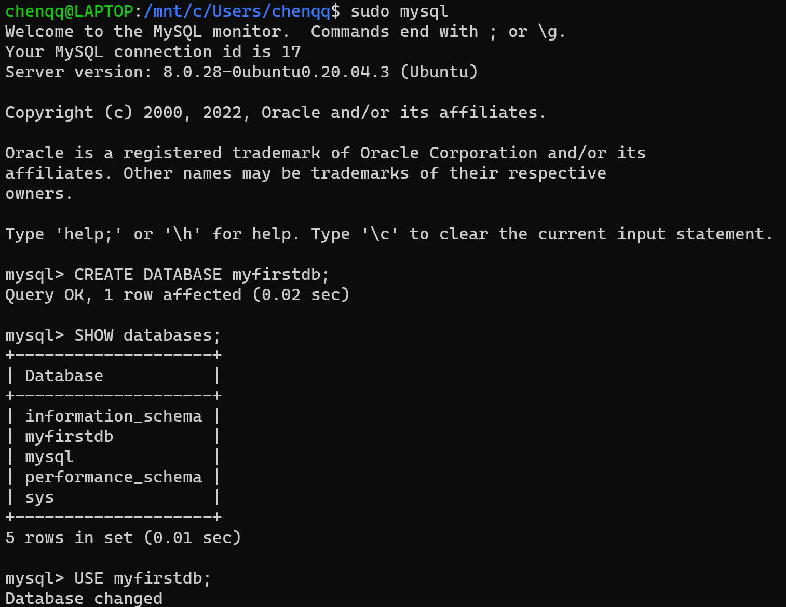
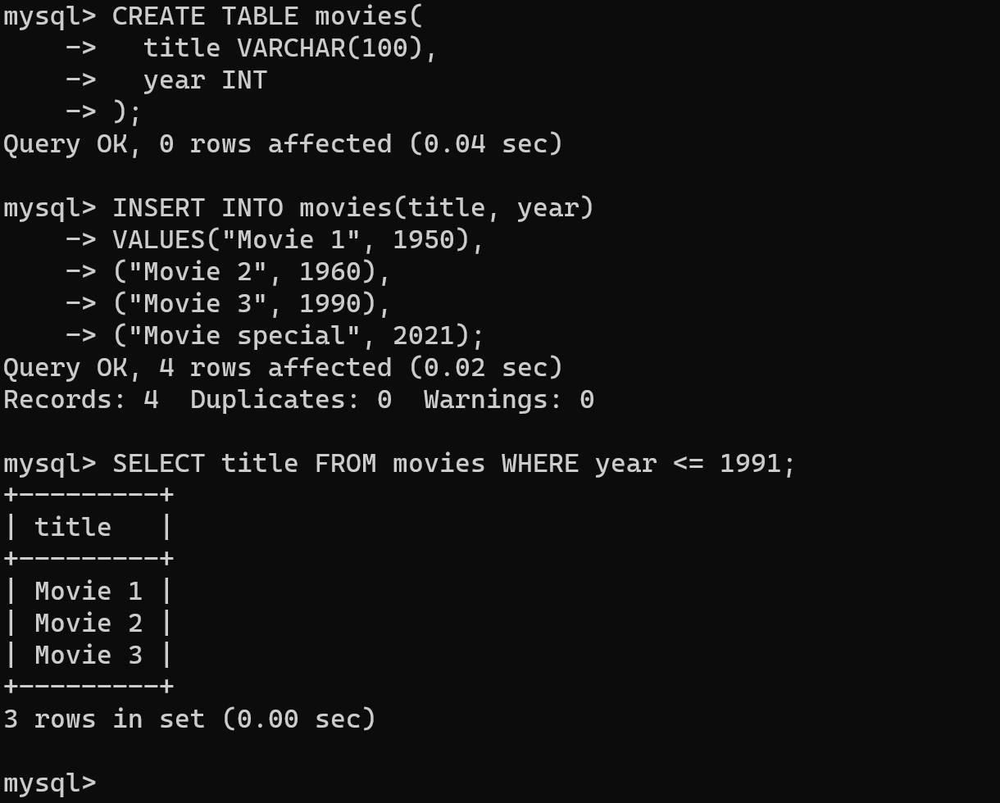

# MySQL 在 WSL 上的安装

在 WSL(例如：Ubuntu) 上安装 MySQL 的步骤如下：

## 安装

### 打开 WSL 终端



### 升级 Ubuntu 包

`sudo apt update`

结果：

```shell
chenqq@LAPTOP:/mnt/c/Users/chenqq$ sudo apt update
[sudo] password for chenqq:
Hit:1 http://mirrors.tuna.tsinghua.edu.cn/ubuntu focal InRelease
Get:2 http://mirrors.tuna.tsinghua.edu.cn/ubuntu focal-updates InRelease [114 kB]
Get:3 http://mirrors.tuna.tsinghua.edu.cn/ubuntu focal-backports InRelease [108 kB]
Get:4 http://mirrors.tuna.tsinghua.edu.cn/ubuntu focal-security InRelease [114 kB]
Get:5 http://mirrors.tuna.tsinghua.edu.cn/ubuntu focal-updates/main amd64 Packages [1600 kB]
Get:6 http://mirrors.tuna.tsinghua.edu.cn/ubuntu focal-updates/main Translation-en [306 kB]
Get:7 http://mirrors.tuna.tsinghua.edu.cn/ubuntu focal-updates/main amd64 c-n-f Metadata [14.8 kB]
Get:8 http://mirrors.tuna.tsinghua.edu.cn/ubuntu focal-updates/restricted amd64 Packages [818 kB]
Get:9 http://mirrors.tuna.tsinghua.edu.cn/ubuntu focal-updates/restricted Translation-en [116 kB]
Get:10 http://mirrors.tuna.tsinghua.edu.cn/ubuntu focal-updates/restricted amd64 c-n-f Metadata [500 B]
Get:11 http://mirrors.tuna.tsinghua.edu.cn/ubuntu focal-updates/universe amd64 Packages [905 kB]
Get:12 http://mirrors.tuna.tsinghua.edu.cn/ubuntu focal-updates/universe Translation-en [201 kB]
Get:13 http://mirrors.tuna.tsinghua.edu.cn/ubuntu focal-updates/universe amd64 c-n-f Metadata [20.1 kB]
Get:14 http://mirrors.tuna.tsinghua.edu.cn/ubuntu focal-updates/multiverse amd64 Packages [23.7 kB]
Get:15 http://mirrors.tuna.tsinghua.edu.cn/ubuntu focal-updates/multiverse Translation-en [7312 B]
Get:16 http://mirrors.tuna.tsinghua.edu.cn/ubuntu focal-updates/multiverse amd64 c-n-f Metadata [580 B]
Get:17 http://mirrors.tuna.tsinghua.edu.cn/ubuntu focal-backports/universe amd64 Packages [22.0 kB]
Get:18 http://mirrors.tuna.tsinghua.edu.cn/ubuntu focal-backports/universe Translation-en [15.2 kB]
Get:19 http://mirrors.tuna.tsinghua.edu.cn/ubuntu focal-backports/universe amd64 c-n-f Metadata [728 B]
Get:20 http://mirrors.tuna.tsinghua.edu.cn/ubuntu focal-security/main amd64 Packages [1265 kB]
Get:21 http://mirrors.tuna.tsinghua.edu.cn/ubuntu focal-security/main Translation-en [221 kB]
Get:22 http://mirrors.tuna.tsinghua.edu.cn/ubuntu focal-security/main amd64 c-n-f Metadata [9624 B]
Get:23 http://mirrors.tuna.tsinghua.edu.cn/ubuntu focal-security/restricted amd64 Packages [764 kB]
Get:24 http://mirrors.tuna.tsinghua.edu.cn/ubuntu focal-security/restricted Translation-en [109 kB]
Get:25 http://mirrors.tuna.tsinghua.edu.cn/ubuntu focal-security/restricted amd64 c-n-f Metadata [504 B]
Get:26 http://mirrors.tuna.tsinghua.edu.cn/ubuntu focal-security/universe amd64 Packages [679 kB]
Get:27 http://mirrors.tuna.tsinghua.edu.cn/ubuntu focal-security/universe Translation-en [116 kB]
Get:28 http://mirrors.tuna.tsinghua.edu.cn/ubuntu focal-security/universe amd64 c-n-f Metadata [13.1 kB]
Get:29 http://mirrors.tuna.tsinghua.edu.cn/ubuntu focal-security/multiverse amd64 Packages [20.7 kB]
Get:30 http://mirrors.tuna.tsinghua.edu.cn/ubuntu focal-security/multiverse Translation-en [5196 B]
Get:31 http://mirrors.tuna.tsinghua.edu.cn/ubuntu focal-security/multiverse amd64 c-n-f Metadata [500 B]
Fetched 7592 kB in 3s (2605 kB/s)
Reading package lists... Done
Building dependency tree
Reading state information... Done
48 packages can be upgraded. Run 'apt list --upgradable' to see them.
```

### 利用包管理器安装 MySQL

 `sudo apt install mysql-server`

结果：

```shell
chenqq@LAPTOP:/mnt/c/Users/chenqq$ sudo apt install mysql-server
Reading package lists... Done
Building dependency tree
Reading state information... Done
The following additional packages will be installed:
  libcgi-fast-perl libcgi-pm-perl libfcgi-perl libhtml-template-perl libmecab2 mecab-ipadic mecab-ipadic-utf8
  mecab-utils mysql-client-8.0 mysql-client-core-8.0 mysql-common mysql-server-8.0 mysql-server-core-8.0
Suggested packages:
  libipc-sharedcache-perl mailx tinyca
The following NEW packages will be installed:
reading /usr/share/mecab/dic/ipadic/Noun.proper.csv ... 27328
reading /usr/share/mecab/dic/ipadic/Others.csv ... 2
reading /usr/share/mecab/dic/ipadic/Noun.nai.csv ... 42
reading /usr/share/mecab/dic/ipadic/Prefix.csv ... 221
reading /usr/share/mecab/dic/ipadic/Noun.org.csv ... 16668
reading /usr/share/mecab/dic/ipadic/Noun.csv ... 60477
reading /usr/share/mecab/dic/ipadic/Symbol.csv ... 208
reading /usr/share/mecab/dic/ipadic/Postp.csv ... 146
reading /usr/share/mecab/dic/ipadic/Noun.adverbal.csv ... 795
reading /usr/share/mecab/dic/ipadic/Adnominal.csv ... 135
reading /usr/share/mecab/dic/ipadic/Interjection.csv ... 252
reading /usr/share/mecab/dic/ipadic/Noun.demonst.csv ... 120
reading /usr/share/mecab/dic/ipadic/Adj.csv ... 27210
reading /usr/share/mecab/dic/ipadic/Verb.csv ... 130750
reading /usr/share/mecab/dic/ipadic/Noun.verbal.csv ... 12146
reading /usr/share/mecab/dic/ipadic/Noun.adjv.csv ... 3328
emitting double-array: 100% |###########################################|
reading /usr/share/mecab/dic/ipadic/matrix.def ... 1316x1316
emitting matrix      : 100% |###########################################|

done!
update-alternatives: using /var/lib/mecab/dic/ipadic-utf8 to provide /var/lib/mecab/dic/debian (mecab-dictionary) in auto mode
Setting up mysql-server (8.0.28-0ubuntu0.20.04.3) ...
Processing triggers for systemd (245.4-4ubuntu3.15) ...
Processing triggers for man-db (2.9.1-1) ...
Processing triggers for libc-bin (2.31-0ubuntu9.2) ...
```

### 确认安装以及版本

`mysql --version`


### 启动服务

`sudo service mysql status/start/stop`



## 使用数据库

### 创建 database



### 修改表



参考：

+ [Add or connect a database with WSL | Microsoft Docs](https://docs.microsoft.com/en-us/windows/wsl/tutorials/wsl-database)
+ [[Fixed\] "System has not been booted with systemd as init system" Error (linuxhandbook.com)](https://linuxhandbook.com/system-has-not-been-booted-with-systemd/)