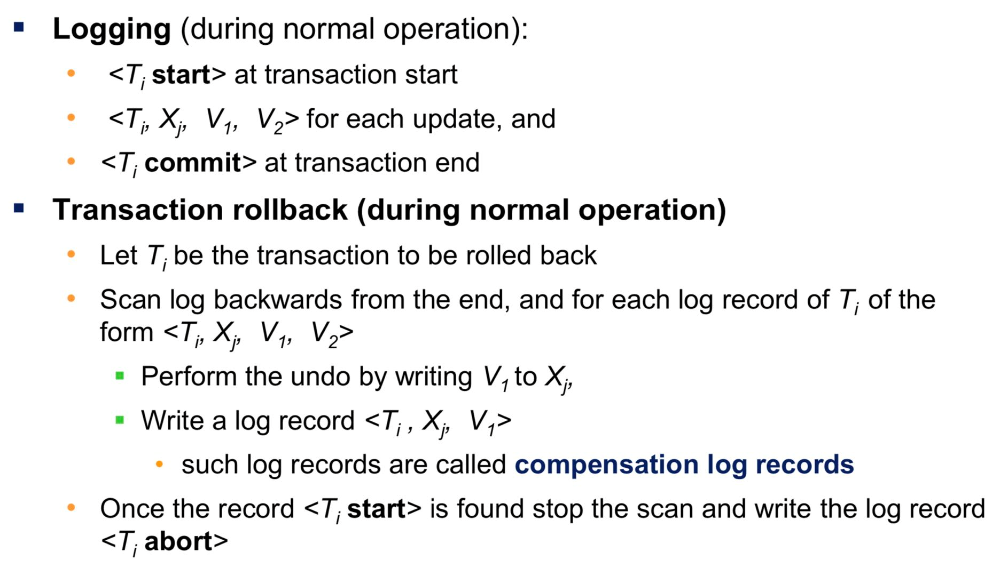
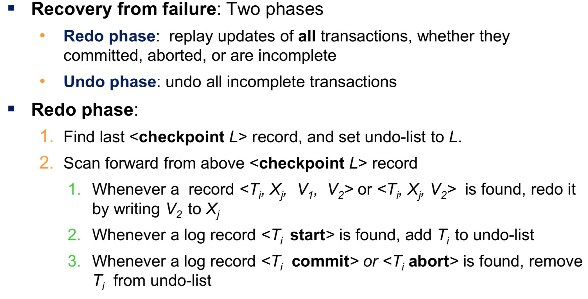
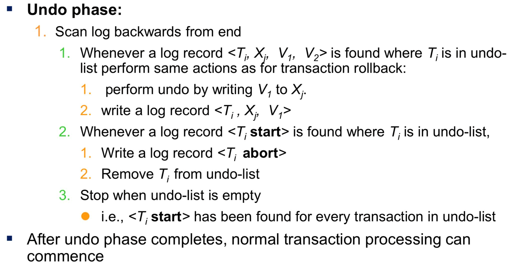

# 恢复 (Recovery)

故障 --> 恢复（保证原子性和持久性）

## 故障

+ 事务故障：事件执行失败
    + 逻辑错误：内部错误（非法数据）
    + 系统错误：e.g. 死锁
+ 系统崩溃（e.g. 硬件故障，导致易失处理器的内容丢失）
    + 故障-停止假设：我们假设系统在遭遇故障时会自动停止
+ 磁盘故障：写失败，数据丢失

## 恢复算法

分为两个部分：

+ 正常事务中：记录一些额外的信息，保证有足够的信息用来恢复
+ 故障后：如何利用以上的额外信息保证数据库的一致性、事务原子性、持久性

## 存储器结构

1. 易失性存储器：主存、缓存
2. 非易失性存储器：磁盘
    + 但他们也可能故障，丢掉所有的数据
3. 稳定存储器：一种可以在近乎所有故障中保存信息的存储器
    + 实现：使用多个非易失存储器，以独立的故障模式复制所需信息，以可控的方式更新信息

### 稳定存储器实现

数据块的传输

1. 成功完成
2. 部分失败：目标块有错误的信息
3. 完全失败

防止传输过程导致的不一致性质：

1. 将信息写入第二个物理块
2. 当第一次写成功完成后，将相同信息写入第二个物理块
3. 当第二次写成功完成后，就成功传输了一个块

如何恢复：

1. 检查每一个块两个拷贝是否一致
2. 如果不一致，将 写入成功的块覆盖到不成功的块，或者进行一次重传

## 数据访问

不是直接访问磁盘，而是通过内存进行缓存。

+ 物理块（在磁盘上）
+ 缓存块（在内存中）

两个操作：

+ input(A) 传输物理块 A 到主存
+ output(B) 传输缓存块 B 到磁盘，替换磁盘上原有的块

对于每个事务 $T_i$，都有一个私有的工作区，将数据项 $X$ 记录为 $x_i$，两个操作：

+ read(X) ：将数据项 $X$ 的值赋予局部变量 $x_i$
+ write(X)：将局部变量 $x_i$ 的值赋予缓冲块中的数据项 $X$
    + 如果 $X$ 所在块不在主存中，需要先进行一次 input

## 恢复与原子性

基于日志的恢复方法

日志，就是日志记录（log record）的序列

几种日志记录：

+ 事务开始：`<T_i start>`
+ 事务提交：`<T_i commit>`
+ 事务中止：`<T_i abort>`
+ 写：`<T_i, X, V_1, V_2>`

## 数据库修改

+ 延迟修改；事务直到提交都还没有修改数据库
+ 立即修改：事务在活跃的时候就修改了数据库

## 事务提交

## 重做和撤销事务

+ undo(T_i)：对每一个写的日志，倒着把旧的值写进去；完成之后写入一个 abort
+ redo(T_i)：注意没有日志

从失败中恢复过来：

1. 有 `<T_i start>`，没有 `commit` 或者 `abort` --> 执行 undo
2. 有 `<T_i start>`，也有 `commit` 或者 `abort` --> 执行 redo

### 检查点

减少恢复的耗时，引入定时执行的 **“检查点”**：

1. 将当前位于主存所有日志记录输出到稳定存储器
2. 将所有修改过的缓冲块输出到磁盘
3. 加入一个日志记录：`<checkpoint L>`，其中 L 是执行检查点的时候活跃的事务。

注意：执行检查点时，所有事务的更新操作都需要暂停运行。

系统崩溃恢复之后：

1. 找到最后一个 `<checkpoint L>`
2. 对 `L` 中的事务，以及在 checkpoint 之后猜 start ，执行 redo 或者 undo 

## 恢复算法

用日志方法的完整的恢复算法：

## 缓冲区管理

恢复技巧需要额外的一些要求，**先写日志**要求（Write-Ahead-Log，WAL）

1. 在 `<T_i commit>` 输出到稳定存储器之后，事务 $T_i$ 进入提交状态
2. 在 `<T_i commit>` 输出到稳定存储器之前，事务 $T_i$ 的所有日志记录必须已经输出到稳定存储器
3. 在主存中的数据块输出到数据库（非易失存储器）之前，与该块中数据有关的所有日志记录必须先输出到稳定存储器。

缓存策略：

1. 强制缓存：事务在提交的时候会将修改的所有快都输出到磁盘。
2. 非强制策略：一个事务修改的某些块还没有被输出到磁盘的时候，也允许它提交。
3. 抢占策略：允许系统将修改过的块写到磁盘，即使这些事务还没有完全提交。
4. 非抢占策略：一个仍然活跃的事务修改过块都不应该被写出到磁盘。

如何输出到磁盘：

1. 首先获得该块上的排他锁（latch），确保没有其他块在对这个块执行写操作
2. 将日志记录输出到稳定存储器，直至该块相关的所有日志记录都输出完成
3. 将该块输出到磁盘
4. 输出完成就释放锁

一些问题：

+ 如果使用虚拟内存，容易被操作系统放到 swap 里面，导致很大的 overhead IO
+ 绝大多数的系统并不支持直接控制虚拟内存

## 非易失存储器上的数据丢失的故障

基本的机制是周期性的**转储**(dump)，类似检查点：

1. 将在主存中的日志记录输出到稳定存储器中
2. 将缓存块输出到磁盘中
3. 将数据库的内容拷贝到稳定存储器中
4. 将 `<dump>` 日志记录输出到稳定存储器中。

恢复：

+ 从最近的 `dump` 恢复到数据库
+ 把 dump 之后的所有部分都 redo 一遍

## 远程备份系统

主站点和辅助站点

+ 故障检测
+ 控制权移交
+ 恢复时间
+ 提交时间