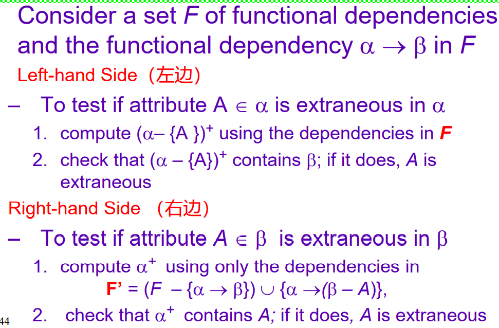
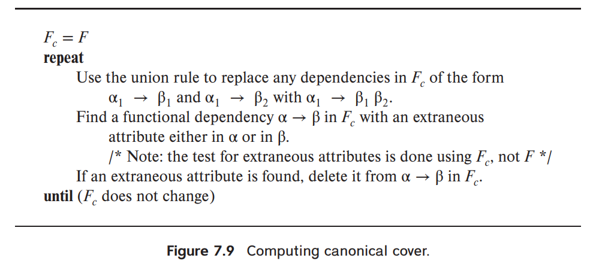
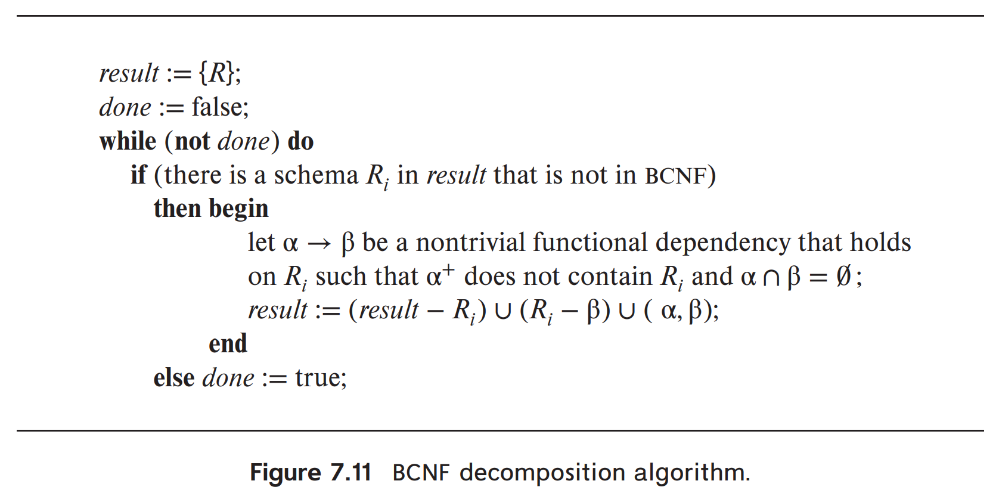
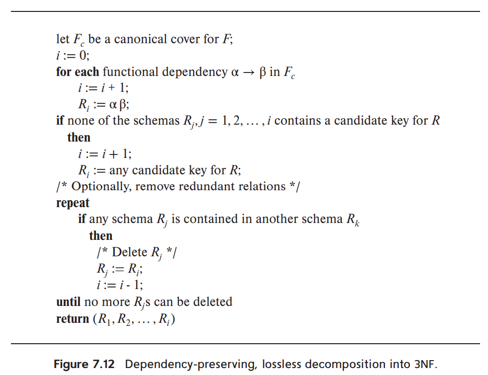

# Relational Norms

How to judge whether a relation model is "good"?

How to make a relation model "good"?

## Some Pitfalls & Solution of E.R model

+ Avoid redundant data
    + decompose a relation $R$ into $R_1, \cdots, R_n$
+ Avoid anomalies of insert, delete and update
    + facilitate the checking of modifications for violation of database integrity constraints

    
## First Normal Form

Domain is atomic if its elements are considered to be indivisible units.

## Functional dependency

$R$ is a relation schema, $\alpha, \beta \subseteq R$

$t_1[\alpha] = t_2[\alpha] \Longrightarrow t_1[\beta] = t_2[\beta]$ for all tuples $t_1,t_2$

for every legal $r(R)$

We denote that as $\alpha \to \beta$

> the values of attributes $\alpha$ can determine values of attributes $\beta$

Trivial ones: $A \to A$, $AB \to A$

### Armstrong rules 

For functional dependency: 

+ reflexivity rule
+ augmentation rule
+ transitivity rule 

Other rules:

+ Union rule
+ Decomposition rule
+ Pseudotransitivity rule

### Clousure of ...

Use $(\cdot)^+$ to denote clousure of

+ Functional Dependency
+ Attribute Set

> $F^+$ is all functional dependency on $F$, considering all rules

!!!example "Use functional dependency to check decomposition"
    $R_1$ and $R_2$ is a loseless decomposition if and only if $R_1 \cap R_2 \to R_1$ or $R_1 \cap R_2 \to R_2$ .

### Extraneous Attributes

Extraneous: we can remove any attributes from a functional dependency.

How to test:

### Canonical Cover

$F_c$ is the Canonical Cover of $F$ if:

+ $F_c$ implies all functional dependency in $F$ (also reversely)
+ no functional dependency is extraneous
+ no functional dependency share same left hand side

How to calculate:

## Decomposition

!!!definition "Loseless Decomposition"
    Decompose $R$ into $R_1$ and $R_2$, then it is **loseless** if and only if $\prod_{R_1}(r) \Join \prod_{R_2}(r) = R$ 。

!!!theorem
    If $R_1 \cap R_2$ forms a superkey for **either** $R_1$ **or** $R_2$, then this decomposition is loseless.

### Dependency preservation 

$F_i$ is the restriction of $F$ to $R_i$:

all functional dependencies in $F^+$ that include only attributes of $R_i$

dependency-preserving decomposition:

$F' = \bigcup F_i$, $F^+ = F'^+$

## Decomposition Algorithm / Normal Form

### BCNF

!!!definition
    For all functional dependency $\alpha \to \beta$, these two condition must satisify at least one:

    1. $\alpha \to \beta$ is trivial
    2. $\alpha$ is a superkey. 

### 3NF

add:

every attributes in $\beta - \alpha$ is included in one of $R$'s candidate keys

