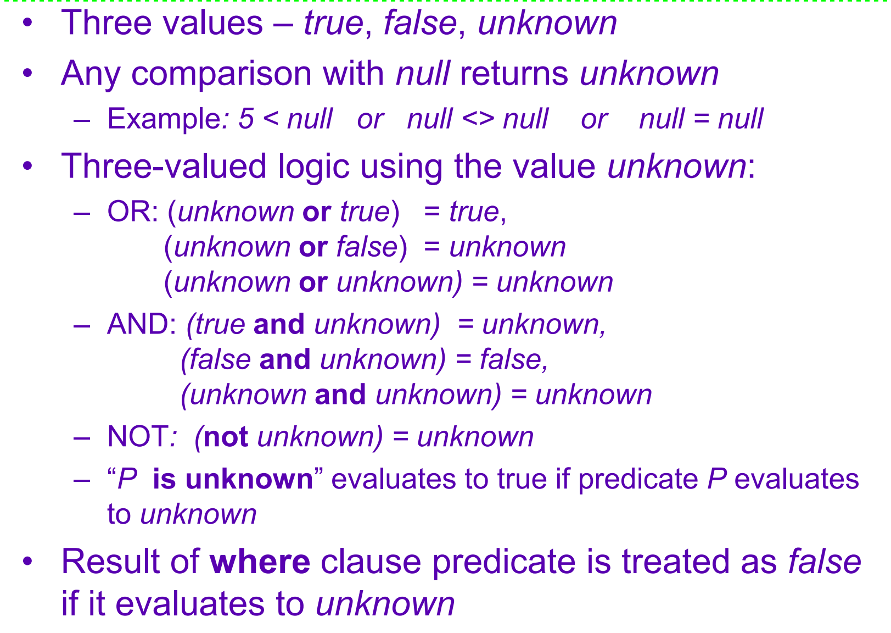

# SQL 语句

## 表操作

### 创建

```sql
CREATE TABLE student (
    sid INT PRIMARY KEY, 
    name VARCHAR(16),
    login VARCHAR(32) UNIQUE, 
    age SMALLINT,
    gpa FLOAT 
);

CREATE TABLE course (
    cid VARCHAR(32) PRIMARY KEY, 
    name VARCHAR(32) NOT NULL
);

CREATE TABLE enrolled (
    sid INT REFERENCES student (sid),
    cid VARCHAR(32) REFERENCES course (cid), 
    grade CHAR(1)
);
```

（课件：

数值形如 `numeric(3, 1)`

约束写在最后面，如：

```sql
primary key(ID, course_id),
foreign key(ID, ...) references student,
```

）

### 删除

```sql
drop table r;
```

### 修改

```sql
alter table r add A D;
```

(新值被赋予 null)

```sql
alter table r drop A;
```

## 查

### 基本：SFW语句

```sql
SELECT s.name
FROM enrolled AS e, student AS s
WHERE e.grade = 'A' AND e.cid = '15-721'
AND e.sid = s.sid;
```

`AS` 来换名

`is null` 



### 聚合属性

几乎只能用在 select 后面，当作输出。

主要的有： `AVG(COL)`, `MIN(COL)`, `MAX(COL)` , `COUNT(COL)` 。

select 里面非聚合的属性必须在 `GROUP BY` 语句中出现。

!!!example
    ```sql
    SELECT AVG(s.gpa), e.cid
    FROM enrolled AS e, student AS s
    WHERE e.sid = s.sid
    GROUP BY e.cid;
    ```
`HAVING` 语句可以根据聚合属性进一步筛选。


!!!example
    ```sql
    SELECT AVG(s.gpa), e.cid
    FROM enrolled AS e, student AS s
    WHERE e.sid = s.sid
    GROUP BY e.cid
    HAVING AVG(s.gpa) > 3.9;
    ```

`DISTINCT` 可以去重。

!!!example
    例子待补。

    
### 输出控制

`ORDER BY` 语句可以把输出排序。 `DESC` 是降序，`ASC` 是升序（默认）。

!!!example 
    ```sql
    ORDER BY a DESC, b ASC，
    ```

`LIMIT` 语句控制输出几个。如果不排序结果是随机的。可以用 OFFSET 语句控制偏移（没有逗号分割）。

### 嵌套查询

几乎在哪里都可以嵌套。

加个括号就完事（）

如果是 `WHERE` 语句内，会用 `IN/ALL/ANY` 来串联。

`IN` 等价于 `=ANY` 。

`EXISTS` ...

`> SOME( subquery)`

!!!example
    ```sql
    SELECT name FROM student
    WHERE sid IN (
        SELECT sid FROM enrolled
        WHERE cid = '15-445'
    );
    ```


### Window Functions

```sql
SELECT *, ROW_NUMBER() OVER (ORDER BY cid) 
FROM enrolled ORDER BY cid;
```

```sql
SELECT cid, sid, ROW_NUMBER() OVER (PARTITION BY cid) 
FROM enrolled ORDER BY cid;
```
### Common Table Expression(CTE)

用 `WITH ... AS... ` 定义表格，简化 `SELECT` 的查询

```sql
with cte1 (col1, col2) as (SELECT 1,2), cte2(col3) as (SELECT 1)
SELECT * from cte1, cte2;
```

用上 Recursive 甚至可以递归，成了图灵完备的语言...

!!!example
    ```sql
    WITH RECURSIVE cte(counter) AS (
        (SELECT 1)
        UNION
        ( SELECT counter + 1 FROM cte WHERE counter < 10)
    )
    SELECT * FROM cte;
    ```

## 删除

```sql
delete from r
where r.A = 'b';
```

## 插入

```sql
insert into course [(course_id, ...)]
values('a', 'b', 123, 'd');
```

## 改

```sql
update instructor
set salary = salary * 1.03
where salary > 100000;
```

### where 中的子查询


## 字符串

`%` 匹配任意子串（包括空）

`_` 匹配任意一个字符

`||` 连接两个字符串

## 数据表示

+ 整数: `INTEGER/BIGINT/SMALLINT/TINYINT`
+ 非整数/小数: `FLOAT/REAL` v.s. `NUMERIC/DECIMAL` (IEEE-754)
+ 字符串: `VARCHAR/CARBINARY/TEXT/BLOB`
+ 时间: `TIME/DATE/TIMESTAMP`


过长的数据会用单独的 overflow page 来存。

有的还可以存很大很大的文件，`blob` ，但是理论上就会缺少许多保护。

以上都会用指针。

## 元数据(Schema)

可以如此查询表头：


=== "SQL-92"
    ```sql 
    SELECT *
    FROM INFORMATION_SCHEMA.TABLES
    WHERE table_catalog = '<db name>'
    ```

=== "Postgres"
    ```
    \d student
    ```

=== "mysql"
    ```
    DESCRIBE student;
    ```

=== "sqlite"
    ```
    .schema student
    ```