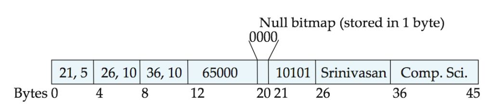

# 数据库的存储方案

数据库所有的数据都存储在磁盘上。

## 记录的存储

### 定长记录

每个 tuple 用连续的，相同长度的数组来存储

可以用自由链表来回收空位置。

### 变长记录

1. 最开始，定长部分存偏移和长度
2. 不变长的直接存
3. 用一个 bitmap 记录是否是空

## Storage Manager

页式存储。

### Database Page

Hardware 的 Page 可以保证失败保护。

Database 的 Page 是存取的的单位。大小为 512B - 16KB。

### Database Heap

组织 Page 的文件。一个 Database 可能不止一个 Heap File。

两种表现形式：

1. 链表
   1. 每个 Heap 有一个 Header Page，指向 Free Page 和 Data Page
   2. Page 会维护一个双向链表
2. 页面目录
   1. 有一个特殊的 Page，维护所有的 Page 的信息（location, free slots）

## Page

聚焦到一个 Page 上面， Page 要维护 Tuple。

### Page Header

维护：

+ size
+ checksum
+ version(Manage System)
+ transaction visibility
+ compression information

### Page Layout: Slotted Pages

可以支持不定长的 Tuple。

除去 header 位置之外：Slot Array 从低往高，Tuple 从高往低。

Slot 记录 Tuple 的起始位置。

删除和增加的时候都利用 Slot 进行。

### Page Layout: Log Structured 

只维护 log 记录。

## Tuple

### Tuple Layout

Header: Visibility info for concurrency control, Bitmap for NULL values(?)

不需要把表的 title 存一遍。

Data: 以 CREATE 语句中的顺序依次存储。

### Unique Identifier

唯一确定一个 Tuple: `(page_id, offser or slot)`

### Denormalized Tuple Data

“pre join”，如果有 foreign key（必须要属于其他的某个表中的元素）。

## Storage Model

|     Name     |     N-ary Storage Model(NSM)     | Decomposition Storage Model(DSM) |
| :-----------: | :-------------------------------: | :------------------------------: |
|  Description  |           按照行来存储           |           按照列来存储            |
|  Advantages  | 快速的插入 整个 Tuple 的读取 |  读取比较高效 可以比较压缩     |
| Disadvantages |      大规模读取引入无关信息      |        单点查询和插入较慢           |
