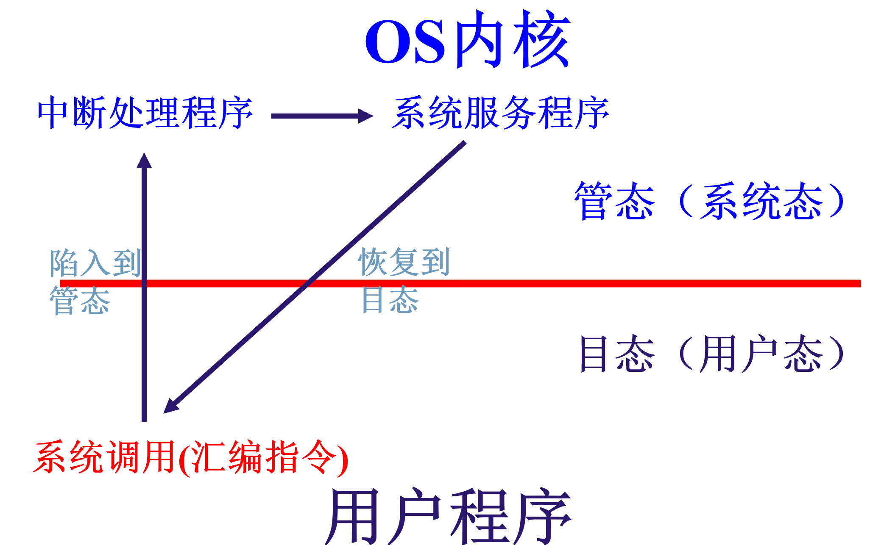

# 第一章 操作系统概述

## 1.1 计算机概述

哪些硬件设备

硬件设备如何组成系统

主板上插了许多硬件设备

计算机指令：指令是计算机运行的最小功能单元，指挥硬件运行的命令

!!!example
    算术、逻辑、移位、数据传送、输入输出、转移

## 1.2 为什么要在计算机中引入操作系统？

假设程序员直接对硬件编程？

* 需要知道 ABCDE 硬件的工作原理...

### 怎么办？

在硬件和应用软件之间，引用一层通用软件：

+ 管理系统部件（硬件）
+ 给上层应用软件和终端用户提供（）接口

---> 操作系统=

不同人眼中的OS——重点不同

## 1.3 操作系统的发展历史

### Phase 1: 1946-1950

硬件非常昂贵，没有操作系统

### Phase 2: 50-70

50-60：批处理管理系统（单道）

通道技术：控制 I/O 设备和内存间的数据传输，有专用的 I/O 处理器

---> 实现 CPU 与 I/O 设备的并行工作

终端技术：CPU 可以保存现场后转去处理该中断事件，完成之后再回来

60-70 多道批处理

当某个作业需要 IO 的时候就把它切换

——宏观上并行，微观上串行

问题：

1. 内存管理
2. 内存保护
3. CPU 调度
4. 进程通信

### Phase 3: 70-

分时系统

terminal -> computer

为了能玩游戏而做出来的

### Phase 4: 80-

硬件便宜起来了

### Phase 5

现代操作系统

+ 规模庞大
+ 极为复杂
+ 互联时代

## 1.4 操作系统的类型

+ 实时操作系统：实时过程控制、实时通信处理
+ 嵌入式操作系统
+ 个人计算机操作系统
+ 分布式操作系统

## 1.5 操作系统需要的硬件特性

### 受保护的指令：只有操作系统才有权使用

- 访问某些硬件资源的指令
- 对 I/O 设备的直接访问
- 对内存管理状态进行操作
- 某些特殊的状态位的设置
- 停机
- 【需要和操作系统提供的接口区分开，有的时候能访问是因为操作系统提供了接口】

#### 如何从硬件上区分？

硬件上记录 ”CPU“ 状态，专门的寄存器：PSW(Program Status Word)，包括 

- CPU 的工作状态码：管态 / 目态
    - 管态：操作系统的管理程序运行时的状态 
    - 目态：用户的程序运行时的状态
    - e.g. x86 处理器：特权环 R0R1R2R3，运行不同类别的代码；现在基本上就两种了
- 条件码：反映指令执行后的结果特征
- 中断屏蔽码：指出是否允许中断

状态之间切换：

+ 管 --> 目：直接改
+ 目 --> 管：使用系统调用

### 系统调用：关机指令之类的，只能...

特殊的访管指令【汇编语句】：执行时引发访管中断；进入管态，执行之后就恢复...

!!! info
    这里是考试重点

Linux 有 72 个系统调用

### 内存保护：控制一个程序能访问的内存空间

最简单的做法：基址寄存器和边界寄存器

### 中断机制

同步中断：CPU 正在执行指令的时候触发的异常（CPU 检测到的、用户设定的）

异步中断：其他的硬件设备在任意时刻所发出的中断（可屏蔽、不可屏蔽），会给一个 0-255 之间的整数，称为”中断向量“

### I/O 系统

### 时钟操作