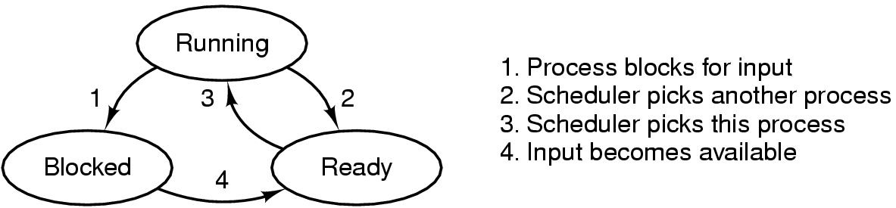
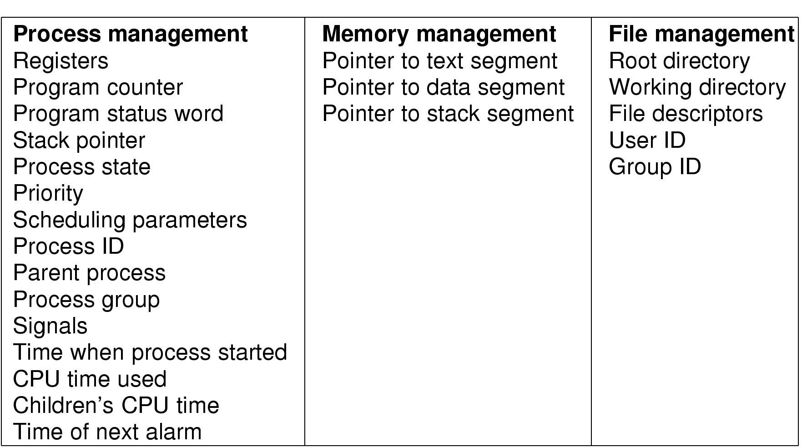
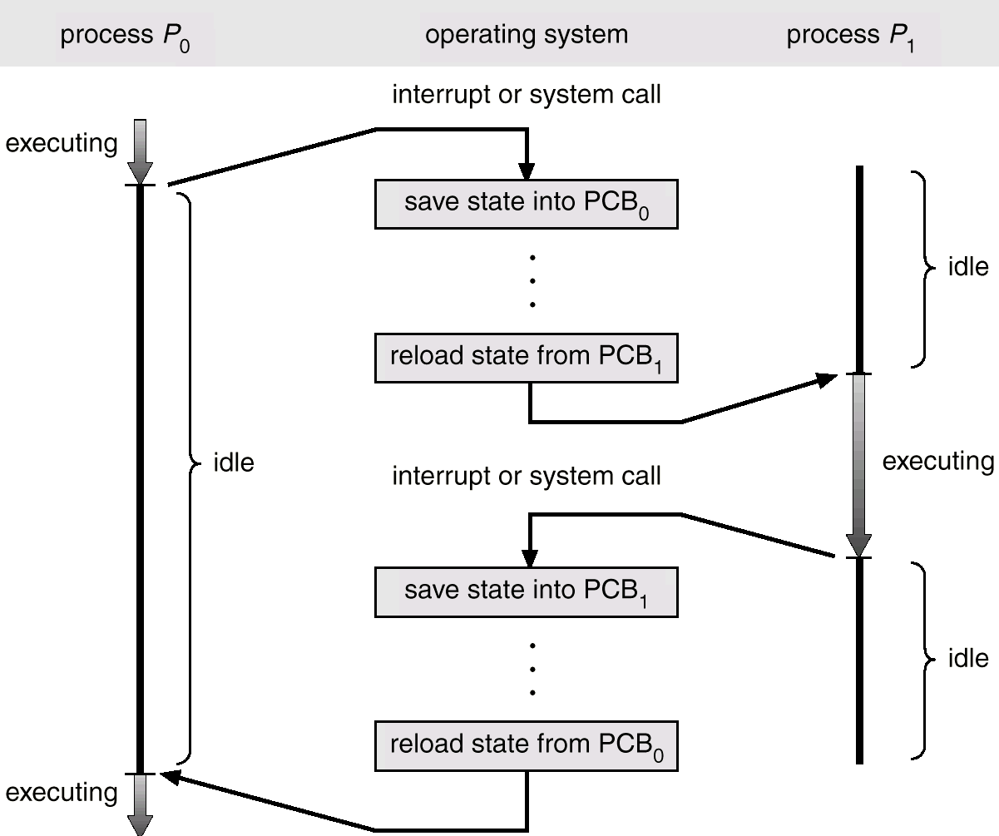
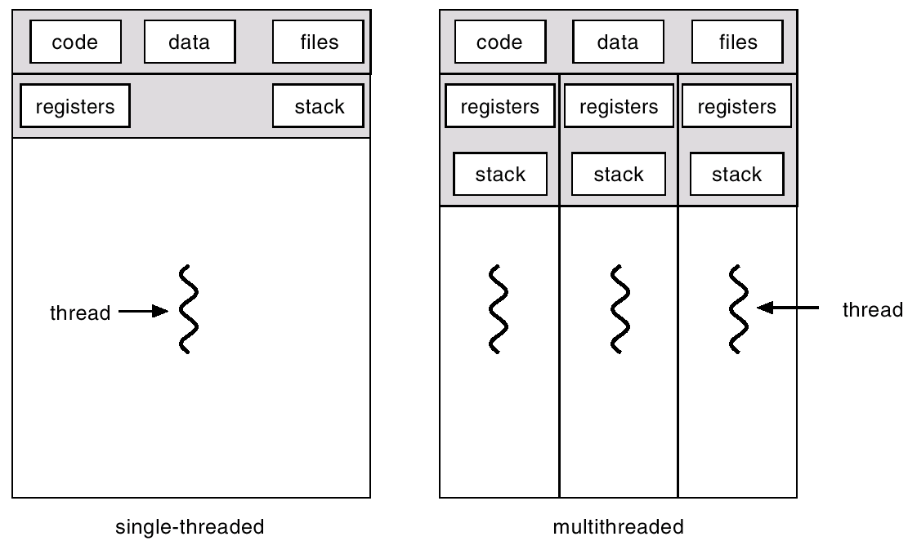
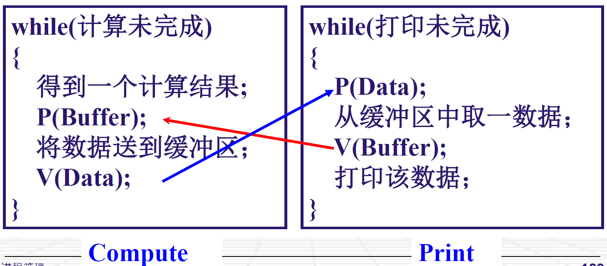

# 第二章 进程管理

Petri 网

## 2.1 进程管理

### 2.1.1 为什么要有进程？

因为多道程序可以...多个程序同时在操作系统中存在并运行

+ 提高计算机系统中各种资源的利用率

CPU会在进程之间来回切换，有一个建议的时间片的值——不能太长也不能太短

### 2.1.2 什么是进程？

A process = a program **in execution**

#### 一个进程应该包括...

+ 程序的代码；
+ 程序的数据；
+ CPU 寄存器的值；
+ 堆（可能不会用到）、栈
+ 一组系统资源（如地址空间、打开的文件【我们现在打开的】）

#### Process and program

Process 拥有 "running context" ，是一个动态的过程。

### 2.1.3 进程的特性

动态性：程序的运行状态在变，PC，寄存器、堆栈等等

独立性：**计算机系统资源的使用单位**，似乎是个“虚拟计算机”，<u>有自己的</u> PC 和 内部状态（物理和逻辑之分）

并发性：宏观上来看，各进程同时独立运行（微观上也是独立的运行的）

### 2.1.4 进程的创建

1. 系统初始化时（服务进程、自启进程）
2. 执行了创建进程的系统调用（父子进程）【windows 底下是 CreateProcess 函数，Unix 是 fork 函数】
3. 用户请求（e.g. 双击程序）

本质上说只有 2 是存在的

### 2.1.5 进程的状态

进程的三种基本状态：

+ 运行状态（Running）：进程占有CPU，并在 CPU 上运行。处于此状态的进程数目 <= CPU 的总核数
+ 就绪状态（Ready）：进程可以运行，但是 CPU 忙
+ 阻塞状态（Blocked）：进程不能运行（等待 IO 操作 或者进程同步 ）

转换：



注：

+ running to ready 可能在用完了时间块的时候发生。

+ block to ready 可能在某另一个事件发生时成立 

### 2.1.5(1) 进程管理

描述进程的数据结构：进程控制块（PCB, process control block）

OS 为每个进程都维护了一个 PCB ，用来保存与该进程有关的各种状态信息。



具体实现：

```c
struct task_struct{
    volatile long state;
    pid_t pid;
    unsigned long long timestamp;
    unsigned long rt_priority;
    struct mm_struct *mm, *active_mm; // [面向内存的...]
	...
};
```

是进程存在的唯一标志。

> 通过 PCB 来管理进程：
>
> + 创建进程：为该进程生成一个PCB
> + 终止进程：回收 PCB
> + 进程的组织管理：组织管理 PCB

PCB 存放在内存中，由 OS 负责管理。

进程转换的时候，究竟做了哪些事情？



### 2.1.6 状态队列

具体实现：

+ OS 维护了一组队列
+ 根据不同的状态（运行、就绪、阻塞）来维护不同的状态（阻塞还要按照原因细分）
+ OS 根据进程的状态组织 PCB，取出元素，塞到正确的队列里面

## 2.2 线程(Thread)

**进程(Process)是资源分配的基本单位，线程(Thread)是CPU计算的基本单位！**

进程间进行资源通讯的代价是很高的。

### 线程的特性

1. 实体之间可以**并发**地执行
2. 实体之间**共享** **相同**【可以使用全部的资源！】的地址空间

从两个方面来理解进程：

+ 从资源组合（存储、寄存器）的角度：*进程*把一组相关的资源组合起来，构成了一个资源平台 (运行环境)，包括地址空间(代码段、数据段)、打开的文件等各种资源；
+ 从运行（CPU）的角度：代码在这个资源平台上的一条执行流(*线程*)。


这样的也是可以的！

### 进程  =  线程 + 资源平台

### 线程的资源占用

虽然线程是对 CPU 计算资源的时间分配，但是也需要一些独占的资源：

+ 寄存器（PC）
+ 栈



### 进程与线程的比较

| 进程                   | 线程                                                         |
| ---------------------- | ------------------------------------------------------------ |
| 资源分配的单位         | CPU调度单位                                                  |
| 拥有一个完整的资源平台 | 只独享必不可少的资源（寄存器、堆栈、程序计数器）；<br />共享地址空间 |
| 难以通信               | 并发执行的时间和空间开销小                                   |
| PCB（进程控制块）      | TCB（线程控制块）<br />【包括：寄存器、栈指针、线程优先级别】 |
|                        |                                                              |

### 2.2.2 线程的实现——线程控制块

线程控制块 TCB

### 2.2.3 一个例子

“工作内容”——要做什么，更偏向于线程


## 2.3 进程间通信与同步

——通信：需要在两个进程间交换数据

——同步：两个进程之间需要满足某种特殊的执行顺序

我们只需要关注**并发**进程之间的通讯；

我们只需要关注相互**关联**【可能是间接关系，就是共用资源】的进程之间的通讯【相互独立：只有竞争CPU的关系】

### 2.3.0 主要问题

多个进程需要访问共同的资源的时候，如何**确保**他们不会相互妨碍——进程互斥

多个进程之间存在某种依存关系时，如何来调整他们的运行次序——进程同步【同步距离不一定是 0 ，可能是 1 / 2 】

### 2.3.1 进程间通信（Inter Process Communication, IPC）

低级通信：只能传递状态和整数值（控制信息）

+ 信号量（semaphore）——user
+ 信号（signal）——OS

高级通信：能够传递任意数量的数据（）

+ 共享内存（shared memory）
+ 消息传递（message passing）
+ 管道（pipe）

——能少传一个字节就少传一个字节！

能不能共享内存单元？——不安全

#### 共享内存

【不是直接读写，而是以OS为中介】

要和操作系统申请——多大的内存，key是什么

进程要在自己的内存空间里面给物理的共享内存区做一个映射

——三份数据缓冲区：共享区、写入区、读取区

#### 消息传递

分布式计算——客户端和服务器段

第三方：异步【并不直接发，发布给第三方代理；接受方去第三方代理“订阅”。】

套接字：同步【直接使用套接字之类的】

#### 管道

实现上类似直接的套接字，利用文件系统

#### 信号

【硬中断】不是CPU引脚电位的变化引起的...

软中断信号（signal）异步通讯。

只告诉什么事件发生了；不期待回复。

只能通过操作系统提供的系统调用（kill）

信号不能传递后续的内容和参数。

处理：

1. 类似硬中断的处理方式，制定信号处理函数
2. 忽略某个信号，不做任何处理。
3. 保留系统的默认值，缺省操作是使得进程终止。

## 2.3.2 进程间互斥

互斥的原因：

+ 竞争CPU：进程宏观上并发执行，依靠时钟中断来实现微观上轮流执行；
+ 竞争资源：访问共享资源。

例子：

| 线程1           | 线程2              |
| --------------- | ------------------ |
| `tmp1 = count;` | `tmp2 = count;`    |
| `tmp1++;`       | `tmp2 = tmp2 + 2;` |
| `count = tmp1;` | `count = tmp2`     |

（汇编里就不是一条指令，因此我们认为这样分解是合理的）

结果会很不一样！

### 竞争状态（race condition）

两个或多个进程对统一共享数据同时进行读写操作——结果不可预测

解决之道：同一时刻，只允许一个进程访问该共享数据。“锁”

### 抽象描述

一个进程分为

+ 内部计算
+ 临界区、临界资源：对共享内存、共享文件的访问的那段的程序、的共享资源

——目标的抽象化：避免竞争状态，避免临界区同时进入

#### 支持互斥访问的四个条件【必要条件？】

1. 任何两个进程不能同时进入临界区
2. 不能事先假定CPU的个数、核数和运行速度
3. 当一个进程运行在它的临界区外面时，不能妨碍其他进程进入临界区
4. 任何一个进程进入临界区的要求应该在**有限时间**内得到满足

#### 实现方法

问题描述：两个进程，在各自临界区中需要对某个共享资源进行访问。


1. 基于关闭中断的互斥实现

    当一个进程进入临界区后，关闭所有的中断；当它退出临界区时，再打开中断。

    问题：

    + CPU不会被分配给其他资源使用了（万一你卡死/使用巨大资源了呢？）。
    + 不适合使用于用户进程。会影响到操作系统，不好。
    + 多CPU系统？

2. 基于繁忙-等待的互斥等待

    方法：

    + 加锁标志位法 

        + ```c
            while(lock);
            lock = 1;
            ... // 临界区
            lock = 0;
        ```

        + 缺点：lock 也是竞争的！要是永远都是进程 0 竞争到呢？（禁止套娃！）

    + 强制轮流法：`while(turn != id)`

        + 钦点了后面谁运行，违反了上面四条定律中的第三条

    + Peterson 方法：

        + ```c
            enter_region(process_id);
            // 临界区
            leave_region(process_id);
            // 非临界区
        ```

        + `enter_region`: 表明本进程感兴趣 + 设置标志位，谦让给对方；循环直到对方设置标志位谦让或者对方不感兴趣

        + `leave_region`：表明本进程不感兴趣。

    统一问题：

    1. 基于繁忙等待，会导致 CPU 空转浪费
    2. 可能导致预料之外的结果（e.g. 高优先级的进程也试图进入临界区）

    解决：

    + 当一个进程无法进入临界区时，应该被**阻塞**起来（sleep）；
    + 当一个进程离开临界区时，需要去唤醒（wakeup）**被阻塞的进程**；

## 2.3.5 信号量(Semaphore)

只允许 $N$ 个进程同时进入临界区（$N≥1$）

Dijkstra 提出

——记录当前可用资源的数量

semaphore 表示——

+ 正数：空闲资源的数量
+ 负数：等待进入临界区 的进程个数

维护：

+ 操作系统维护
+ 用户进程初始化：指定一个非负整数，空闲资源总数
+ 用户调用——标准原语
    + P：申请一个空闲资源，信号量 -1，成功则退出；失败则阻塞，进入阻塞队列
    + V：释放一个被占用资源，信号量 + 1），若发现队列中有被阻塞的进程，则选择一个唤醒之。

## 2.3.6 进程间同步

进程间存在某种能够时序关系，需要相互配合

——使用信号量

### 问题1

如何实现 A 先执行，然后 B 执行？


### 问题2

有一个缓冲区buffer，大小为**<u>一个字节</u>**。

Compute进程不断产生字符，送入buffer，Print进程从buffer中取出字符打印。




## 2.3.7 经典的进程间通讯问题

用信号量解决问题的一般方法：

1. 如何选择信号量（意义、初值）
2. 如何安排 P, V 原语的位置和顺序

### 生产者-消费者问题

生产者、消费者共享缓冲区。

信号量：空闲的缓冲区个数、缓冲区当中的产品个数、缓冲区互斥访问的“锁”【放入、拿出的时候需要加锁】

### 哲学家就餐问题

方案1

方案2

方案3 

方案4

互斥信号量，初始值为 1 

每次拿叉子之前，进入临界区

```c++
void philosopher(int i){
    while(true){
        think();
        take_forks(i);
        eat();
        put_forks(i);
    }
}

void take_forks(int i){
    P(mutex);
    state[i] = HUNGRY;
    test(i);
    V(mutex);
    V(s[i]);
}

void test(int i){
    if(state[i] == HUNGRY && state[LEFT] != EATING　&& state[RIGHT] != EATING){
        state[i] = EATING;
        V(s[i]);
    }
}

void put_forks(int i){
    P(mutex);
    state[i] = THINKING;
    test(LEFT);
    test(RIGHT);
    V(mutex);
}
```


## 2.3.8 一些问题探讨

### 信号量机制

### 多 CPU、多核对进程间通信的影响

### CPN Tools 的使用

## 2.4 进程调度

+ 运行状态：每个核最多一个
+ 就绪状态：随时可以运行
+ 阻塞状态：如在某个信号量上被阻塞的

维护了相应的状态队列。 

### 2.4.1 若干问题

1. 解决的问题

WHEN：何时分配 CPU —— 调度时机

WHAT：按什么原则分配CPU —— 调度算法

HOW：如何分配CPU —— 进程的上下文切换

不能太频繁的切换，也不能太不频繁的切换；

进程会有高优先级、低优先级

2. 进程的行为

+ CPU执行 (CPU brust)
+ 等待IO操作 (wait for IO)

——为什么以阻塞进行？太慢了，没有必要去一直check

CPU 繁忙和 IO 繁忙

e.g.  海图绘制

读取是IO繁忙，绘图是CPU繁忙，所以放在两个线程中进行

——但是提升的也不是很多

3. 何时调度

    1. 当一个新的进程被创建时，是执行新进程还是继续执行父进程？
    2. 当一个进程运行完毕时
    3. 当一个继承由于 I/O、信号量或其他的某个原因被阻塞时
    4. 当 I/O 执行完了，通知CPU把进程扔到就绪
    5. 分时系统的时钟中断，防止进程被饿死

    + 两种方法：不可抢占（1-3形式），可抢占（4-5）【甚至可以被杀死】

4. 调度算法的类别

    1. 用户的要求
        1. 周转时间：开始到结束的总共的时间
        2. 等待时间：在就绪队列中等待的总时间
        3. 相应世界：输入请求到系统给出首次相应
    2. 系统关心的评价指标：
        1. 吞吐量：单位时间的完成的作业数
        2. CPU的利用率：大型主机的CPU应该不断运行
        3. 各种设备的均衡利用：CPU繁忙和 IO 繁忙的作业搭配
    3. 批处理：不可抢占
    4. 交互式系统：可抢占
    5. 实时系统：可抢占

5. 进程切换


7. 调度算法

+ 先来先服务
    + 按照作业到达的先后次序

+ 短作业优先
    + 对预计执行时间短作业优先分派处理器
+ 时间片轮转法
    + 在时间片结束时，如果进程还没有执行完，就发配到就绪队列的末尾
    + 优点：公平性、活动性
    + 缺点，时间片大小如何确定？太小了内耗，太大了没用

+ 优先级算法
    + 静态优先级：创建时制定优先级，一直不变
    + 动态优先级：在运行的时候可以动态更改，可以根据运行时间和等待时间调整优先级
        + 分组+时间片轮转法
        + “多级反馈队列算法”