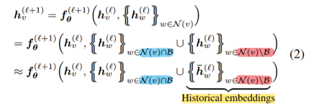
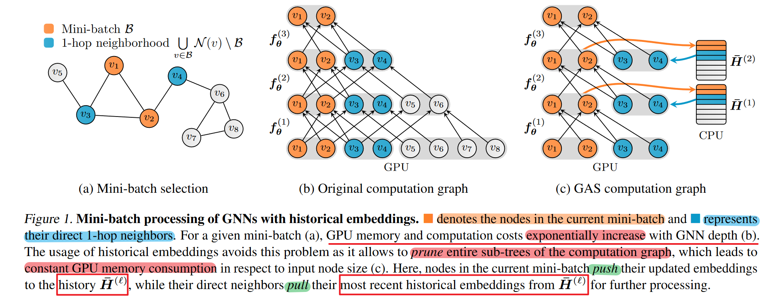
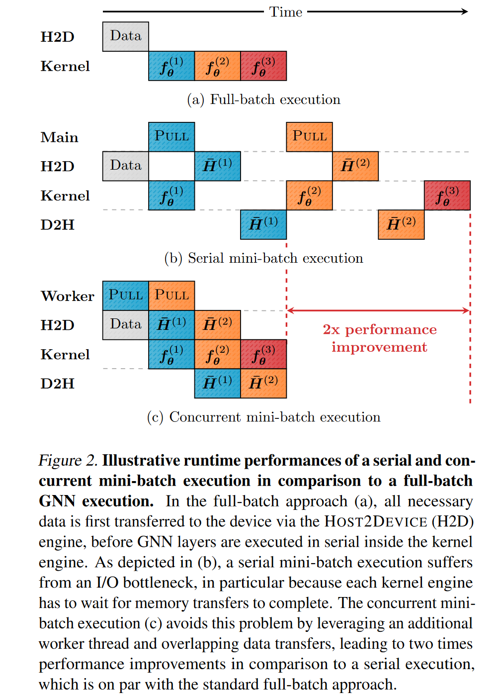

# GNNAutoscale

> Fey, M., Lenssen, J. E., Weichert, F., & Leskovec, J. (2021). GNNAutoScale: Scalable and Expressive Graph Neural Networks via Historical Embeddings. Proceedings of the 38th International Conference on Machine Learning, 3294–3304. https://proceedings.mlr.press/v139/fey21a.html

> AI papers are sooo much easier to read than those OSDI's papers.

## Historical Embeddings

Let $\bm h_v^{(l)}$ denote the **node embedding** in **layer** $l$ of a node $v \in B$ in **a mini-batch** $B \subseteq V$. For the general message scheme, the execution of $\bm f_{\bm \theta}^{(l+1)}$ can be formulated as:

For out-of-mini-batch nodes, approximate their embeddings via historical embeddings acquired in previous iterations of training

> Cite "Chen, J., Zhu, J., and Song, L. Stochastic training of graph convolutional networks with variance reduction. In ICML, 2018b." here

### Additional advantages

1. GAS trains over all the data: In GAS, a GNN will make use of all available graph information, i.e. no edges are dropped, which results in lower variance and more accurate estimations.

2. GAS enables constant inference time complexity: The time complexity of model inference is reduced to a constant factor, since we can directly use the historical embeddings of the last layer to derive predictions for test nodes.

3. GAS is simple to implement: Our scheme does not need to maintain recursive layer-wise computation graphs, which makes its overall implementation straightforward and comparable to full-batch training.

4. GAS provides theoretical guarantees

## Theoretical analysis

...

## Implementation (Pipeline)

Our approach accesses **histories** to account for any data outside the current mini-batch, which **requires frequent data transfers** to and from the GPU.

1. **pulling historical embeddings** for each layer asynchronously at the **beginning of each optimization step**
    > Synchronization is done by synchronizing the respective CUDA stream before inputting the transferred data into the GNN layer.
2. The same strategy is applied for **pushing information to the history**.

