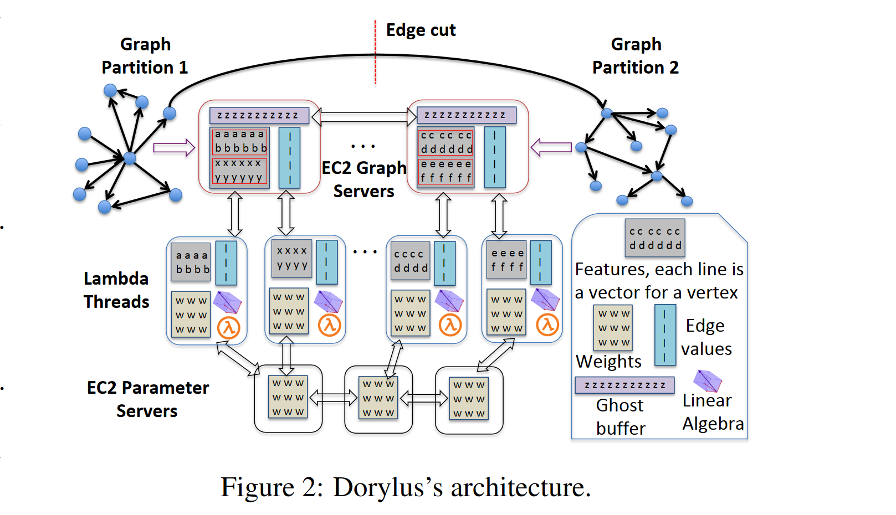
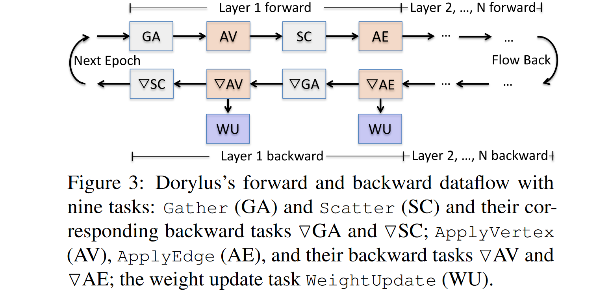

# Dorylus: Affordable, Scalable, and Accurate GNN Training with Distributed CPU Servers and Serverless Threads

> Thorpe, J., Qiao, Y., Eyolfson, J., Teng, S., Hu, G., Jia, Z., Wei, J., Vora, K., Netravali, R., Kim, M., & Xu, G. H. (2021). Dorylus: Affordable, Scalable, and Accurate {GNN} Training with Distributed {CPU} Servers and Serverless Threads. 495–514. https://www.usenix.org/conference/osdi21/presentation/thorpe

Low cost with CPUs!

## Generals

Challenges:

1. “Limited compute resources (e.g., 2 weak vCPUs)” 有限的计算资源（例如，2 个弱 vCPU）
    * Lambda thread is often too weak to execute a tensor kernel on large data
2. “Restricted network resources (e.g., 200 Mbps between Lambda servers and standard EC2 servers” 网络资源受限（例如，Lambda 服务器和标准 EC2 服务器之间的 200 Mbps 网络）
    *   breaking the data to tiny minibatches mitigates the compute problem at the cost of higher data-transfer overheads

Observation:

GNN training comprises of **two classes of tasks** – **neighbor propagations** (e.g., Gather and Scatter) over the input graph and **per-vertex/edge NN operations** (such as Apply) over the tensor data (e.g., features and parameters).

Solutions:

1. **divide** a training pipeline into a set of **fine-grained tasks** based on **the data type** that they process
    * Tasks that operate over the **graph structure** belong to *a graph-parallel path*, executed by <u>CPU instances</u>, while those that **process tensor data** are in *a tensor-parallel path*, executed by <u>Lambdas</u>.
2. bounded pipeline asynchronous computation (BPAC)
    * **tasks overlap with each other**, e.g., when graph-parallel tasks process graph data on CPUs, tensor-parallel tasks process tensor data, simultaneously, with Lambdas.
    * “asynchrony” 
        * staleness tolerance: parameter updates (in the tensor-parallel path) and data gathering from neighbor vertices (in the graph-parallel path)
        * weight stashing -> not let asynchrony slow down the convergence        

## Structures

three major components: 

1. EC2 graph servers
2. Lambda threads for tensor computation
3. EC2 parameter servers.

Graph partition: edge-cut

ghost buffer: storing data that are scattered in from remote servers

Communicating happens when:

* (1) *forward pass* where activation values are **propagated along cross-partition edges**
* (2) *backward pass* where gradients are **propagated along the same edges in the reverse direction.**

## Tasks and Pipelining

Fine-grained Tasks: based on both data type and computation type

### Bounded Asynchrony

Weight updates: weight stashing

> “Weight stashing is a simple technique that allows any interval to use the latest version of weights available in a forward pass and stashes (i.e., caches) this version for use during the corresponding backward pass.” ([Thorpe 等, 2021, p. 500](zotero://select/library/items/9JD7SIR2)) ([pdf](zotero://open-pdf/library/items/T9XVKBKN?page=7&annotation=4ZCIF2X9)) 权重存储是一种简单的技术，它允许任何间隔使用前向传递中可用的最新版本的权重，并存储（即缓存）此版本以在相应的反向传递期间使用。

### Asynchronous Gather

> “Asynchronous Gather allows vertex intervals to progress independently using stale vertex values (i.e., activations vectors) from their neighbors without waiting for their updates.” ([Thorpe 等, 2021, p. 500](zotero://select/library/items/9JD7SIR2)) ([pdf](zotero://open-pdf/library/items/T9XVKBKN?page=7&annotation=762IZCKI)) 异步聚集允许顶点间隔使用来自其邻居的陈旧顶点值（即激活向量）独立前进，而无需等待它们的更新。

## Lambda Management

> “the per-Lambda bandwidth goes down as the number of Lambdas increases” ([Thorpe 等, 2021, p. 501](zotero://select/library/items/9JD7SIR2)) ([pdf](zotero://open-pdf/library/items/T9XVKBKN?page=8&annotation=742BP95P)) 随着 Lambda 数量的增加，每个 Lambda 带宽下降

Dorylus provides three optimizations for Lambdas:

1. task fusion: $AV$ of the last layer in a forward pass is connected directly to $\nabla AV$ of the last layer in the next backward pass (see Figure 4), we merge them into a single Lambda-based task
2. tensor rematerialization: instead of caching
3. Lambda-internal streaming

### Autotuning Numbers of Lambdas

> “Due to inherent dynamism in Lambda executions, it is not feasible to statically determine the number of Lambdas to be used. On the performance side, the effectiveness of Lambdas depends on whether the pipeline can be saturated. In particular, since certain graph tasks (such as SC) rely on results from tensor tasks (such as AV), too few Lambdas would not generate enough task instances for the graph computation G to saturate CPU cores. On the cost side, too many Lambdas overstaturate the pipeline — they can generate too many CPU tasks for the GS to handle. The optimal number of Lambdas is also related to the pace of the graph computation, which, in turn, depends on the graph structure (e.g., density) and partitioning that are hard to predict before execution.” ([Thorpe 等, 2021, p. 502](zotero://select/library/items/9JD7SIR2)) ([pdf](zotero://open-pdf/library/items/T9XVKBKN?page=9&annotation=49LJZZWM)) 由于 Lambda 执行中固有的动态性，静态确定要使用的 Lambda 的数量是不可行的。在性能方面，Lambdas 的有效性取决于管道是否可以饱和。特别是，由于某些图形任务（例如 SC）依赖于张量任务（例如 AV）的结果，因此太少的 Lambda 将无法为图形计算 G 生成足够的任务实例来使 CPU 内核饱和。在成本方面，过多的 Lambda 会使管道过度饱和——它们会生成过多的 CPU 任务供 GS 处理。 Lambda 的最佳数量还与图形计算的速度有关，而图形计算的速度又取决于图形结构（例如密度）和执行前难以预测的分区。

> “To solve the problem, we develop an autotuner that starts the pipeline by using min(#intervals, 100) as the number of Lambdas where intervals represents the number of vertex intervals on each GS. Our autotuner auto-adjusts this number by periodically checking the size of the CPU’s task queue — if the size of the queue constantly grows, this indicates that CPU cores have too many tasks to process, and hence we scale down the number of Lambdas; if the queue quickly shrinks, we scale up the number of Lambdas. The goal here is to stabilize the size of the queue so that the number of Lambdas matches the pace of graph tasks.” ([Thorpe 等, 2021, p. 502](zotero://select/library/items/9JD7SIR2)) ([pdf](zotero://open-pdf/library/items/T9XVKBKN?page=9&annotation=7HJW5X2A)) 为了解决这个问题，我们开发了一个自动调谐器，它通过使用 min(#intervals, 100) 作为 Lambda 的数量来启动管道，其中间隔表示每个 GS 上的顶点间隔的数量。我们的 autotuner 通过定期检查 CPU 任务队列的大小来自动调整这个数字——如果队列的大小不断增长，这表明 CPU 核心有太多任务需要处理，因此我们减少了 Lambda 的数量；如果队列迅速缩小，我们会增加 Lambda 的数量。这里的目标是稳定队列的大小，以便 Lambda 的数量与图形任务的速度相匹配。