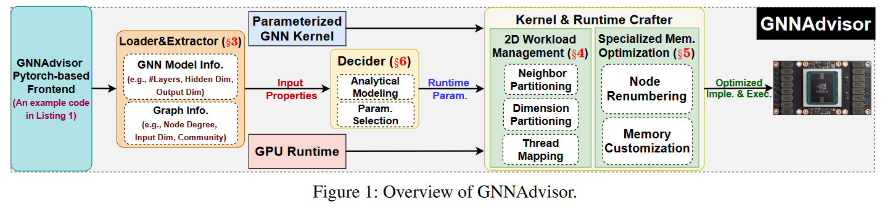

# GNNAdvisor: An Adaptive and Efficient Runtime System for GNN Acceleration on GPUs

> Wang, Y., Feng, B., Li, G., Li, S., Deng, L., Xie, Y., & Ding, Y. (2021). {GNNAdvisor}: An Adaptive and Efficient Runtime System for {GNN} Acceleration on {GPUs}. 515–531. https://www.usenix.org/conference/osdi21/presentation/wang-yuke

真的好长啊...

1. First, GNNAdvisor explores and identifies **several performance-relevant features** from both the GNN model and the input graph, and uses them as a new driving force for GNN acceleration. 
2. Second, GNNAdvisor **implements a novel and highly-efficient 2D workload management**, tailored for GNN computation to improve GPU utilization and performance under different application settings. 
3. Third, GNNAdvisor **capitalizes on the GPU memory hierarchy** for acceleration by gracefully coordinating the execution of GNNs according to the characteristics of the GPU memory structure and GNN workloads. 
4. Furthermore, to enable automatic runtime optimization, GNNAdvisor **incorporates a lightweight analytical model** for an effective design parameter search.

