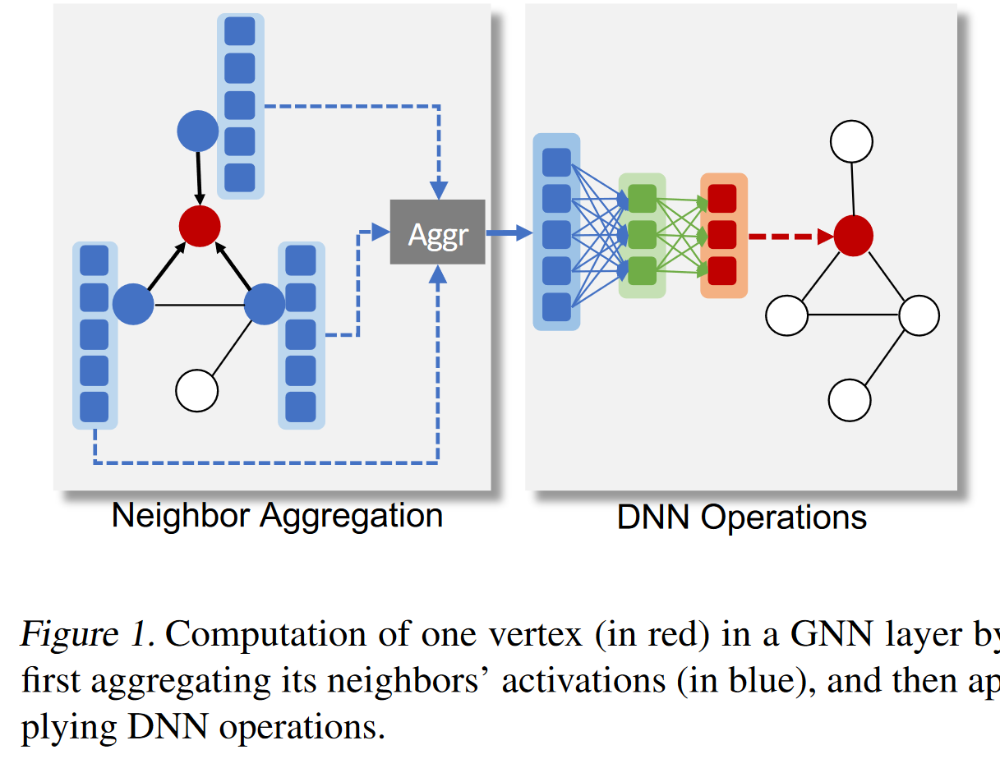
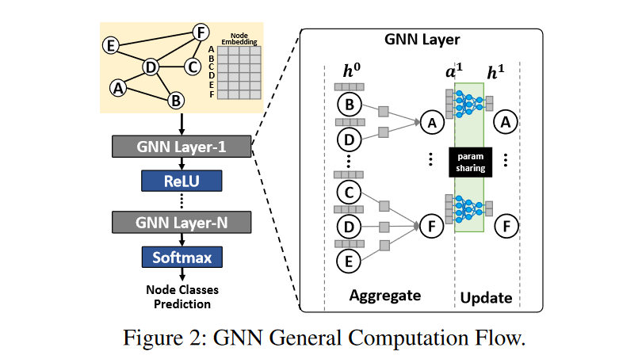

# Graph Neural Network

> Figures are from: Jia, Z., Lin, S., Gao, M., Zaharia, M., & Aiken, A. (2020). Improving the Accuracy, Scalability, and Performance of Graph Neural Networks with Roc. Proceedings of Machine Learning and Systems, 2, 187–198.

## Structure

Each GNN layer:

1. **gathers** the activations of the neighbor vertices from the previous GNN layer
2. then **updates** the activations of the vertex, using DNN operations such as convolution or matrix multiplication. 

Formally, the computation in a GNN layer is:

$$
a_v^{(k)} = \text{AGGREGATE}^{(k)} (\{h_u^{(k-1)} \mid u \in \mathcal N(v)\})
$$

!!!note
    This corresponds to the left part of the figure.

$$
h_v^{(k)} = \text{UPDATE}^{(k)} (a_v^{(k)}, h_v^{(k-1)})
$$

!!!note
    This step is usually some DNN operations

## Challenge in Training
