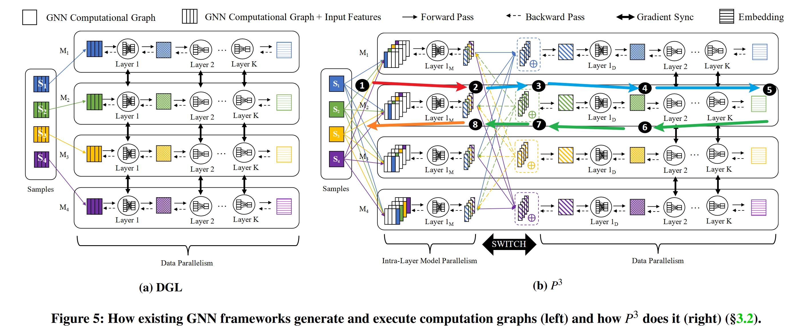
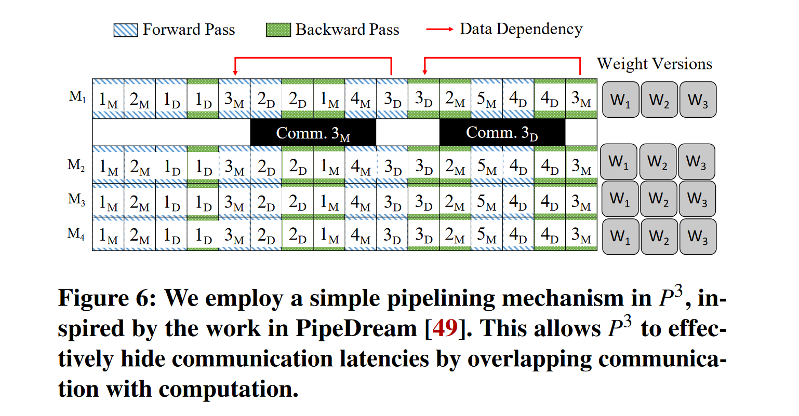

# P3: Distributed Deep Graph Learning at Scale

> Gandhi, S., & Iyer, A. P. (2021). P3: Distributed Deep Graph Learning at Scale. 551–568. https://www.usenix.org/conference/osdi21/presentation/gandhi

1. eliminates high communication and partitioning overheads
2. a new pipelined push-pull parallelism based execution strategy for fast model training

## Motivation

GNNs have **small model parameters** but **large data samples** due to the dense feature vectors associated with each node’s sampled computation graph

==> distributing the **graph structure** and the **features** across the machines <u>independently</u>.

## Structure: Pipelined Push-Pull

Forward pass:

1. **pushes** the computation graph for layer 1 to all the machines,

2. each machine start the forward pass for layer 1 in a *model parallel fashion* (layer 1M).
    * calculate the partial activation
3. the machine assigned to each node in our hash partitioning scheme **pulls** partial activations from all other machines, then reduce

4. switch to *data parallelism mode* (layer 1D), **pass through the rest of layer 1D operations** (if any, e.g., non-linear operations) to obtain the final activations for layer 1

5. The following computation proceeds in a *data-parallel fashion* to** obtain the embedding in the end**

Backward pass:

6. backward pass proceeds similar to existing GNN frameworks in a *data parallel fashion*, invoking global gradient synchronizations until layer 1D

7. At layer 1D, P3 **pushes** the error gradient to all machines in the cluster and *switches to model parallelism*.

8. Each machine now has the error gradients to apply the backward pass for layer 1M **locally**

### Analysis

1. Overhead for aggregation of partial activations during the forward pass and the additional movement of gradients in the backward pass

2. significantly save in network communication
    * P3 doesn’t pull features at all which tremendously reduces network traffic
    * the size of the activations and gradients are small in GNNs (due to the smaller number of hidden dimensions)

## Pipelining

four phases per minibatch:

1. a model parallel phase in the forward pass
2. a data parallel phase in the forward pass
3. a data parallel phase in the backward pass
4. a model parallel phase in the backward pass.

Pipeline Delay: 3 

$w_{t+1} = w_t − \alpha \cdot \nabla f (w_{t−3})$, where, $w_t$ is weight values after $t$ optimizer steps, $∇ f$ is the gradient function, $α$ is learning rate and $w_{t−3}$ the weight used in forward and backward passes.

### Caching

when host memory is available, P3 uses a **simple greedy approach** to utilize **all the available free memory** by caching the partitions of the graph and/or features on multiple machines using a user-defined setting.

==> fit the input in the minimum number of machines, and **create copies (caches) of partitions on other machines**.