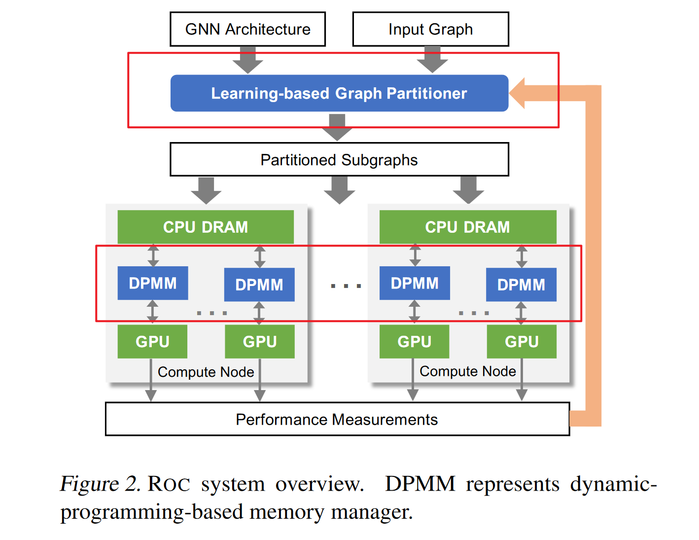
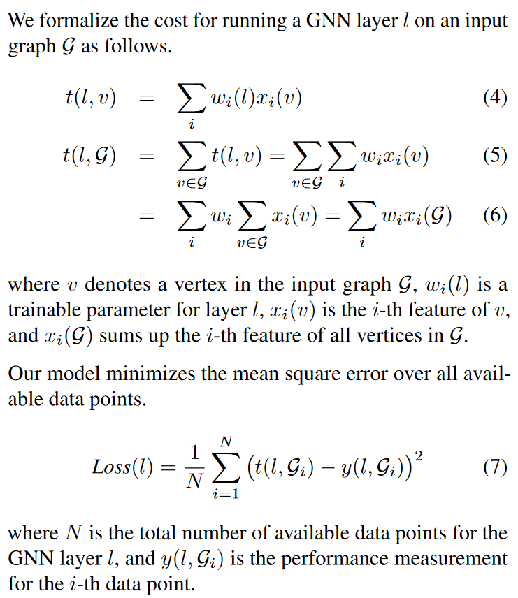
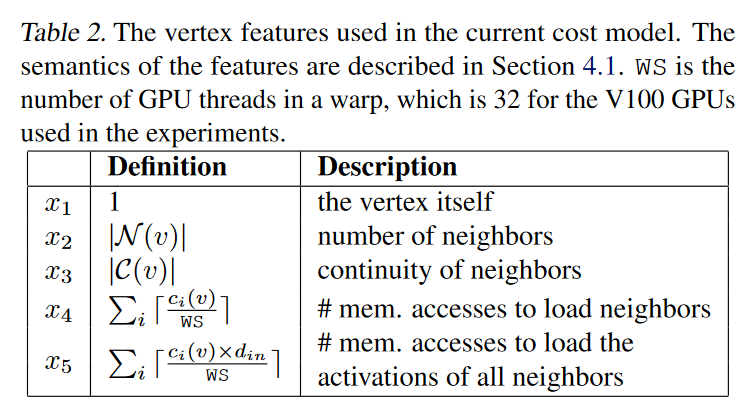
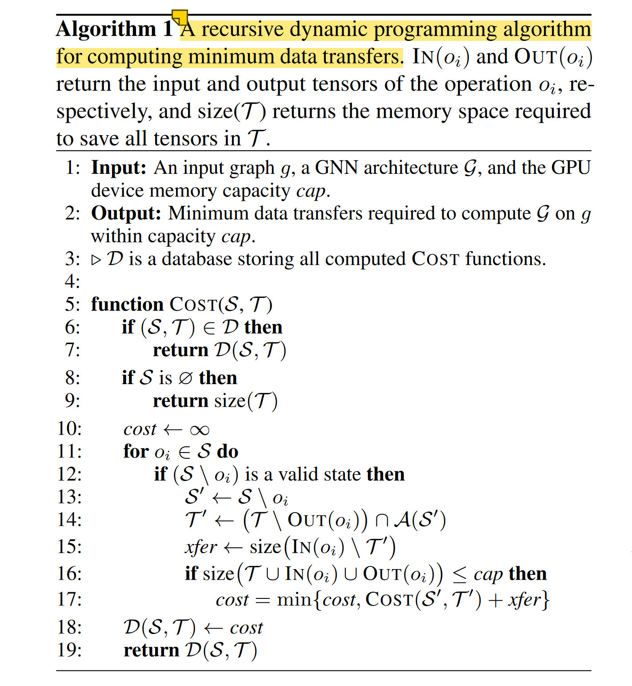

# Improving the Accuracy, Scalability, and Performance of Graph Neural Networks with Roc

> Jia, Z., Lin, S., Gao, M., Zaharia, M., & Aiken, A. (2020). Improving the Accuracy, Scalability, and Performance of Graph Neural Networks with Roc. Proceedings of Machine Learning and Systems, 2, 187–198.

Two main contributions:

* graph partitioning 
* memory management optimizations

## Graph Partitioner

online-linear-regression-based model:

1. takes the runtime performance measurements of previously processed graphs as training samples for a **cost model**
2. then used to predict performance on arbitrary new graphs and enable efficient partitioning.

### Cost Model

the cost model learns to predict the execution time of a GNN layer (instead of the full network)

Assumptions:

1. the cost to perform a DNN operation on a vertex is **linear** in a collection of vertex features

2. the cost to run an arbitrary graph is the **summation** of the cost of all its vertices.

Can be extended easily.

### Partition algorithm

> Purposed by "Jia, Z., Kwon, Y., Shipman, G., McCormick, P., Erez, M., and Aiken, A. A distributed multi-gpu system for fast graph processing. Proc. VLDB Endow., 11(3), November 2017."

Objective: maximize coalesced accesses to GPU device memory

* each partition holds consecutively numbered vertices
* use $N−1$ numbers $\{p_0, p_1, ..., p_{N−1}\}$ to partition the graph into $N$ subgraphs

1. **preprocesses** an input graph by computing the **partial sums of each vertex feature**, which allows ROC to estimate the runtime performance of a subgraph in $O(1)$ time.

2. uses binary search to find a splitting point $p_i$ in $O(\log V)$, and therefore computing balanced partitioning only takes $O(N \log V)$ time,

## Memory Manager

* GNN data: in CPU DRAM memory.

* Cache tensors in GPU's device memory.

### Dynamic Programming Cost Optimization 

Algorithm 1 shows the pseudocode. $COST(S,T)$ computes the minimum data transfers required to compute all the operations in **a state $S$**, with $T$ being the **set of tensors** cached in the GPU memory; $T$ should be a subset of $\mathcal A(S)$

