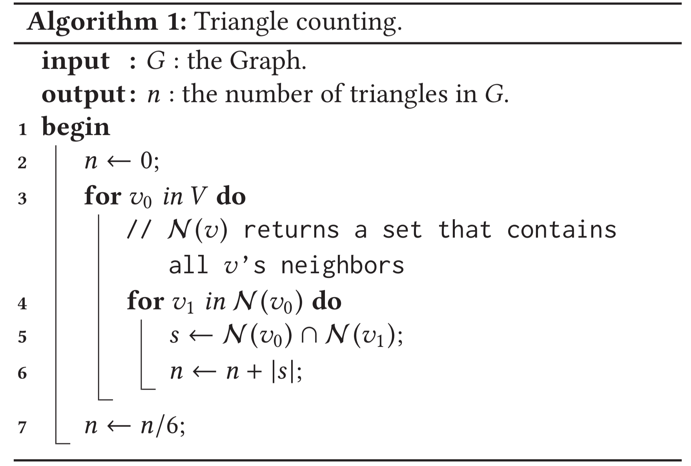
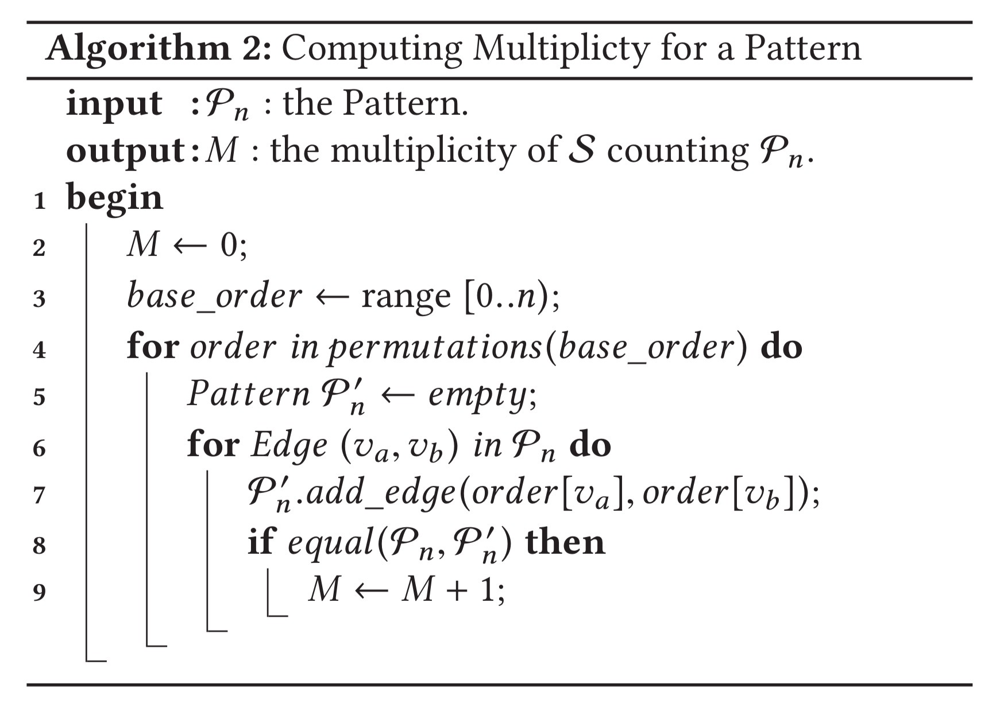
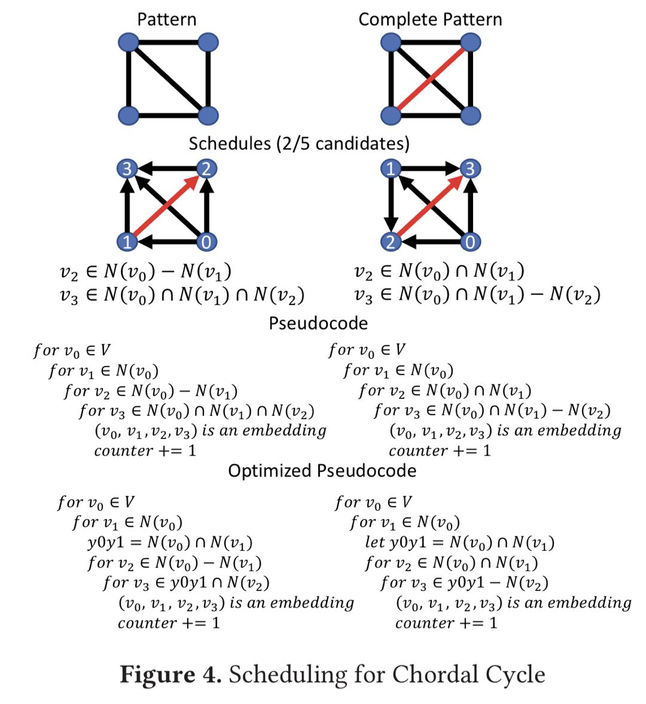

# Automine

Mawhirter, Daniel, and Bo Wu. "Automine: harmonizing high-level abstraction and high performance for graph mining." *Proceedings of the 27th ACM Symposium on Operating Systems Principles*. 2019.

Link：https://dl.acm.org/doi/abs/10.1145/3341301.3359633

## Review

### Questions

+ without friendly interfaces
+ large intermediate data
+ do not consider the subgraph pattern

facing two conflicting goals:

1. providing a high-level abstraction
2. high performance

### Now solution

Their performance is far from ideal,

medium sized graph that has 1.1 million edges takes 43 sec(Arabe)

#### Arabesque 

A distributed system, purposed "think like an embedding" paradigm

+ high overhead for small graphs
+ require enterprise clusters for large graphs

#### RStream

A single-machine graph mining system

## Contribution

1. both high level abstraction & high performance(however, I didn't see the high level abstraction)
2. propose a space-efficient representation of embeddings(lays the foundation for automatic mining algorithm)
3. some modeling & optimization techniques to generate efficient programs(in C++)

## Code


### Base API

```cpp
Pattern definePattern(Edge[] edgelist);
Program countPatterns(Pattern[] patterns);
Program enumeratePatterns(Pattern[] patterns);
```

There are three applications that they implement:

+ Clique(团) Counting(CC)
+ Motif Counting(MC)
+ Frequent Subgraph Mining(FSM)

definition of triangle pattern like: `Pattern p = definePattern([(a,b), (b,c), (c,a)]);`

## Principle

### A Simple Triangle Counting



Some properties:

1. exploit the local structure of the input graph
    + can discard the edge embedding immediately (found in the same loop)
2. each vertex od the discovered set corresponds to a distinct triangle incident on $(v_0,v_1)$
    + the intersection operation performed on the neighbour set of $v_0$ & $v_1$ generates the structure
    + [not very understood]

### Algorithm

$\mathcal P_k$ is the pattern on $k(k>2)$ vertices.

$\mathcal P_{k-1}$ is a sub-pattern of $\mathcal P_k$ .

$E_{\mathcal P_k}$ is a instance of $P_k$'s embeded graph, composing of vertices $(v_0, \cdots, v_{k-1})$ .

They introduce function $\mathcal F^k(E_{\mathcal P_{k-1}})$, satisfying:

1. return: $\mathbf V_k$ , which is all nodes that can extends $E(\mathcal P_{k-1})$ to $E(\mathcal P_{k})$
2. process: operation can be applied **only** on the neibour sets of the vertices in $E_{\mathcal P_{k-1}}$.

They prove that:

$$
\mathbf V_k = \mathcal F^k(E_{\mathcal P_{k-1}}) = \bigcap_{v \in\mathbf V_T} \mathcal N(v) - \bigcup_{v \in \mathbf V_F}\mathcal N(v)
$$


in which $\mathbf V_T$ is vertices that are neighbours to the vertex that extends $\mathcal P_{k-1}$ to $\mathcal P_{k}$, $\mathbf V_T$ & $\mathbf V_F$ is a partition of $E_{\mathcal P_{k-1}}$ 's vertices..

For example, if we want to count a tailed triangle, the schedule can be:

1. $\mathcal F^2 = \mathcal N(v_0) \cap \mathcal N(v_1)$
2. $\mathcal F^3 = \mathcal N(v_2) -  \mathcal N(v_0) - \mathcal N(v_1)$

Then, we call  the **sequence** $\{\mathcal F^1, \cdots, \mathcal F^k\}$ a schedule.

There is a one-to-one mapping between the sequence & the schedule.

---

They use a colored(black for existing & red for absent ones) complete graph to present the **pattern**.

Then, they give every edge a direction to make it a tournament graph.

This tournament graph encodes define the sequence $\{\mathcal F^1, \cdots, \mathcal F^k\}$.

As long as this tournament graph is acyclic, we can get a topology order, which is exactly the "adding" order, or the "schedule".

Notice that, it is the color that distinguish graph from isomorph.


We can iterate over all possible tournaments to search in the schedule space.

### Multiplicity



### Code Generating

By multiple loops that applies $\mathcal F^k$ to vertices set (???), we can count in the innermost set.



#### Multi-Pattern scheduling

These patterns can share the same prefixes of their own sequences $\{\mathcal F^1, \cdots, \mathcal F^k\}$ .


#### Other Features

Parallelization: using OpenMP

Memory Management: using VertexSet Class, a readonly reference;

Set Operation: also using VersexSet class

Out of core Processing: can work on single machine