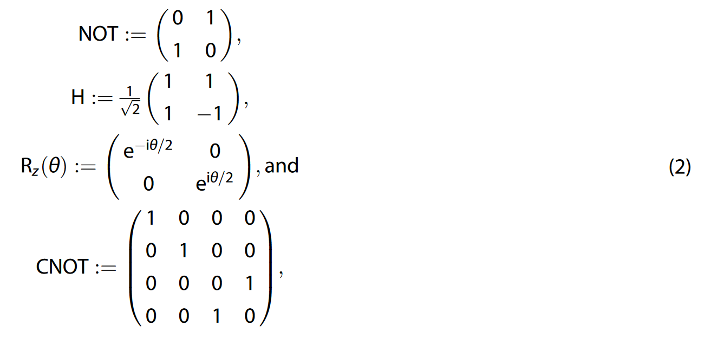
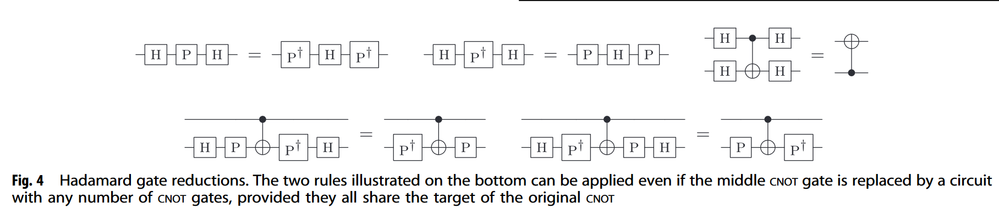
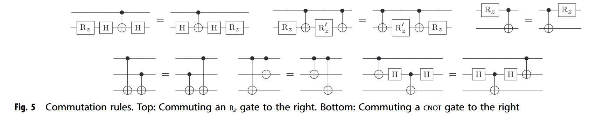
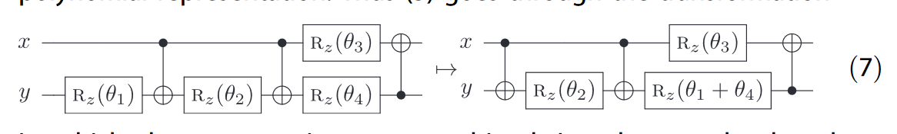
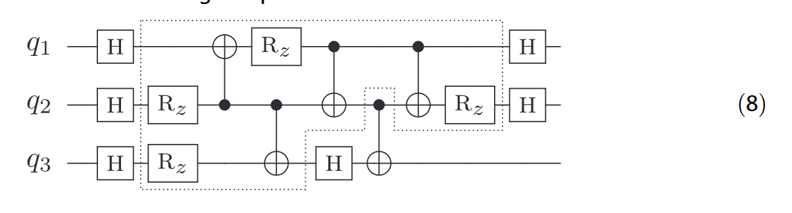
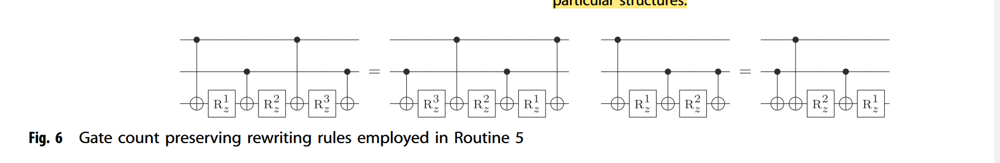
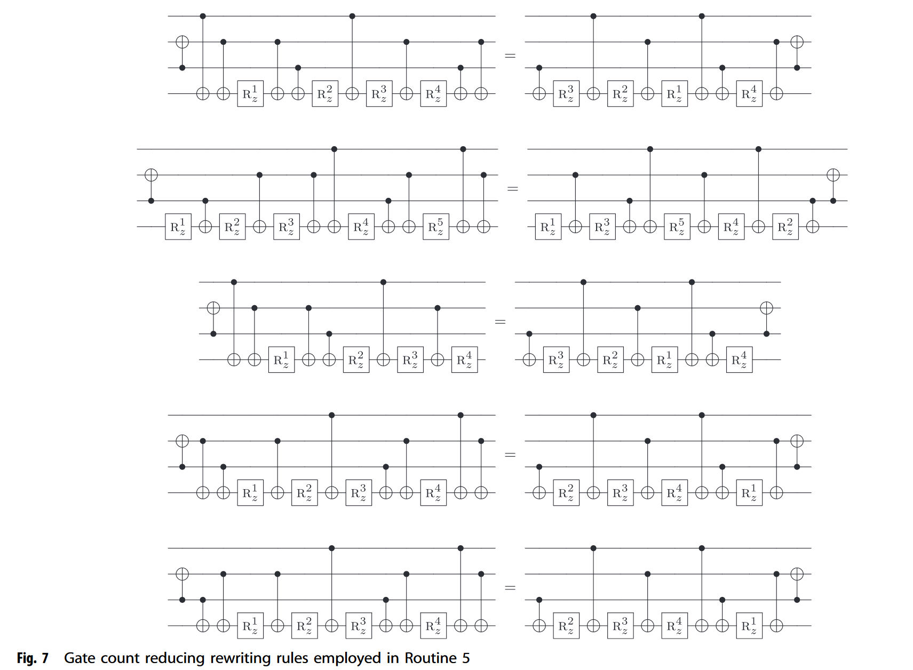
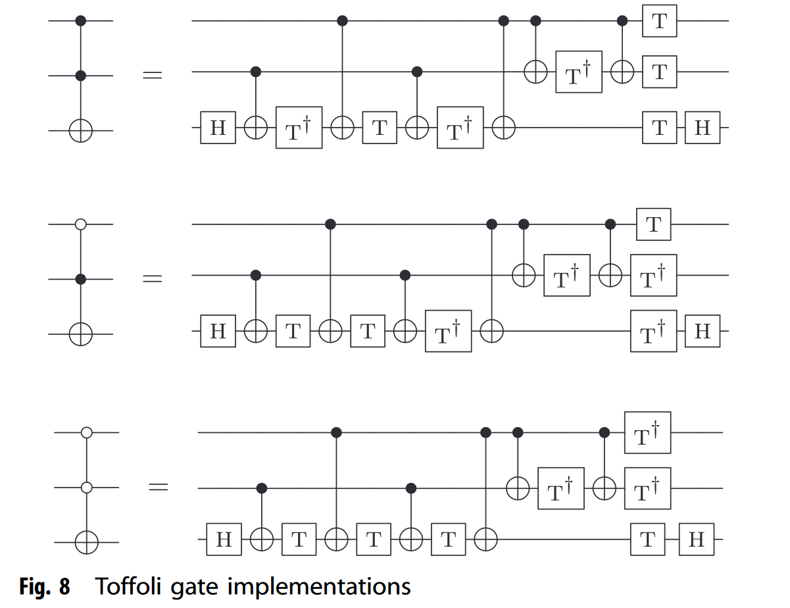

# Automated optimization of large quantum circuits with continuous parameters

https://doi.org/10.1038/s41534-018-0072-4

Nam, Y., Ross, N. J., Su, Y., Childs, A. M., & Maslov, D.. (2018). Automated optimization of large quantum circuits with continuous parameters. Npj Quantum Information, 4(1). https://doi.org/10.1038/s41534-018-0072-4

we apply a set of **carefully chosen heuristics** to reduce the gate counts, often resulting in substantial savings.

our approach typically finds smaller circuits in less time.

> All results were obtained using a machine with a 2.9 GHz Intel Core i5 processor and 8 GB of 1867 MHz DDR3 memory, running OS X El Capitan.

## Gate Set

+ Toffoli gates

## Optimizing Goal

1. Reduce 2-qubit gates: CNOT
2. Optimizing non-clifford gates $R_z(\theta)$

## Representation

First, we store a circuit as a list of gates to be applied sequentially (a netlist). ".qc" file format.

Second, we use a directed acyclic graph (DAG) representation. The vertices of the DAG are the gates of the circuit and the edges encode their input/output relationships.

Third, we use a generalization of the phase polynomial representation of {CNOT, T} circuits.

+ consisting entirely of NOT, CNOT, and $R_z$ gates
+ A circuit consisting only these three kinds of gates can be represented as: $|x_1, \cdots , x_n\rangle \mapsto e^{ip(x_1, \cdots x_n)} | h(x_1, \cdots, x_n)\rangle$
    + $h: \{0,1\}^n \to \{0,1\}^n$ is an affine reversible function
    + $p(x_1, \cdots, x_n) = \sum_{i=1}^l (\theta_i \bmod 2\pi) \cdot f_i(x_1, \cdots, x_n)$ will boolean function $f:\{0,1\}^n \to \{0,1\}$

> Those three representation can be transformed into other in linear time.

## Preprocessing

we push the NOT gates as far to the right as possible

pushing a NOT gate through a Toffoli gate control, we negate that control

a pair of adjacent NOT gates, we remove them from the circuit.

1. Toffoli gates that may have negated controls and optimize their decomposition into Clifford + T circuits by exploiting freedom in the choice of $T$/$T^†$ polarities (see section Special-purpose optimizations).
2. since cancellations of NOT gates simplify the phase polynomial representation (by making some of the functions fi in the phase polynomial representation (4) linear instead of merely affine), such cancellations make it more likely that Routine 4 and Routine 5 in section Optimization subroutines will find optimizations (since those routines rely on finding matching terms in the phase polynomial representation).

$O(g)$

## Subroutine

### Step 1: Hadamard gate reduction.

Reason:

+ Hadamard gates do not participate in phase polynomial optimization

+ tend to hinder gate commutation

Use DAG representation, onepass, $O(g)$

### Step 2: Single qubit gate cancellation

a gate and its inverse are adjacent, then both gates can be removed

we can cancel two single-qubit gates U and U† that are separated by a subcircuit A that commutes with U

computationally demanding --> apply a specific set of rules

patterns:

$O(g^2)$

$R_z(θ_1)$ and $R_z(θ_2)$ can be combined into a single rotation $R_z(θ_1 + θ_2)$

### Step 3: Two-qubit gate cancellation.

U is a two-qubit gate(CNOT)

$O(g^2)$

### Step 4: Rotation merging using phase polynomials

a subcircuit consisting of NOT, CNOT, and Rz gates

$f_i(x_1, ..., x_n)$ = $f_j(x_1, ..., x_n)$ for some $i \neq j$, then $R_z(θ_i)$ and $R_z(θ_j)$ can be merged.

How to find that subcircuit

Generate phase polynominal:

For $R_z$ gate: 

+ determine the associated affine function its phase is applied to and the location in the circuit where it is applied.
+ sort it, merge it 
+ placing result on the first place of subcircuit

$O(g^2 \log g)$

### Step 5: Floating $R_z$ gates

record all affine functions that occur in the subcircuit and their respective locations

identify all possible locations where an $R_z$ gate could be placed

we employ three optimization subroutines: 

+ two-qubit gate cancellations: identical to Step 3 above, with "floating" $R_z$
+ gate count preserving rewriting rules
    
+ gate count reducing rewriting rules
    

$O(g^3)$

## Algorithm

### General-purpose optimization algorithms

Light or Heavy

Light: 1, 3, 2, 3, 1, 2, 4, 3, 2.

Heavy: 1, 3, 2, 3, 1, 2, 5.

Repeat those sequence, until no further optimization is available

Routine 1–Routine 3, we access individual gates using the DAG, updating only the DAG representation

Routine 4 and Routine 5, we concurrently update both representations on the fly whenever a reduction is found

Because the identification process requires an up-to-date DAG representation and creating the phase polynomial representation requires an up-to-date netlist representation.

### Special-purpose optimizations

#### LCR optimizer

we can simplify $O^t$ to $LC^{t-2}R$

#### Toffoli decomposition

The optimization is considered complete when movements of the indeterminate T and T† gates cannot further reduce the gate count.

the optimizer leaves the polarity of T/T† gates (i.e., the choice of which gates include the dagger and which do not) undetermined

After choosing the polarities, we run Routine 3 and Routine 2.
