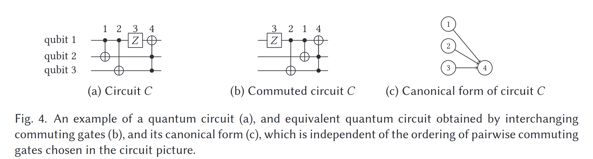
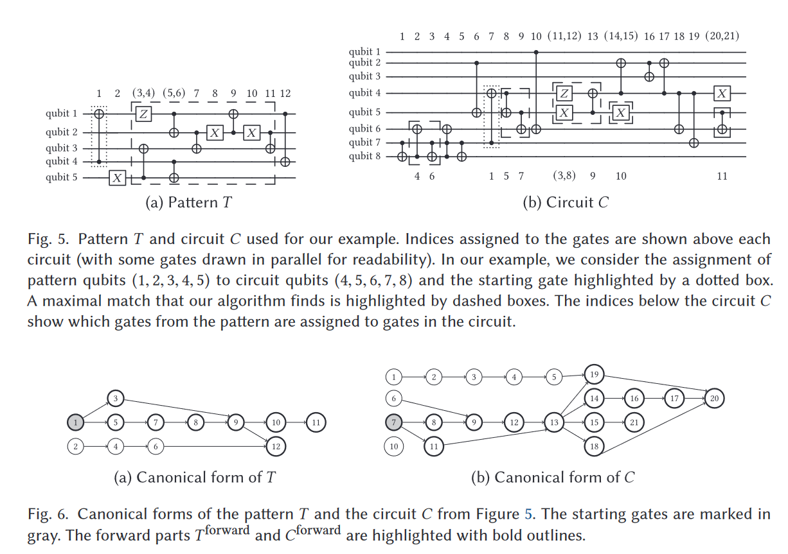
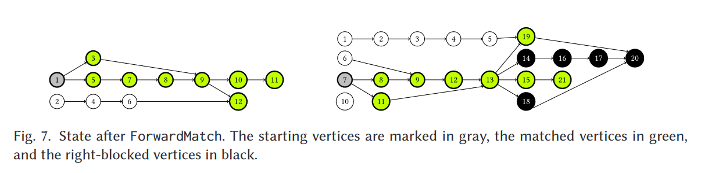
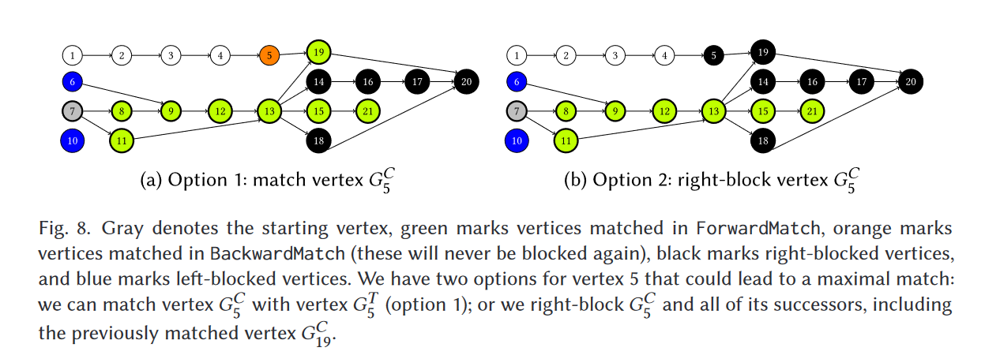
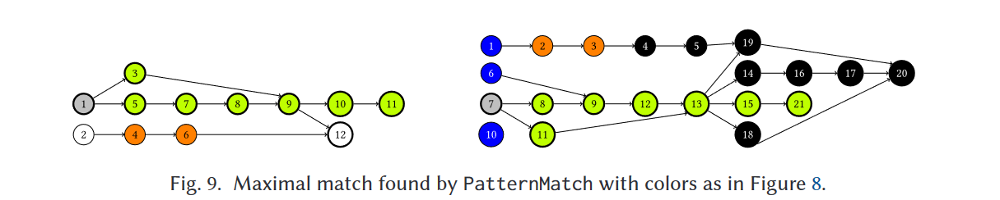

# Exact and Practical Pattern Matching for Quantum Circuit Optimization

Iten, R., Moyard, R., Metger, T., Sutter, D., & Woerner, S.. (2022). Exact and Practical Pattern Matching for Quantum Circuit Optimization. ACM Transactions on Quantum Computing, 3(1), 1–41. https://doi.org/10.1145/3498325

Simple pattern matching are ordinary, but they:

> we are interested in finding all matches of a pattern under pairwise commutation of gates, that is, considering all possible orderings of quantum gates that arise by repeatedly swapping commuting gates in the circuit.

> “Our goal is to find all maximal matches of the pattern T in the circuit C, that is, all instances of a maximally sized subcircuit of T being equal to a sub-circuit in C, up to pairwise commutation of gates.In particular, we do not require that the whole pattern T can be matched to a sub-circuit in C, which is called a complete match.”
> 
> We give the first practical algorithm for this task that provably finds all matches of a pattern and whose worst-case complexity scales polynomially as a function of the circuit size (for a constant-sized pattern). Specifically, the time complexity of our algorithm as a function of the number of gates $|T|$ and qubits $n_T$ in the pattern and gates $|C|$ and qubits nC in the circuit scales as
>
> $$
> \mathcal O\left(|C|^{|T|+3} |T|^{|T|+4} n_C^{n_T-1}\right)
> $$

## Canonical Form for Quantum Circuits

The **canonical form** of a quantum circuit is a directed acyclic graph with the following two properties.

First, **vertices** in the graph correspond to **individual gates** in the circuit. We can index all of the gates in the circuit (in some fixed order) and label the graph vertices with these indices.

Second, the graph has an **edge** $i → j$ from vertex i to vertex j if by repeatedly interchanging commuting gates in the circuit, one can bring gate $i$ immediately to the left of gate $j$. However, gates $i$ and $j$ themselves do not commute.

## Pattern-Matching Algorithm for Quantum Circuits

Given a pattern $T$ and a circuit $C$, we want to find all maximal matches of $T$ in $C$, that is, all instances in which a maximally sized sub-circuit of $T$ equals a sub-circuit of $C$, taking into account qubit reordering and swapping of commuting gates.

For intuition, it is helpful to consider the circuit **reordered** in the way that allows for the largest possible match. 

Then, we can think of the circuit as consisting of **three regions**: 

1. an unmatched region to the left
2. a matched region in the middle
3. an unmatched region to the right. 

On a high level, the algorithm then needs to **decide whether to keep a gate in the matched middle region or to use the commutation relations to push it out to the unmatched side regions.** 

($T$ is the pattern)

We can use the starting gate to partition the other gates in the pattern into two parts, $T^{backward}$ and $T^{forward}$. $T \simeq (T^{backward},T^{forward})$

+ $T^{backward}$: contains all of the gates in the pattern that can be commuted to the *left* of the starting gate

+ $T^{forward}$: contains the remaining gates (in the order in which they appear in the circuit, thus, the first gate in $T^{forward}$ is the starting gate)

Translated to the graph picture, $T^{\text{forward}}$ contains **all successors of the starting gate**, that is, all vertices that can be reached from the starting gate by a directed path.

### First Step: FORWARD_MATCH

Find a match of the forward-part $T^{forward}$ of the pattern in the forward-part $C^{forward}$ of the circuit

It matches gates greedily, that is, it **greedily decides whether to include gates in the middle matched part of the circuit** or push them to the right unmatched part.

### Second Step: BACKWARD_MATCH

It needs to decide:

which of the gates from $T^{backward}$ to include in the match. 

This is a more difficult task because adding gates from $T^{backward}$ to the match may **require “unmatching” some of the matches found by `ForwardMatch`**.

Hence, BackwardMatch needs to make a trade-off between 

+ how many **gates** to include **from the backward direction**
+ how many **matches** in the forward direction to **destroy** for this purpose. 

To do so, `BackwardMatch` builds a tree of possible options and then finds the optimal one among them.

### Example 

Forward Match:

+ Starting(gray): decided before the algorithm begin
+ Matched(green)
+ Right-Blocked(black)[]

Backward Match:

Since $T_2,T_4,T_6 \neq C_{10}$, we cannot match $G^C_{10}$

left-block all predecessors of a left-blocked vertex

Then, vertex $G^C_5$ is considered for matching. We find that it matches the candidate vertex $G^T_6$. 
Now, we have two options, shown in Figure 8:

1. We could **match** $G^C_5$ , that is, include the gate $C_5$ in the middle matched part of the circuit. 
2. We could **push** the gate C5 all the way **to the right unmatched part** of the circuit, that is, right-block $G^C_5$. 

> The second option has the disadvantage that we need to block $G^C_5$ and all of its successors, even ones that have already been matched during ForwardMatch. However, it might enable us to match more of the predecessors of $G^C_5$ . 

At this stage, we cannot yet decide which option will result in more matches overall, and we keep **track of both in a tree of options** (called MatchingScenarios in Algorithm 5). 

1. Considering one option at a time, **if we matched** the vertex $G^C_5$ , one finds that no further gates can be matched (without right-blocking some of the predecessors of $G^C_5$ , which would also block $G^C_5$ . This we do not have to consider since it would lead to the same scenario as the non-matching case already added to the tree MatchingScenarios). Hence, **we could match 10 gates in total** in this scenario, which turns out to be a maximal match (over all qubit assignments and starting gates). 

2. On the other hand, **if we do not match** vertex $G^C_5$ , we proceed as follows: no match can be found for $G^C_4$ . We could either left- or right-block it. Since all successors of $G^C_5$ are already blocked but its predecessors are not, right-blocking is the better option. We then see that $G^C_3$ can be matched with $G^T_6$ ,and $G^C_2$ with $G^T_4$ . No match can be found for $G^C_1$ . Since it has no predecessors but has matched successors, left-blocking it is the best option. This way, we can again **match 10 gates in total.** Hence, we found another maximal match.

