# Quantum Fan-out: Circuit Optimizations and Technology Modeling

Gokhale, P., Koretsky, S., Huang, S., Majumder, S., Drucker, A., Brown, K. R., & Chong, F. T.. (2021). Quantum Fan-out: Circuit Optimizations and Technology Modeling. https://doi.org/10.1109/qce52317.2021.00045

SIMD:

preserve a program’s logical correctness by respecting constraints known as hazards.

In Quantum Circuit, the structural hazard is:

> exclusive activation: a qubit can be involved in at most one operation per timestep

In Quantum circuit, the parallelism is enabled by:

> simultaneously executing instructions on **disjoint** qubits.

## Idea

Observation:

> the structural hazard of exclusive activation is not actually enforced by most quantum hardware. 
> 
> In fact, it can be more natural for a quantum processor to simultaneously execute multiple operations on shared qubits through global interactions.

e.g.

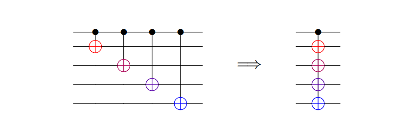

Actually these four CNOT can be performed together.

## Controlled-U

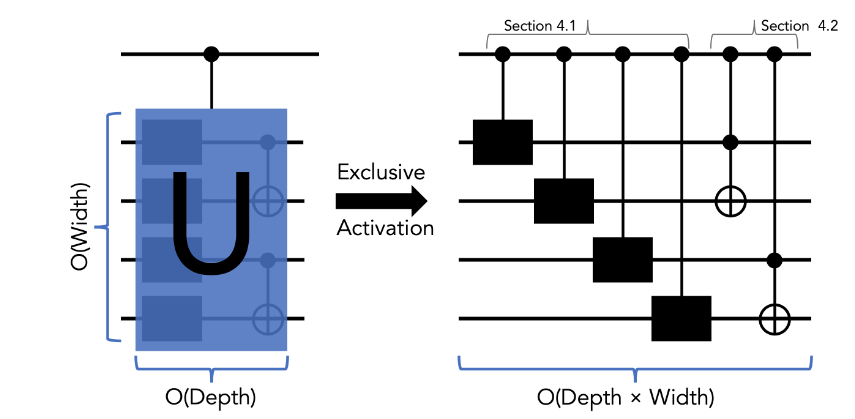

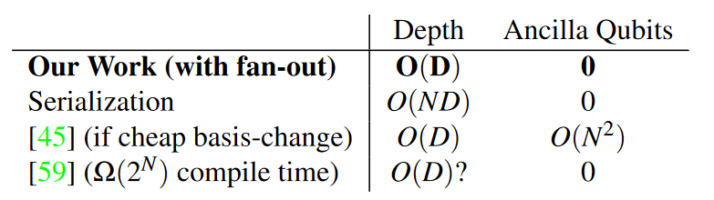

decomposing U into a form amenable to ‘alignment’ of CNOTs

Into two parts:

### Shared-Control Single Qubit Gates

we only have access to the fan-out SIMD primitive

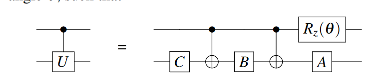

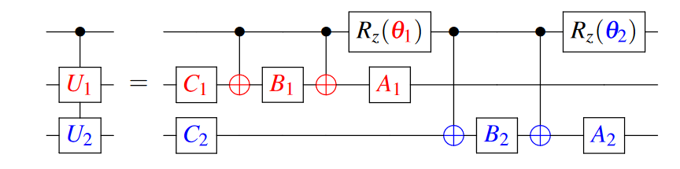

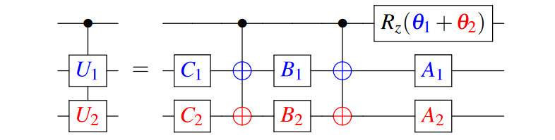

This pattern extends ad infinitum to more qubits—the total depth will always consist of five layers: two fan-out layers and three single-qubit gate layers.

### Shared-Control Toffoli’s

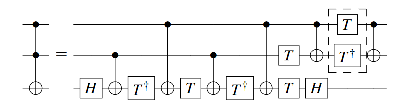

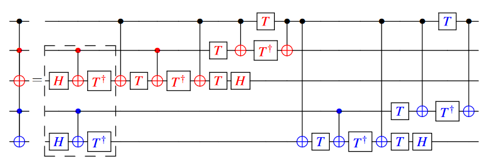

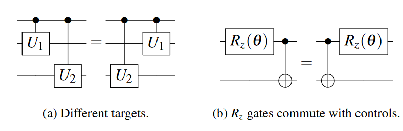

dependency between the right-most red CNOT and the subsequent blue CNOT is in fact a false dependency.

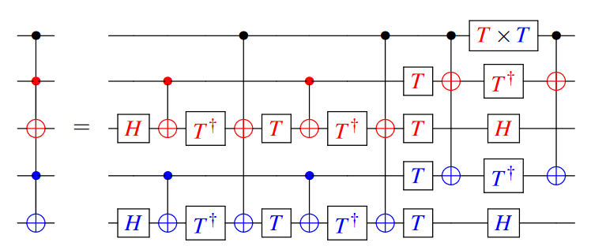

## Application

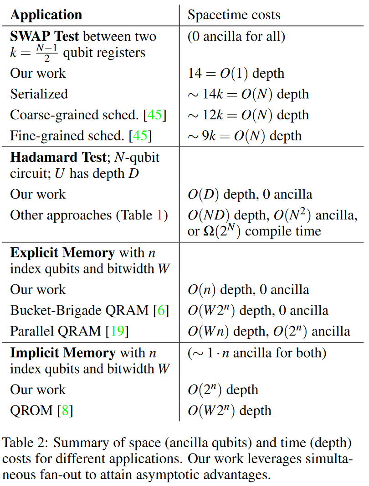

### SWAP Test

inner product

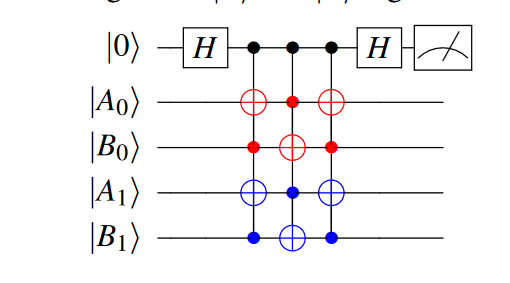

### Hadamard Test

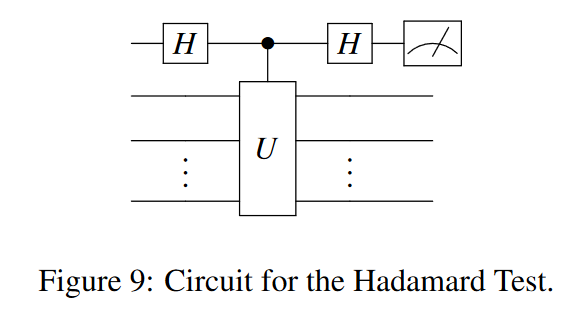

### Quantum Memory

