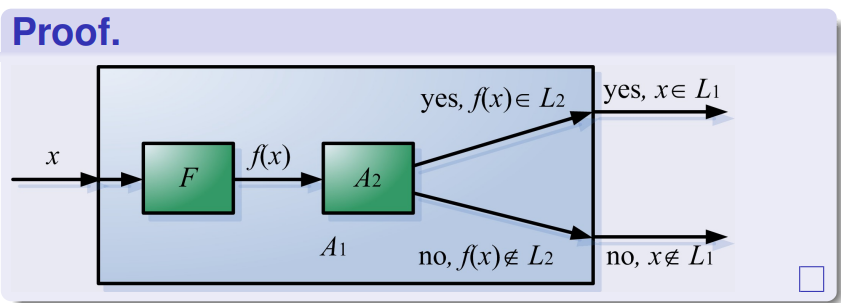
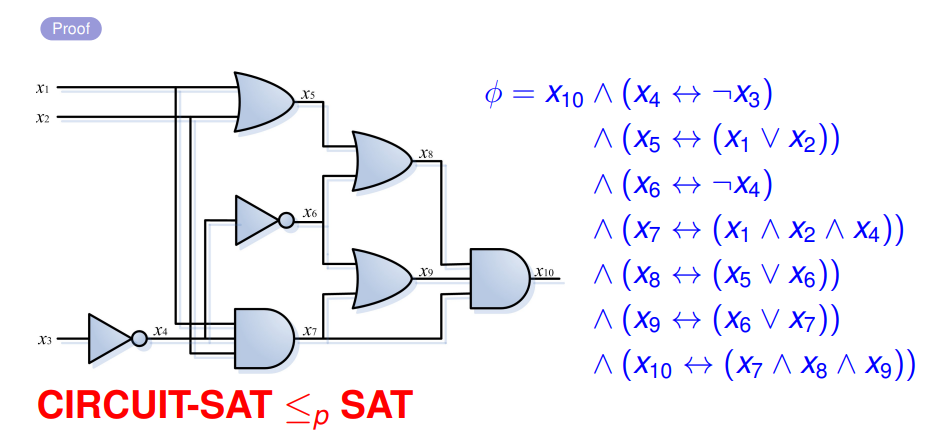
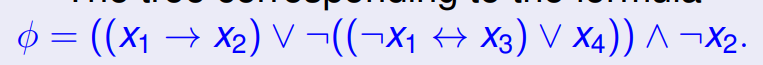
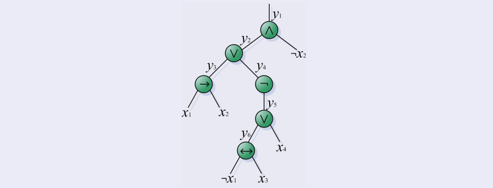
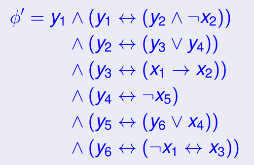
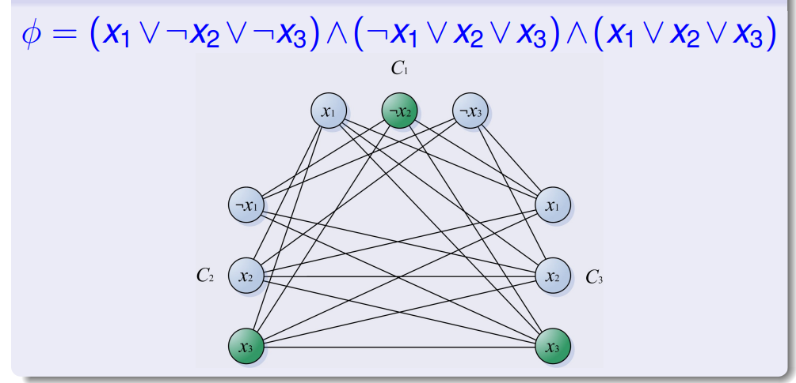
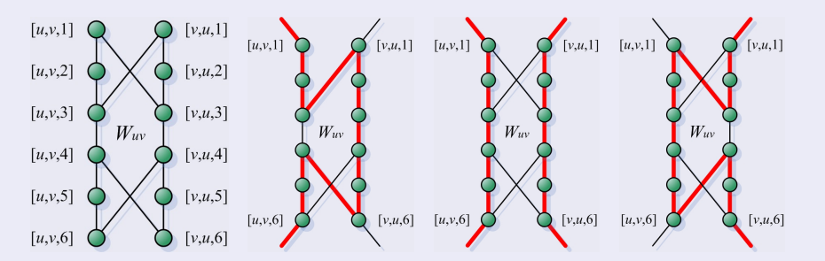
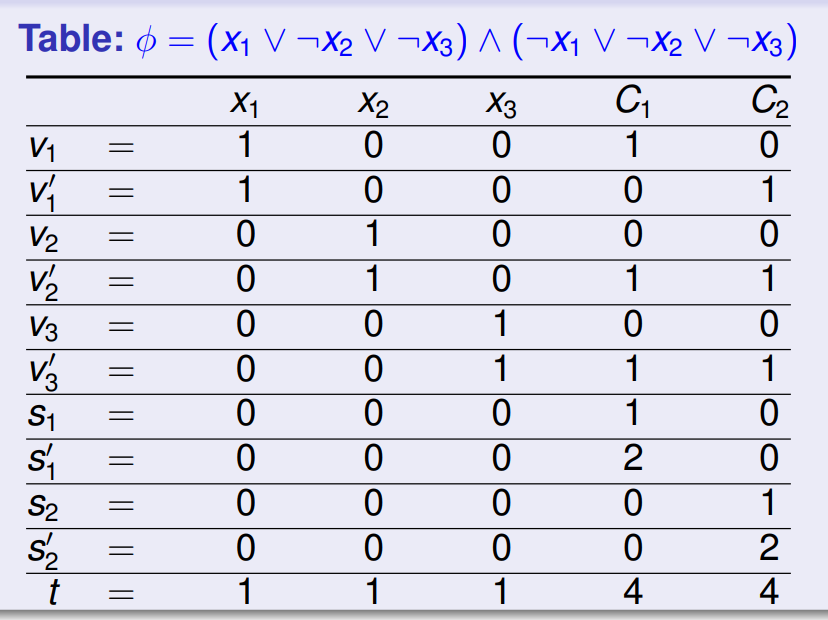
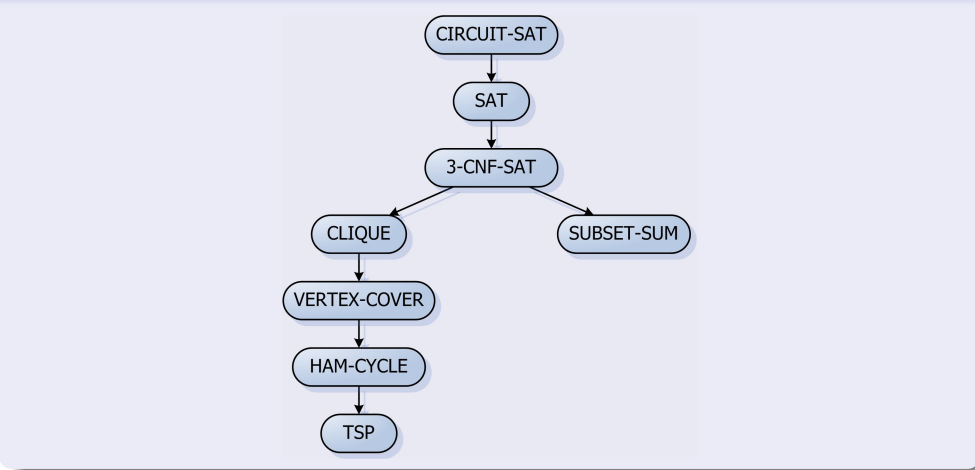

# P & NP & NP completeness

## 抽象问题与具体问题

抽象问题 $Q$ 是问题实例集合 $I$ 和问题解集合 $S$ 上的一个二元关系。

> 判定问题：$S = \{0, 1\}$

具体问题：$I \in \{0,1\}^*$，通过编码映射 $e : I \to \{0, 1\}^*$  从抽象问题构造具体问题。

> 不同的编码甚至可能会带来超多项式的影响。

!!!definition "定义：编码的多项式相关性"
    有两个多项式时间可计算的函数 $f_{12}$ 与 $f_{21}$ ，满足对任意 $i \in I$ 有：

    $$
    f_{12}(e_1(i)) = e_2(i) \wedge f_{21}(e_2(i)) = e_1(i)
    $$

多项式相关的编码方式不同不影响一个问题是否属于 P 类。

> 我们假定使用一种“标准”的编码，也就是“一个整数的编码和其二进制表示是多项式相关的，一个有限集合的编码与其相应的括号中元素间用逗号隔开的列表的编码是多项式相关的”
>
> 这样就可以不考虑编码方式的选取。

## P 类与 NP 类

P 类：可以在多项式时间（$O(n^k)$，$k$ 是常量，$n$ 是输入规模）内解决的问题。

NP 类：可以在多项式时间内可以被证明（如果已知一个证书，则证明该问可以在多项式时间内被解决）

## 形式化

算法 $A$ 接受（拒绝） $x \in \{0,1\}^*$ ，当 $A(x) = 1$ （$A(x) = 0$）。

算法 $A$ 接受的语言 $L$ ： $L = \{x \in \{0,1\}^* \mid A(x) = 1\}$

语言 $L$ 被算法 $A$ 判定：

+ 对 $x \in L$ 有 $A(x) = 1$
+ 对 $x \not \in L$ 有 $A(x) = 0$

多项式时间判定：

+ $x$ 无论在或不在 $L$ 中，都能在多项式时间内给出判定结果。

### P 类形式化

$$
P = \{L \subseteq \{0,1\}^* \mid 存在算法 A 能在 多项式时间内判定L\}
$$

!!!theorem "定理：判定和接受差不多"
    $P = P = \{L \mid 存在算法 A 能在 多项式时间内接受L\}$

    证明思路：假设算法 $A$ 是 $O(n^k)$ 的，那么构造算法 $A'$，足够大的常数 $c$，如果不能在 cn^k 时间内接受，就拒绝。

### NP 类形式化

算法 $A$ 验证了输入串 $x$，当存在一个证书 $y$，满足 $A(x,y) = 1$。

算法 $A$ 验证的语言：$L = \{ x \in \{0,1\}^* \mid \exists y \in \{0,1\}^*, s.t.\ A(x,y) = 1\}$

NP 类：

$$
NP = \{L \subseteq \{0,1\}^* \mid 存在一个多项式时间验证的算法\}
$$

$L \in NP$ 当且仅当：

$$
L = \{x \in \{0,1\}^*\mid \exists y, |y| = O(|x|^c), s.t.\ A(x,y) = 1\}
$$

> 事实上，形式化很少用

## NP completeness

### 多项式时间规约

$L_1$ 可以在多项式时间归约到 $L_2$，写作 $L_1 \leq_P L_2$

形式化定义：存在一个多项式时间可计算的函数 $f: \{0,1\}^* \to \{0,1\}^*$，使得对于所有 $x \in \{0,1\}^*$ 有 $x \in L_1 \iff f(x) \in L_2$

> 说明 $L_1$ 比 $L_2$ 好解决，$L_1$ 更靠近 P，$L_2$ 更靠近 NP Complete

!!!theorem 
    如果 $L_1 \leq_P L_2$，那么 $L_2 \in P \implies L_1 \in P$

    

### 形式化定义

$L \in \text{NP-complete}$ 当且仅当：

1. $L \in NP$
2. $L' \leq_P L, \forall L' \in NP$ （只满足这条叫做 NP-hard ）

!!!theorem 
    假如任何 NP-complete 问题是多项式可解的，那么 $P=NP$。

    假如任何 NP 问题不是多项式可解的，那么 NP-complete 问题都不是多项式可解的

## NP-complete 问题

### 电路可满足问题(CIRCUIT_SAT)

给出一个由 AND, OR 和 NOT 门构成的布尔组合电路，它是可满足电路（能输出为 1）吗？

1. 证明 NP

证书：电路输入的赋值

2. 证明 NP-hard

略（）

### 布尔公式可满足性问题(SAT)

从电路可满足问题规约到公式可满足问题。

具体规约方法：每根线都代表一个变量

### 3-CNF 可满足性(3-CNF-SAT)

$\phi =(x_1\vee \lnot x_1\vee \lnot x_2) \wedge  (x_3\vee x_2\vee x_4) \wedge (\lnot x_1\vee \lnot x_3\vee \lnot x_4)$

3-合取范式，每个析取式只有三个变量

1. 证明 NP
    同前
2. 证明 NP-hard （$\text{SAT} \leq_P \text{3-CNF-SAT}$）

+ 给出任意一个 SAT 问题
    
+ 为输入公式 $\phi$ 构造二叉语法树 = 电路
    
+ 构造这种形式
    
+ 把每个子句转换成析取式

### 最大团问题（CLIQUE）

转换为判定问题：是否存在一个规模为 k 的团？

1. 证明 NP
    证书为：k个顶点。
2. 证明 NP-hard 问题
    规约：使用 $\text{3-CNF-SAT} \leq_P \text{CLIQUE}$

    给出一个 3-CNF-SAT 问题 $\phi$，构造 CLIQUE 问题如下：

    假如共有 $n$ 个析取式，每个析取式创建三个点，代表三个“文字”（包含 $\lnot$）；当不同析取式中的，两点不矛盾（只有 $x_i$ 和 $\lnot x_i$ 矛盾），连边。如图。

    

    找是否存在大小为 $n$ 的团。

    需要证明**双向**的规约是成立的。简单。
    
### 顶点覆盖问题（VERTEX-COVER）

无向图，最少需要选中多少个顶点，使得每条边都至少有一个顶点是被选中的。

转换为判定问题：是否存在大小为 $k$ 的顶点覆盖？

1. 证明 NP
    证书为 $k$ 个顶点。
2. 证明 NP-hard
    规约：使用 $\text{CLIQUE} \leq_P \text{VERTEX-COVER}$

    给定一个图 $G$，求解 CLIQUE 问题，参数为 $k$。

    对 $\overline{G} = (V,\overline{E})$ 求解 VERTEX-COVER 问题，参数为 $|V| - k$，答案的在 $V$ 上的补就是 CLIQUE 问题的答案

### 哈密顿回路问题(HAM-CYCLE)

经过每个点一次且仅一次的回路。

就是判定问题

1. 证明 NP
    证书为 哈密顿回路的 $n$ 条边
2. 证明 NP-hard
    规约：使用 $\text{VERTEX-COVER} \leq_P \text{HAM-CYCLE}$

    根据 G 构造 G'，使得 $G$ 中存在 $k$ vertex-cover $\iff$ $G'$ 中存在哈密顿回路

    这是一个“附件”，每条边都有一个附件。（附件图的哈密顿只有以下几种走法）：

    

    剩下的点叫做“选择器”，有 $k$ 个。

    有两类边：

    1. 附件之间的连接：所有相邻的边，设 $\{u^{(i)}\}$ 是 $u$ 的邻居集合（给定顺序），那么连接 $[u,u^{(i)},6] \leftrightarrow [u,u^{(i+1)},1]$    
    2. 选择器到附件：设 $\{u^{(i)}\}$ 是 $u$ 的邻居集合，连接 $s_j \leftrightarrow [u,u^{(1)},1]$ 和  $s_j \leftrightarrow [u,u^{(degree(u))},6]$ 

    需要证明构造的多项式性。

### 旅行商问题（TSP）

最短的花费，访问每个城市至少一次。

判定问题：是否存在一个花费为 $k$ 的旅行回路

1. 证明 NP 
    证书：路径
2. 证明 NP-hard
    规约：使用 $\text{HAM-CYCLE} \leq_P \text{TSP}$

    给出一个哈密顿回路问题 $G$，构造一个 TSP 问题 $G'$：

    $G'$ 在 $G$ 有边的地方边权为 1，在 $G$ 没边的地方边权为 0。

### 子集求和问题（SUBSET-SUM）

是否存在一个子集的元素的权值和为 $t$

1. 证明 NP
    证书：子集
2. 证明 NP-hard
    规约：使用 $\text{3-CNF-SAT} \leq_P \text{SUBSET-SUM}$

    给定一个 3-CNF-SAT 问题，构造一个 SUBSET-SUM 问题。

    使用 $n+k$ 个数位。避免进位。

    

    （v 对应变量 s 对应松弛变量，s 让只有一个满足的情况也可以）

## 总结

