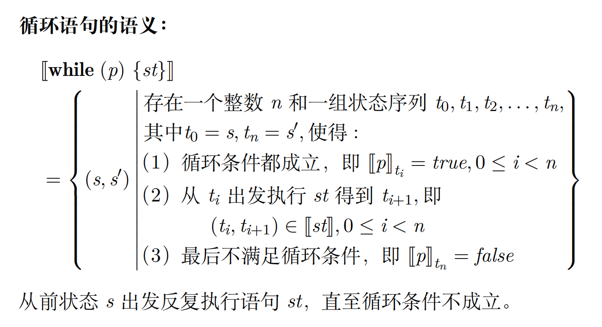

# 第五讲：IMP 程序设计语言及其语义

$$
\newcommand{\while}[2]{\mathbf{while}\ (#1)\ \{#2\}}
\newcommand{\if}[2]{\mathbf{if}\ (#1)\ \{#2\}}
\newcommand{\else}[1]{\mathbf{else}\ \{#1\}}
\newcommand{\true}{\mathbf{true}}
\newcommand{\false}{\mathbf{false}}
\newcommand{\skip}{\mathbf{skip}}
\newcommand{\meaning}[1]{\llbracket #1 \rrbracket}
$$

## 语法

### 语法范畴

1. 整数集 $\mathbb Z$: $a,b,c$
2. 变元集 $Var$: $x,y,z$
3. 算术表达式集 $AExp$: $e$
4. 布尔表达式集 $BExp$: $p,q$
5. 语句集 $Stmt$: $st$

### 语法定义

递归定义如下：

$$
e ∈ AExp ::= c ∈ \mathbb Z \mid x ∈ Var \mid e_1 + e_2 \mid e_1 − e_2 \mid e_1 ∗ e_2
$$

$$
p ∈ BExp ::= \true \mid \false \mid e_1 = e_2 \mid e_1 ≤ e_2 \mid ¬p \mid p_1 ∧ p_2
$$

$$
st ∈ Stmt ::= \skip \mid x := e \mid st_1; st_2 \mid \if{p}{st_1} \else{st_2} \mid  \while{p}{st}
$$

## 语义

### 状态

!!!definition "定义：状态(state)"
	状态(state)是从**变元集**到**整数集**的全函数:
	
	$$
	State: Var \to \mathbb Z
	$$
	
	!!!note
		* 状态就是对程序变元的一组赋值，我们不区分状态/赋值
		* $\mathcal S$ 为状态全集
		* 状态的变体：$s' = s[x \mapsto 0]$

### 算术表达式的语义

### 布尔表达式的语义

以上均与常识相同，采用递归定义

### 程序语句的语义

$$
\meaning{st} = \{(s, s') | \text{从 } s \text{ 出发执行 } st \text{ 得到 } s'\}
$$

!!!note
	* 思想：用前后两个状态的变化来描述程序语句的语义 
	* $s$ 称为前状态，$s'$称为后状态
	* $\meaning{st} \subseteq \mathcal S \times \mathcal S$

#### 空语句的语义

$$
\meaning{\skip} = \{(s, s) \mid  s \in \mathcal S \}
$$

#### 赋值语句的语义

$$
\meaning{x := e} = {(s, s') | a' = s[x \mapsto \meaning{e}_s ]}
$$

#### 分支语句的语义

$$
\
\meaning{\if{p}{st_1}\ \else{st_2}} = \left \{ (s,s') \left| \begin{aligned}  \meaning{p}_s = true\text{ 且 } (s, s') \in \meaning{st_1}\\  \meaning{p}_s = false\text{ 且 } (s, s') \in \meaning{st_2}\\ \end{aligned}\right.\right\}
$$

#### 顺序语句的语义

$$
\meaning{st_1;st_2} = \meaning{st_1} \circ \meaning{st_2}
$$

#### 循环语句的语义

!!!note
	不结束，语义就是空集
	

### 程序语句的语义等价

!!!definition "定义：语义等价"
	$$
	\forall s,s' \in \mathcal S, (s,s') \in \meaning{st_1} \leftrightarrow (s,s') \in \meaning{st_2}
	$$
	则称语义等价。

!!!note
	简而言之就是，语义集合相同

