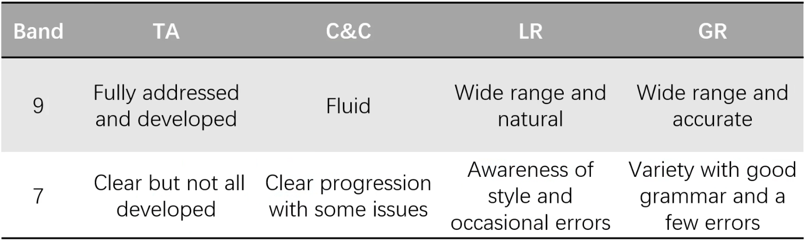
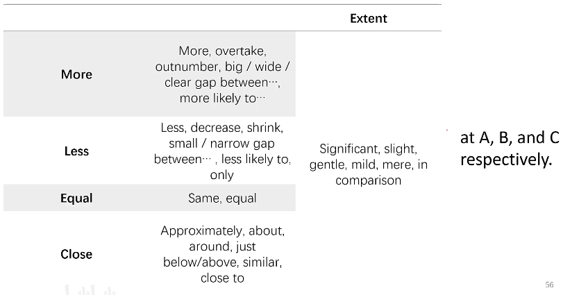
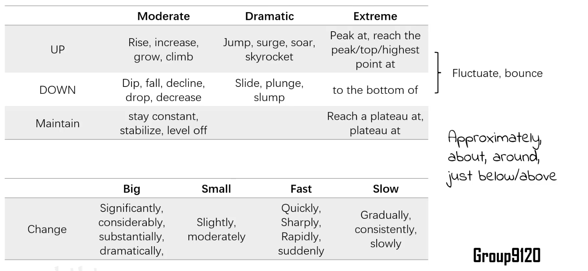
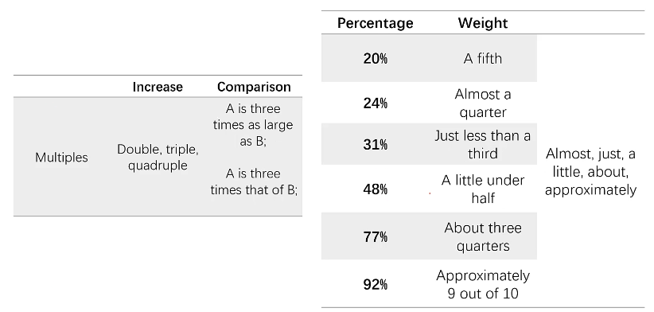
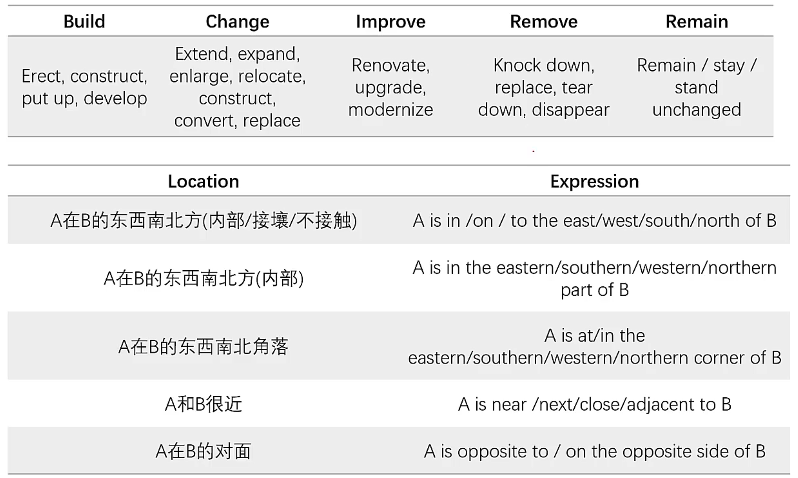
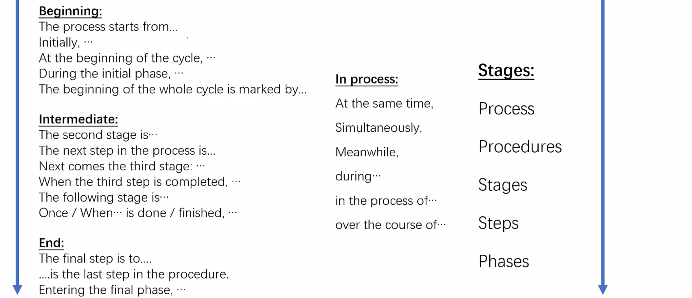

# IELTS Writing TASK1

## General Limit

150 words, 20 minutes, 1/3 score weight

(More time probably need due to needing to add more information)

## Problem Types

Dynamic：比较**趋势**(Trends)。

Static：比较**数量**(Quantities)。

数据分析的方式与表达。

Map: Outdoor Map & Indoor Map

Flow Chart: 

## What is a good passage?

Like reporting to your manager or professor

+ Brief & Clear
+ Replicatable(可复原的)
+ WITHOUT PERSONAL OPINION

## General tips

+ Tense: whether it is in the past (2020?)

## Dynamic / Static Charts

### Step1: Summary

!!!note inline end 
    + this ... demonstrates ...
    + (time) ... witnessed ...

1. Paraphrase the description.

2. Framework: Focus on the two axis, show numbers or quality.
    + From one side to another，similar or different between them？
    + similarity / differennce(grouping)

3. [Dynamic]General Trends: up or down?

4. [Static]What about your data group? 
    + connection between data groups

### Step2: Grouping & Step3 : Analysis

!!!note inline end
    + According to the graph, ...
    + it was a **different** story for ... 
    + Subsequently, ... 
    + the number peaked at ... by ...
    + going down a bit at ... by ...
    + among those who ...
    + In the mean time, ...
    + In contrast, ...
    + , accounting for the largest proportion.
    + unlike ..., ...
    + it experienced a  ....

1. major __commonalities__ : why grouping
2. What are the **key features** of each group?
    * [dynamic]Point: starting ,turning, ending, intersections, high & low
    * quantity: number
    * [static]internal difference/exception: lower or higher

总分结构：质 + 量

on one hand, ...; on the other hand, ...

### Step4: Interpretation

!!!note inline end
    + In conclusion, ...

Give reason.

Complete other general information.

升华一下: what stands behind these?

升华一下: 整体的想法

升华一下: 一张图的某个轴和另一张图的另一个轴

[Mixed charts] connection(similar, difference) between charts.

### Expression

#### Words

#### Sentence Pattern

1. sub + verb + extent + change in data
2. ...[time] saw/witnessed a   ... change in ...
3. ... demonstrated / showed an ... trend, increasing/decreasing from ...  to ...
4. A ... change can be seen in ..., [data] 
5. There was  ... change in  ... , [data]

#### Connection:

+ before ...
+ and then ...
+ followed by ...

## Map

Indoor Map / Outdoor Map

### The description of changes

**HOW TO ORGANIZE?** 

!!!note inline end
    word:

    + roundabout == circular road
    + recreational

1. get a point of reference, standing at this point
    + at the center
    + at an important changing point
    + use a walking path

2. locate **major** changes
    + structural changes
    + funcational changes
    + big square space

3. locate other changes

### Step1: Summary & Conclusion

!!!note inline end
    + The map depicts ....
    + Overall, ...

1. What does the map say?

!!!note inline end
    + ... was/were added
    + ... was renovated

2. What is the change?
    + general, give a qualitative conclusion(add/remove ? modernize ? extend?)
    + the intention?

### Step2: Major changes & key features

!!! note inline end
    + the most prominent change is ...
    + in ... corner 

1. What is the change?
    + categorize changes by feature 
    + unchange features used as supplemental info(to major change, or as a reference point)
2. Where does the change happen?
    + move with the point of reference 
4. --> improve coherence & cohesion

### Step3: Other changes & key features

### Expression

## Flow Chart

Write what you see.

### Step1: summary

framework: rewrite the title of the chart

### Step2: Phase & Steps

!!!note inline end
    First, ... . After that, ... . Then, ... . Finally, ... .

Stress **detailed action** from charts!

+ Use more verb to point out the purpose
+ Add relationship between steps and phases
+ add other details:
    * via ...; the shape ...; the size; other feature

### Conclusion

(Usually not need)

### Expression 

