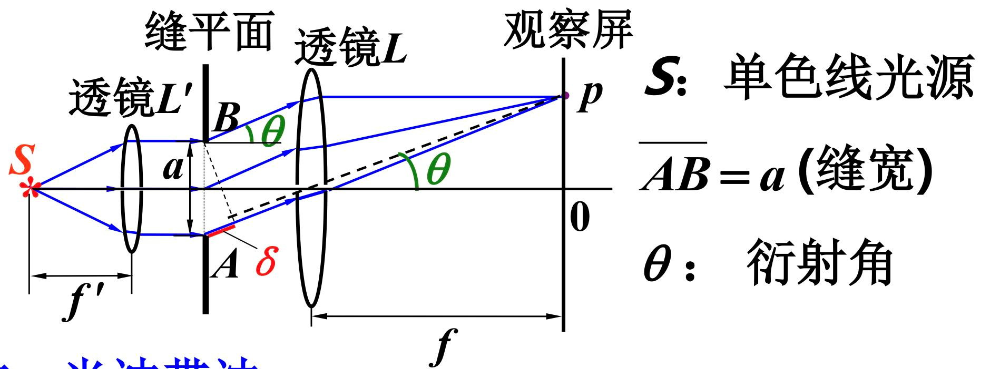
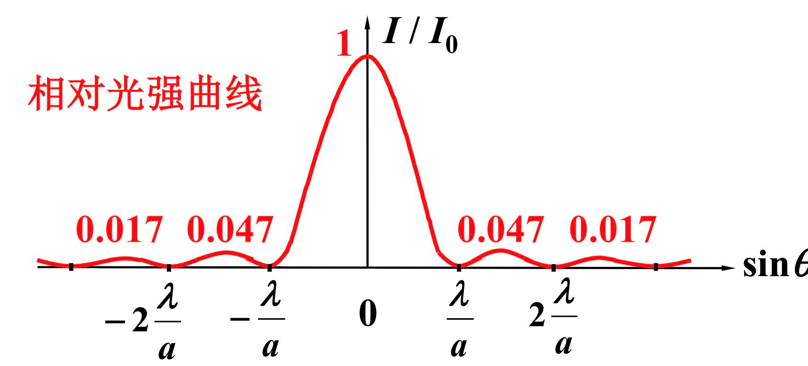
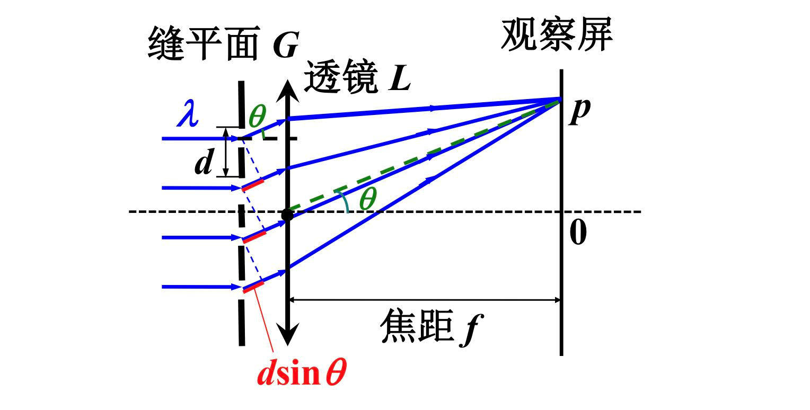
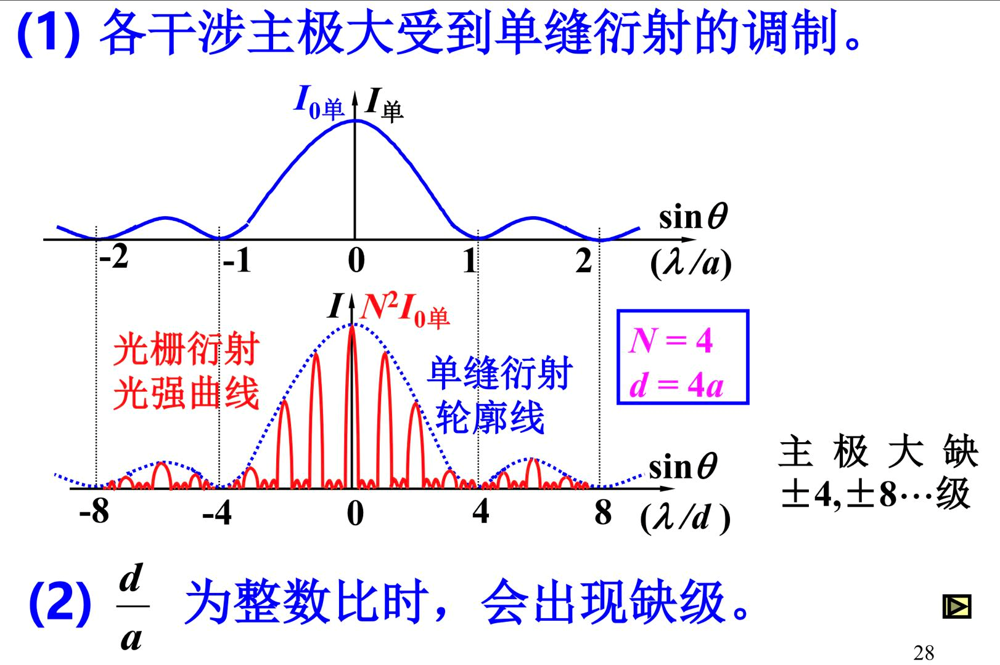

# 衍射

## 分类

+ 菲涅尔——近场衍射，$L$ 和 $D$ 至少有一个是有限值
+ 夫琅禾费——远场衍射，$L$ 和 $D$ 均为无穷大

## 单缝的夫琅禾费衍射

$\theta$ 是透镜光心到观察屏的角度

### 条纹位置

#### 半波带法结果

明纹：$a\sin \theta = \pm (2k'+1) \frac{\lambda}{2}$ 【有一定偏离】

暗纹：$a\sin \theta = \pm (2k) \frac{\lambda}{2}$

中央明纹：$a \sin \theta = 0$

> 上下移动单缝不影响条纹位置和宽度

#### 振幅矢量法结果

P 点的光强：$I = I_0 \left(\frac{\sin\alpha}{\alpha}\right)^2$

$\alpha = \frac{\Delta \Phi}{2} = \frac{\pi a \sin \theta}{\lambda}$

次极大位置满足 

$\frac{\text d I}{\text d \alpha} = 0$, $\tg \alpha = \alpha$，

解出来是：$a\sin \theta = \pm 1.43 \lambda, \pm 2.46\lambda, \pm 3.47 \lambda, \cdots$

注意：$I_{次极大} \ll I_{主极大}$

### 条纹宽度

中央明纹宽度：$\Delta x_0 = 2 f \frac{\lambda}{a}$

次极大明纹宽度：$\Delta x \approx f \frac{\lambda}{a} = \frac{1}{2} \Delta x_0$

波长越长，条纹间隔越宽

缝宽越小，条纹间隔越宽

## 光栅

太长不看：

多缝干涉 + 单缝衍射

光栅常数 $d = a + b$，为透光 + 不透光的长度之和

【干涉决定】

明纹（主极大）条件：$d \sin \theta = \pm k \lambda$  

暗纹条件：$d \sin \theta = \pm \frac{k'}{N} \lambda, k' \neq Nk$

相邻主极大间有 $N-1$ 条暗纹和 $N-2$ 个次极大。

【衍射】

主极大的光强受到单缝衍射的“调制”

光强公式：

$$
I_p = I_{0单} {\color{red} \left(\frac{\sin \alpha}{\alpha}\right)^2} {\color{green} \left(\frac{\sin N \beta}{\sin \beta}\right)^2} 
$$

### 斜入射的光栅方程

$d (\sin \theta - \sin i) = \pm k \lambda$

能观测到的最大的级次变大

## 光学仪器的分辨本领

【圆孔的衍射】

$D \cdot \sin \theta_1 \approx 1.22 \lambda$

大小为 $\theta \approx \sin \theta = \frac{1.22\lambda}{D}$

### 透镜

瑞利判据：一个象斑的中心恰好落在另一个象斑的边缘，则此两个物点被认为是刚刚可以分辨的。

最小分辨角：

$$
\delta\theta = \theta_1 \approx 1.22 \frac{\lambda}{D}
$$

分辨本领：

$$
R \equiv \frac{1}{\delta\theta}=\frac{D}{1.22\lambda}
$$

### 光栅

$\lambda$ 不同时，$\theta$ 不同。称为光栅色散

角色散本领：$D_\theta = \frac{\delta\theta}{\delta \lambda} = \frac{k}{d \cos \theta}$

线色散本领：$D_l = \frac{\delta x}{\delta \lambda} = \frac{k \cdot f}{d \cos \theta}$

分辨本领：$R = \frac{\lambda}{\delta \lambda} \approx Nk$

## X 射线的衍射

$2d \sin \Phi = k \lambda$

（$\Phi$ 是掠射角[入射角的余]， $d$ 是晶面间距[晶格系数]）

主要应用：已知道