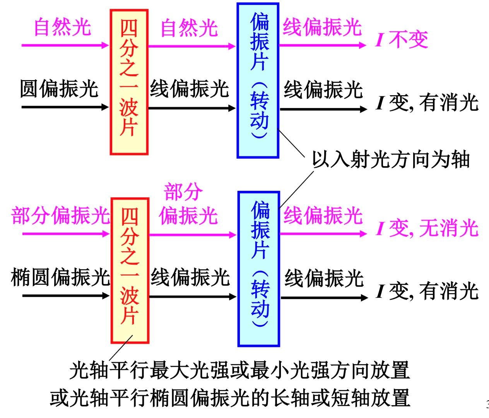

# 偏振

· 是垂直 | 是平行板面 

完全偏振光：线偏振、圆偏振、椭圆偏振

自然光：可以分解成两个垂直，等幅，**不相干**线的偏振光，光强度为 1/2 

部分偏振光：自然光和完全偏振光的混合

偏振度：$P = \frac{I_p}{I_t} = \frac{I_p}{I_n+I_p}$ $I_n$ 自然光强度

## 起偏

非偏振光 $I$ $\xrightarrow[]{(偏振片/...)}$ 线偏振光 $I$：$I = \frac{1}{2} I_0$

!!!theorem "马吕斯定律"
    $I = I_0 \cos^2 \alpha$

> $\alpha$ 为夹角，感性理解就是电矢量的投影

布儒斯特角：反射只有 S 分量（平行于光路所在的平面）

$$
\tan i_0 = \frac{n_2}{n_1} = n_{21}
$$

且有折射角+反射角为 90 度：$i_0 + r_0 = 90 ^{\circ}$

$n_1$ 入射介质，$n_2$ 透射介质

$$
\frac{I_反}{I_入} = \frac{1}{2} \sin^2 (i_0 - r_0)
$$

## 双折射

!!!definition "定义：双折射"
    一束光入射到各向异性介质时，折射光分成两束的现象

o 光：遵从折射定律，振动方向与光轴垂直

e 光：不遵守折射定律，振动方向在主平面内

正晶体 $n_e > n_o$，负晶体：$n_e < n_o$

## 波片

——相位延迟片

是对某个确定的波长来说的，o 光和 e 光通过之后会产生相位差，因为波速不同

$|\Delta \varphi| = |n_e-n_o| \cdot d \cdot \frac{2\pi}{\lambda}$

四分之一波片：$d = \frac{\lambda}{4 |n_e - n_o|} \Rightarrow |\Delta \varphi| = \frac{\pi}{2}$

> 线偏振光 <---> 圆/椭圆偏振光

二分之一波片：线偏振光转过 $2 \alpha$ 的角度

全波片：...

可以用波片检偏：

## 偏振光的干涉

