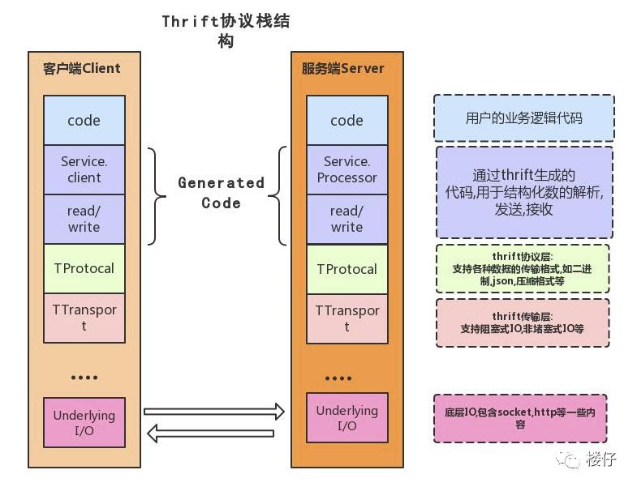

# Thrift

（数据库大作业的侧记）

## 什么是 Thrift？

首先要了解的概念是 **RPC** 。

> 可以阅读[这篇文章](https://mp.weixin.qq.com/s/ll4nUVB28KpyTMS93xAckQ)了解 RPC 服务。

> RPC（Remote Procedure Call Protocol）远程过程调用协议。一个通俗的描述是：**客户端在不知道调用细节的情况下，调用存在于远程计算机上的某个对象，就像调用本地应用程序中的对象一样。**
> 
> 比较正式的描述是：一种通过**网络**（或者本地的 Socket）从（远程/本地其他）计算机程序上请求服务，而不需要了解底层网络技术的协议。
> 
> 那么我们至少从这样的描述中挖掘出几个要点：
> 
> 1. RPC是协议：既然是协议就只是一套规范，那么就需要有人遵循这套规范来进行实现。目前典型的RPC实现包括：Dubbo、Thrift、GRPC、Hetty等。
> 
> 2. 网络协议和网络IO模型对其透明：既然RPC的客户端认为自己是在调用本地对象。那么传输层使用的是TCP/UDP还是HTTP协议，又或者是一些其他的网络协议它就不需要关心了。
> 
> 3. 信息格式对其透明：我们知道在本地应用程序中，对于某个对象的调用需要传递一些参数，并且会返回一个调用结果。至于被调用的对象内部是如何使用这些参数，并计算出处理结果的，调用方是不需要关心的。那么对于远程调用来说，这些参数会以某种信息格式传递给网络上的另外一台计算机，这个信息格式是怎样构成的，调用方是不需要关心的。
> 
> 4. 应该有跨语言能力：为什么这样说呢？因为调用方实际上也不清楚远程服务器的应用程序是使用什么语言运行的。那么对于调用方来说，无论服务器方使用的是什么语言，本次调用都应该成功，并且返回值也应该按照调用方程序语言所能理解的形式进行描述。
> 
> 
> 
> 图片来源同上。

上面提到，Thrift 是 RPC 的一种实现。那么 Thrift 具体实现了什么呢？来看一段简介。

> Thrift 是一种可伸缩的跨语言服务的RPC软件框架。它结合了功能强大的软件堆栈的代码生成引擎，以建设服务，高效、无缝地在多种语言间结合使用。2007年由 Facebook 贡献到 Apache 基金，是 Apache 下的顶级项目，具备如下特点：
> 
> + 支持多语言：C、C++ 、C# 、D 、Delphi 、Erlang 、Go 、Haxe 、Haskell 、Java 、JavaScript、node.js 、OCaml 、Perl 、PHP 、Python 、Ruby 、SmallTalk
> + 消息定义文件支持注释，数据结构与传输表现的分离，支持多种消息格式
> + 包含完整的客户端/服务端堆栈，可快速实现RPC，支持同步和异步通信
>
> 


以下部分内容来自于 [这篇文章](https://juejin.cn/post/6844903622380093447)。
> Thrift 软件栈分层从下向上分别为：传输层(Transport Layer)、协议层(Protocol Layer)、处理层(Processor Layer)和服务层(Server Layer)。
>
> Transport 层：Transport 层负责直接从网络中读取和写入数据，它定义了具体的**网络传输协议**；比如说TCP/IP传输等。Thrift 定义了如下几种常用数据传输方式：
> 
> + TSocket: 阻塞式socket；
> + TFramedTransport: 以frame为单位进行传输，非阻塞式服务中使用；
> + TFileTransport: 以文件形式进行传输。
> 
> Protocol 层：Protocol 层定义了**数据传输格式**，负责网络传输数据的序列化和反序列化；比如说JSON、XML、二进制数据等。thrift定义了如下几种常见的格式：
> 
> + TBinaryProtocol: 二进制格式；
> + TCompactProtocol: 压缩格式；
> + TJSONProtocol: JSON格式；
> + TSimpleJSONProtocol: 提供只写的JSON协议。
>
> 处理层(Processor Layer)：处理层是由具体的IDL（接口描述语言）生成的，封装了具体的底层网络传输和序列化方式，并委托给用户实现的Handler进行处理。
> 
> 服务层(Server Layer)：整合上述组件，提供具体的网络线程/IO服务模型，形成最终的服务。
> 
> + TSimpleServer: 简单的单线程服务模型，常用于测试；
> + TThreadPoolServer: 多线程服务模型，使用标准的阻塞式IO；
> + TNonBlockingServer: 多线程服务模型，使用非阻塞式IO(需要使用TFramedTransport数据传输方式);
> + THsHaServer: THsHa引入了线程池去处理，其模型读写任务放到线程池去处理，Half-sync/Half-async处理模式，Half-async是在处理IO事件上(accept/read/write io)，Half-sync用于handler对rpc的同步处理；

简单来说，我的理解就是：

> 一个 Server - Client 模型程序的实现方法。

## Thrift 文件

接下来比较重要的就是 `.thrift` 文件的编写。下面介绍一些基本的 `.thrift` 文件中的元素。

参考了：

+ [Thrift RPC 系列教程（1）——Thrift语言 - hezhiming的文章 - 知乎](https://zhuanlan.zhihu.com/p/48653455)
+ https://thrift-tutorial.readthedocs.io/en/latest/thrift-types.html


### 数据类型

基础的有：

* bool: A boolean value (true or false)
* byte: An 8-bit signed integer
* i16: A 16-bit signed integer
* i32: A 32-bit signed integer
* i64: A 64-bit signed integer
* double: A 64-bit floating point number
* string: A text string encoded using UTF-8 encoding

和一般的编程语言类似。

复杂的有：

* list: An ordered list of elements. Translates to an **STL vector**, Java ArrayList, native arrays in scripting languages, etc.
* set: An unordered set of unique elements. Translates to an **STL set**, Java HashSet, set in Python, etc. Note: PHP does not support sets, so it is treated similar to a List
* map: A map of strictly unique keys to values. Translates to an **STL map**, Java HashMap, PHP associative array, Python/Ruby dictionary, etc. While defaults are provided, the type mappings are not explicitly fixed. Custom code gesnerator directives have been added to allow substitution of custom types in various destination languages

### Struct 结构体定义

```cpp
struct Person {
    1: required string name; // 必须字段，很明确
    2: required i64 age;
    3: optional string addr; // 可选字段
    4: optional string defaultValue = "DEFAULT"; // 默认字段
    5: string otherValue; // 不是很明确!
}
```

就是一种复合的数据类型

### Exception 异常定义

```
exception InvalidOperation {
  1: i32 whatOp,
  2: string why
}
```

和类是类似的

### Enum 枚举定义

```
enum Operation { // 功能着实比较孱弱
  ADD = 1,
  SUBTRACT = 2,
  MULTIPLY = 3,
  DIVIDE = 4
}
```

### Service / Interfaces 接口

```
// 接口, 还可以继承, 也许我们有时候可以搞个 『BaseService』 之类的，不过我很少用到。
service CalculatorService extends shared.SharedService {  
	
    // 正常方法，和C++这类传统语言，基本一模一样。
   void ping(),

   i32 add(1:i32 num1, 2:i32 num2),

   i32 calculate(1:i32 logid, 2:Work w) throws (1:InvalidOperation ouch),
	
    // 特殊方法，基本很少用到了，在我有限的经历中，只使用过一次，读者没必要关注它
   oneway void zip()

}
```

## 实现接口

和一系列的框架类似，仍然是通过继承 Thrift 自动生成的代码类来实现自己的接口功能。

### 编译（？） Thrift 文件成为代码

目前是 Maven 自动管理了这一过程，`maven compile` 的过程中就会生成。

### Client 端

```java
// transport - procotol - client 的初始化结构
transport = new TSocket(host, port);
transport.open();
protocol = new TBinaryProtocol(transport);
client = new CalculatorService.Client(protocol)
```

```java
// 调用接口
client.add(a,b);
```

```java
// 记得关闭 Transport
transport.close();
```

可以回顾一下上文提到的 Transport - Protocol 层次结构。Transport 代表使用什么载具（socket？）进行传输，而 Protocol 则规定了传输的格式。


### Server 端

与上面的 Client 类，在 Server 端对应的是 Processor 类。Processor 类会把服务委托给 用户实现的 Handler。

用户实现的 Handler 需要继承 Iface 类。

```java
public class CalculatorServiceHandler implements CalculatorService.Iface {
    @Override
    public int getTime(int a, int b) throws TException {
        return a + b;
    }
}
```

然后用户实现的 Server （可以单例模式）：

```java
public class SimpleServer {
    public static void main(String[] args) throws Exception {

        // Processor 的 初始化，指定 Handler
        CalculatorService.Processor processor =
                new CalculatorService.Processor<CalculatorService.Iface>(new CalculatorServiceHandler());

        // TServerSocket? 应该算 Transport 
        TServerSocket serverTransport = new TServerSocket(DEFAULT_SERVER_PORT);
        
        TSimpleServer.Args tArgs = new TSimpleServer.Args(serverTransport);
        tArgs.processor(processor);

        // TProtocol ，协议（似乎不是必要的）
        TBinaryProtocol.Factory protocolFactory = new TBinaryProtocol.Factory();
        tArgs.protocolFactory(protocolFactory);

        // 指定 Server 模型
        TServer tServer = new TSimpleServer(tArgs);
        System.out.println("Running Simple Server");
        tServer.serve();
    }
}
```

还有很多其他的方法，但是在这里只是给出需要什么内容来构建一个基本的 Server。（毕竟是随便写的）
