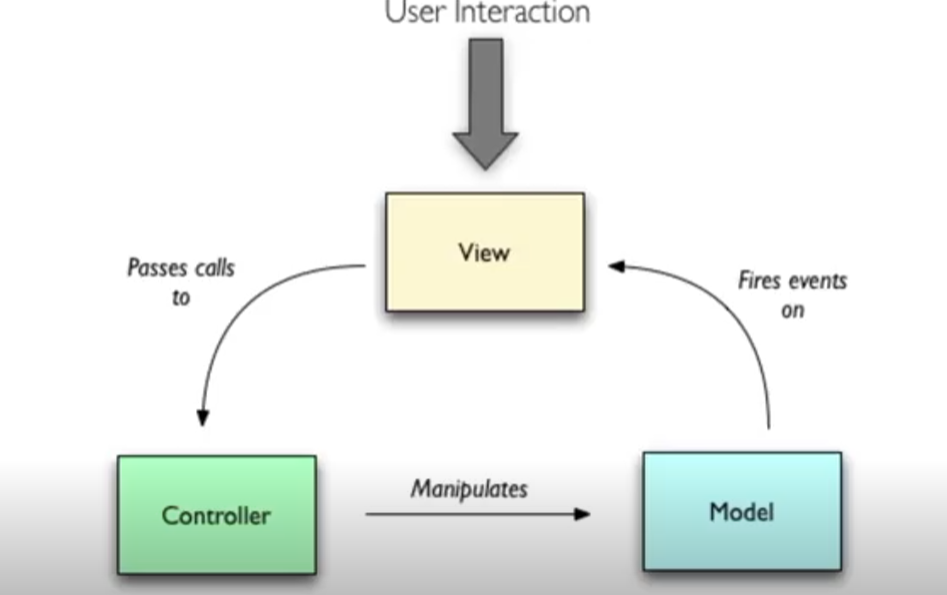
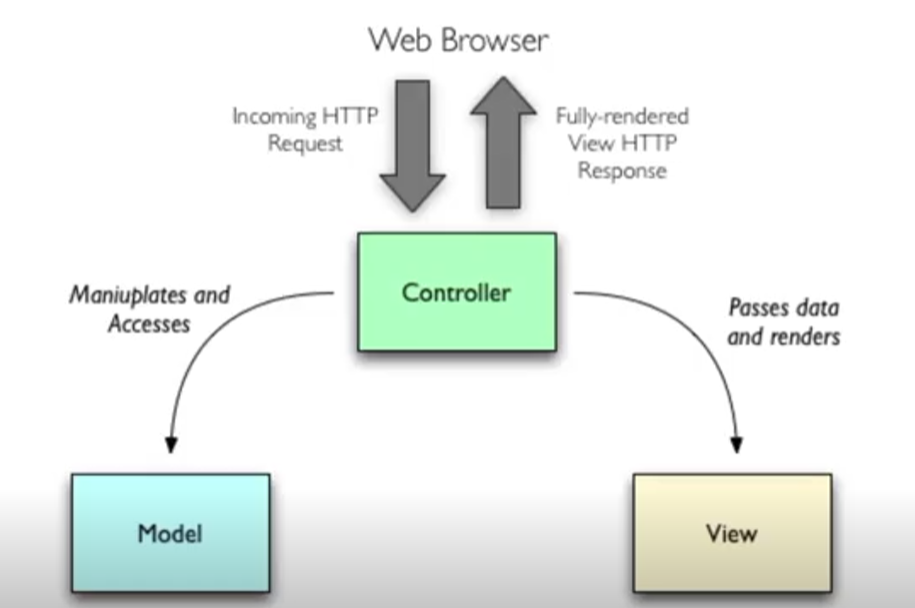
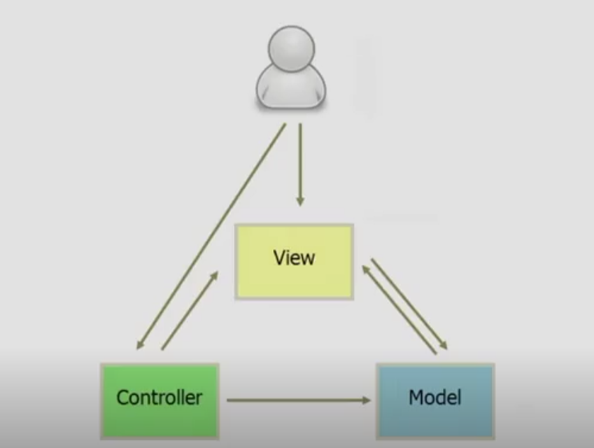
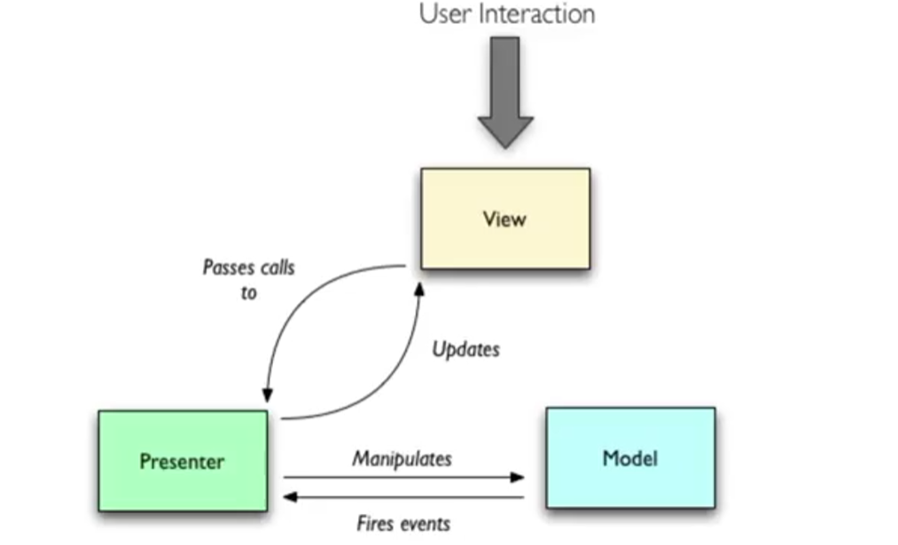
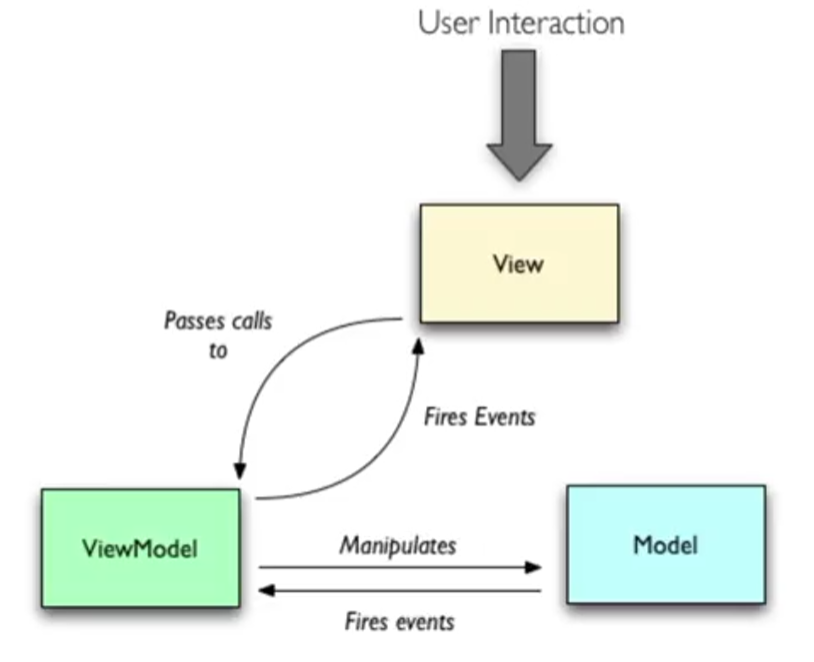
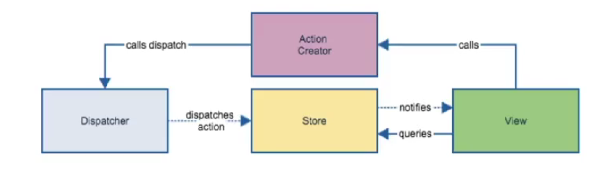

# Vue.js

一个前端的 JS 框架。

> 一个模板化、组件化、响应式的用于构造用户界面/内容的 Javascript 框架。

[Vue.js (vuejs.org)](https://v3.cn.vuejs.org/)

## 核心问题与思想

组件化与封装

数据与表现方式的解耦（模板化）

性能

Debug

## 前端模式与发展

### 传统 MVC



### Web 的 MVC





### MVP模型



View 专注于人机交互

Presenter 负责操控若干个 View

### MV-VM 模式



省去了 Javascript（Model）和 HTML（View）的同步

### Flux



整个发展 --> 更多的重点转移到 View，Model 越来越少

## Vue 的架构

## 组件化

### 底层：Web Components 标准

+ Shadow DOM
+ Custom Elements
+ HTML Templates
+ CSS changes
+ JSON，CSS，HTML Modules

### Vue 框架的引入

1. 直接在 HTML 中引入
2. npm 中安装 vue，在 nodejs 中引入，采用 webpack 打包后在 HTML 中引入
3. 使用 vue-cli 的配套工具链条

## 组件

组件是 Javascript 中的对象，可以与 DOM  中的元素绑定。

以下代码可以创建一个全局应用实例：

```javascript
const app = new Vue.createApp({
    // 配置
})
```

将这个全局应用实例挂载到某个 DOM 上，成为根组件：

```javascript
const vm = app.mount('#app') // <div id="app"> </div>
```

`vm` 就是根组件的实例。

组件是带有名称的可复用实例。

定义一个组件：

```javascript
app.component('my-component-name', {
  // 选项 ...
})
```

组件的生命周期


### 组件的 Props

```javascript
props: ['title', 'likes', 'isPublished', 'commentIds', 'author']
```

```javascript
props: {
  title: String,
  likes: Number,
  isPublished: Boolean,
  commentIds: Array,
  author: Object,
  callback: Function,
  contactsPromise: Promise // 或任何其他构造函数
}
```

### 组件的属性

```javascript
{
    data() { // 数据属性，或 data property
        return {
            items: ["1", "2"]
        }
    },
    // vm.$data.items => ["1", "2"]
    // vm.items => ["1", "2"]
    // 不可以后加
    methods: { // 方法，或 method
        increment() { // 不能使用箭头函数！会被自动绑定 this
            this.item.push("+1") // this 是指向组件
        }
    },
    computed: { //计算属性，或 computed property
        // 对于包含复杂的逻辑的"data"和 template
        currentComputedValue() {
            return this.items.length(); // this 是指向组件
        },
        // 复杂的 getter 和 setter
        fullName: {
            // getter
            get() {
                return this.firstName + ' ' + this.lastName
            },
            // setter
            set(newValue) {
                const names = newValue.split(' ')
                this.firstName = names[0]
                this.lastName = names[names.length - 1]
            }
        }
    },
    watch : {// 侦听
        items(newItem, oldItem) {
            // ... 
        }
    },
}
```

### 组件模板

写在配置中

```javascript
    template: `
        <button @click="count++">
        You clicked me {{ count }} times.
        </button>` // 字符串模板，简化，事实上更多用 .vue 单文件
```

#### 插槽

```html
<slot> Default Content </slot>
```

带名字的插槽：

```html
<slot name="footer"></slot>
```

使用：

```html
<template v-slot:header>
<h1>Here might be a page title</h1>
</template>
<template #header>
    <!-- test -->
</template>
```

### 组件模版的语法

#### 文本插值

```html
{{message}}
```

+ 不变的文本插值：

```html
<div v-once> {{message}} </div>
```

+ HTML 插值：

```html
<span v-html="rawHtml"> </span>
```

+ （对）属性的插值

```html
<div v-bind:id="dynamicId"> </div>
```

简写：

```html
<div :id="dynamicId"> </div>
```

!!!note
    如果 `dynamicId` 是 `null` 或者 `undefined`，那么这个属性将不会被渲染出来。


+ Javascript 表达式

```html
{{ number + 1 }}

{{ ok ? 'YES' : 'NO' }}

{{ message.split('').reverse().join('') }}

<div v-bind:id="'list-' + id"></div>
```

!!!note
    只能是 **单个** **表达式**，不能是语句（如 `var a = 1` ，如控制结构）。

### 组件模版中的指令（Directives）

#### 条件渲染

!!!!note inline end
    `v-if` 必须被绑定到“元素”上，可以套在 `<template> </template>` 上面。

`v-show`：调整 display，更高的初始开销

`v-if/v-else/v-else-if`：调整渲染出来的东西，更高的切换开销


#### 列表渲染

`v-for`： 循环渲染

```html
<ul id="array-rendering">
  <li v-for="item in items" v-bind:key="item.mesage">
    {{ item.message }}
  </li>
</ul>
```

```javascript
Vue.createApp({
  data() {
    return {
      items: [{ message: 'Foo' }, { message: 'Bar' }]
    }
  }
}).mount('#array-rendering')
```

!!!note inline end
    `v-if` 有比 `v-for` 更高的优先级，并且不推荐一起使用

1. 可以遍历数组（？），可选的第二个参数: `(item, index)`
    1. 被包裹/监听的数组修改方法：push, pop, shift, unshift, splice, sort, reverse
    2. 其他被监听的数组替换方法：filter, concat, slice (比较高效，放心使用)
2. 可以遍历一个对象所有的 property，可选的第二/三个参数 `(value, name, index)`


!!!note
    可以搭配 `v-bind:key` 减少开销（就地更新），需要保证 key 唯一（且为字符串，数值）。

#### 事件的绑定

可以让事件与一系列东西绑定。

语法： `v-on:click="methodName"` 或者简写 `@click="methodName"`

+ 可以直接写 JavaScript 表达式/内联 `counter += 1` `warn(...)`
+ 可以写多个事件


```html
<!-- 这两个 one() 和 two() 将执行按钮点击事件 -->
<button @click="one($event), two($event)">
  Submit
</button>
```

**修饰符**：事件处理过程中的处理 `.stop`, `.prevent`, `.capture`, `.self`, `.once`, `.passive` 

```html
<!-- 阻止单击事件继续冒泡 -->
<a @click.stop="doThis"></a>

<!-- 提交事件不再重载页面 -->
<form @submit.prevent="onSubmit"></form>

<!-- 修饰符可以串联 -->
<a @click.stop.prevent="doThat"></a>

<!-- 只有修饰符 -->
<form @submit.prevent></form>

<!-- 添加事件监听器时使用事件捕获模式 -->
<!-- 即内部元素触发的事件先在此处理，然后才交由内部元素进行处理 -->
<div @click.capture="doThis">...</div>

<!-- 只当在 event.target 是当前元素自身时触发处理函数 -->
<!-- 即事件不是从内部元素触发的 -->
<div @click.self="doThat">...</div>

<!-- 点击事件将只会触发一次 -->
<a @click.once="doThis"></a>

<!-- 滚动事件的默认行为 (即滚动行为) 将会立即触发，   -->
<!-- 而不会等待 `onScroll` 完成，                    -->
<!-- 以防止其中包含 `event.preventDefault()` 的情况  -->
<div @scroll.passive="onScroll">...</div>
<!-- 不要把 .passive 和 .prevent 一起使用 -->
```

**按键修饰符**：`.enter` `.tab` `.delete` (捕获“删除”和“退格”键) `.esc` `.space` `.up` `.down` `.left` `.right`

**特殊按键修饰符**：`.ctrl` `.alt` `.shift` `.meta`

!!!note
    请注意修饰键与常规按键不同，在和 `keyup` 事件一起用时，事件触发时修饰键必须处于按下状态。换句话说，只有在按住 ctrl 的情况下释放其它按键，才能触发 `keyup.ctrl`。而单单释放 ctrl 也不会触发事件。

鼠标按钮修饰符：`.left` `.right` `.middle`

```html
<!-- 只有在 `key` 是 `Enter` 时调用 `vm.submit()` -->
<input @keyup.enter="submit" />
<input @keyup.page-down="onPageDown" />
<!-- 有且只有 Ctrl 被按下的时候才触发 -->
<button @click.ctrl.exact="onCtrlClick">A</button>
```

!!!note
    使用修饰符时，顺序很重要；相应的代码会以同样的顺序产生。

#### 表单的绑定

`v-model`：在表单 `<input>`、`<textarea>` 及 `<select>` 元素上创建双向数据绑定。

#### 自定义指令

```javascript
const app = Vue.createApp({})
// 注册一个全局自定义指令 `v-focus`
app.directive('focus', {
  // 当被绑定的元素挂载到 DOM 中时……
  mounted(el) {
    // 聚焦元素
    el.focus()
  }
})
```
```javascript
// 局部注册
directives: {
  focus: {
    // 指令的定义
    mounted(el) {
      el.focus()
    }
  }
}
```

使用

```html
<input v-focus />
```

## 事件处理/沟通

父子组件

跨层级

